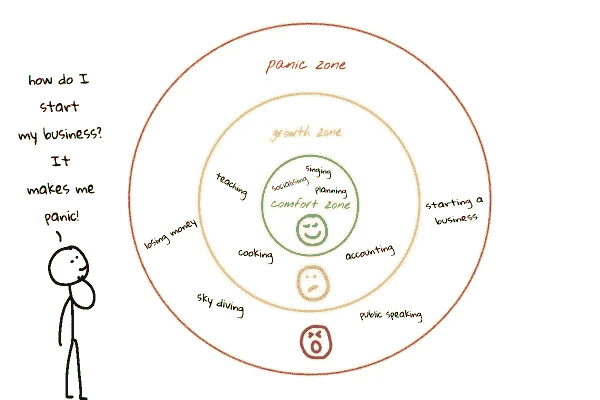

# 你应该辞职

> 原文：<https://medium.com/hackernoon/you-should-quit-your-job-c506a20fc556>

## 你觉得没有动力吗？你正在做的项目没有影响？你不记得上一次你学到东西或者面对挑战是什么时候了吗？这些迹象表明你正处于舒适区，必须马上改变。

除了工作问题，如精疲力竭、同事问题和薪水，舒适区是你应该辞职的主要原因。

Photo by [Joshua Earle](https://unsplash.com/@joshuaearle?utm_source=medium&utm_medium=referral) on [Unsplash](https://unsplash.com?utm_source=medium&utm_medium=referral)

# 什么是舒适区？

简而言之，舒适区是一种对事物感到熟悉的心理状态。当你能控制你的环境时。这导致了稳定的表现和低的个人发展速度。

在职业背景下，当你处于舒适区时，你会很舒服地做日常工作中的所有事情。没有挑战，没有压力。如果你在自己的舒适区，你什么也学不到。不学习，不进化。

> 舒适区阻止你成长。

# 我被困在舒适区了吗？

要确定你是否在这个区域，你必须回答一个问题:

> 你上一次面临真正的挑战是什么时候？

**处于舒适区很容易。**你分配的活动都是老一套，很容易解决。挑战让我们专业地学习和成长。当你从事新产品或项目时，你会面临从未解决过的任务。这让你学习和提高你的技能。

如果你甚至不记得你面临的最后一个挑战，那就是你处于舒适区的标志。

困在舒适区的问题是你停下来发展你的能力。你的日常工作变得很容易，你可以毫不费力地解决日常挑战。还是那句话，没有学习，就没有进化。

# 走出舒适区

> 如果你想要一些你还没有的东西，很有可能你不得不去做一些你还没有做过的事情。

舒适区和增长区之间的主要障碍是**恐惧**。你需要冒险，改变你的常规，创造新的习惯。

我想在公众面前演讲，这也是我成长空间中的一个点。障碍是我害怕在公共场合说话(又名[语言恐惧症](https://en.wikipedia.org/wiki/Glossophobia))。为了走出舒适区，我必须学习演讲术，并尝试在公共场合演讲。如果我不冒险尝试，我永远不会成长。

## 我辞职并走出舒适区的经历

我在一家巴西公司工作了两年。我在那里工作的最后几个月开始平淡无奇。我正在解决的挑战变得很容易，我正在解决的问题不费吹灰之力就解决了。我在舒适区。

我试图走出这个区域，但是我致力于的每个项目都是舒适和安全的。没有任何挑战，我停止了学习和发展我的技能。

我开始寻找新的挑战和工作机会。我对更高的薪水不感兴趣，而是对更高的个人发展感兴趣。在过去的两个月里，我做了职业生涯中最棒的一件事。我接受了一份很棒的工作。我在一家全球金融科技公司工作，开发一种新的电子商务产品。我从未使用过我在新工作中使用的编程语言，也没有为金融科技或电子商务引擎工作过。这都是关于打破舒适区和不断发展技能。

> [别忘了在 Medium 上关注我，了解我对技术、创业、生产力和自我提升的想法。](/@vnbrs)