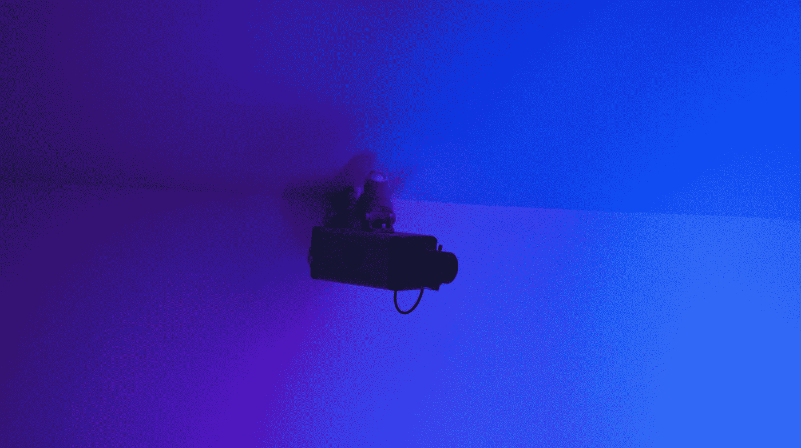

# 你应该监视你的用户

> 原文：<https://medium.com/hackernoon/you-should-spy-on-your-users-f8a2c8a7c8dd>

这听起来像是一个邪恶的建议，但这是为他们好。你毕竟是一个仁慈的开发者…不是吗？

需要澄清的是，我所说的“间谍活动”并不涉及黑客网络摄像头、窃取用户数据或穿着白色燕尾服点上等鸡尾酒。我说的[间谍](https://hackernoon.com/tagged/spy)是指*通过观察或审查发现或发现*。

软件开发人员每天都必须做出影响其应用程序使用方式的决策。问题是大多数人不像开发者那样思考。这就是间谍的用武之地。

## 用户测试

你观察过你的[用户](https://hackernoon.com/tagged/users)实际使用你的应用吗？用户测试(也称为可用性测试)是设计师和开发者的无价资源。这是一个“窥探”你的用户并见证真实的人如何与你的软件互动的机会。

下面是开始用户测试的一些简单步骤:

1.  确定一小组要测试的用户。三到五个应该够了。努力获得多样化的用户群。
2.  设置一个具有屏幕共享功能的设备供他们使用，这样您就可以从另一个房间“窥探”了。
3.  请每个用户单独执行一组任务(例如，在给定类别中找到评分最高的产品并将其添加到购物车中)。他们不应该看到或听到被测试的其他用户。每个用户将执行相同的任务。
4.  让他们在浏览你的应用程序时大声说出他们的想法。这将让你一窥他们的思维过程。
5.  完成测试后听取汇报。如果他们能够完成任务，提问以了解他们为什么尝试他们所做的事情，什么令人困惑，他们期望什么，等等。如果他们不能完成任务，你就有更大的问题。问很多问题来确定他们为什么卡住了。

**请务必记录测试过程，以便日后参考。**

即使用户被你认为简单的东西卡住了，把他们的输入视为无效也是错误的。他们的反馈可能是最有价值的。如果某个特定的体验让用户感到困惑，那么它对你来说有多大意义并不重要。如果他们不能轻松完成他们需要的东西，他们就不会使用你努力创造的软件。

我对用户测试的第一次体验令人难以置信的深刻。对我来说“直观”的东西是显而易见的，因为我已经构建并使用了这个应用程序几个月了。测试中的用户帮助确定了许多需要改进的地方。现在，我抓住一切机会观察人们使用我帮助构建的工具，并提出许多问题。

## 分析工具

现在让我们从更高的层面开始窥探。像 [Google Analytics](https://www.google.com/analytics/) 或 [Azure Application Insights](https://azure.microsoft.com/en-us/services/application-insights/) 这样的分析洞察服务提供了另一种了解用户的方式——以及许多其他工具。他们将帮助您回答以下问题:

*   我有多少用户？
*   他们使用“我的应用程序”的频率如何？
*   我的用户在哪里？
*   用户如何找到我的应用？
*   我上个月添加的杀手级新功能到底有多受欢迎？

有许多可用的服务，所以做一些研究，找到一个最适合你的解决方案。

记住要认真对待这些见解。如果你不利用你收集的信息来改进你的产品，这些信息将毫无价值。做出深思熟虑的改变，然后重复这个过程。间谍快乐！