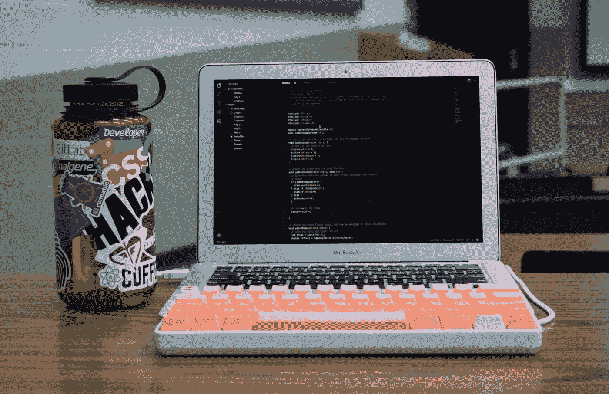

# 你想成为一名计算机科学家，现在呢？

> 原文：<https://medium.com/hackernoon/you-want-to-be-a-computer-scientist-now-what-2874cbe2cc7e>

```
system.out.println("Become a Computer Scientist");
```

当我们出生时，没有人知道如何说话。现在我们可以坐下来谈论我们的想法，而不用去想我们所说的每个单词及其定义。和我们说话已经成了第二天性。



# 学习编程

学习[编程](https://hackernoon.com/tagged/program)的过程和说话差不多。前一天你学习如何创建一个变量，第二天你就学习循环和如何使你的程序递归。

你一点一点地学习一切，而不是一下子。

当你学会了在一个程序中放入什么的不同方面，并且自己写了几十个之后，把所有的部分放在一起将成为你的第二天性。例如，在 java 中向列表添加项目看起来像这样:

```
List<String> myList = new LinkedList<String>();
myList.add("Hello");
myList.add("reader");
```

我很自然地把“.”在我的列表和添加之间，但我经常忘记去想那是什么。正在做。这是因为增加清单已经开始成为我的第二天性。

这就是为什么计算机科学的一部分是自学的原因。*想想呼吸。我们就这么做了。好，现在考虑试着向某人描述如何呼吸。向某人描述如何做对你来说是第二天性的事情是相当困难的。*你的老师试图向你描述概念时会有这种感觉。这就是为什么寻找[在线资源](http://www.breakingthecode.xyz/programming)和实践是学习如何编程的关键。

# 计算机科学中的概念

成为一名计算机科学家[的一部分是学习该领域内不同的概念。](https://hackernoon.com/tagged/computer-scientist)

例如，我目前不认为在我的研究生生活中我会使用人工智能(AI)。也就是说，我仍然可以讨论这些话题。如果我和某人一起做一个项目，他们建议我们使用人工智能来解决问题，我应该能够说为什么或者为什么不，我认为这是一个好主意。


这个概念类似于做面包师。假设我是一名职业面包师，但我只想烤布朗尼。你不认为我知道纸杯蛋糕是怎么做的仍然很重要吗，尤其是如果我打算把自己当成一名职业面包师的话？也许我应该知道怎么做一个简单的纸杯蛋糕。

当你处理像计算机科学这样的领域时，精通这门学科的多个领域的概念尤其重要。计算机科学不像工程学那样需要获得执业许可。在计算机科学中，你可以完全自学，并且仍然在该领域取得成功。当计算机科学家做出重要决定时，精通你的选择是必要的。