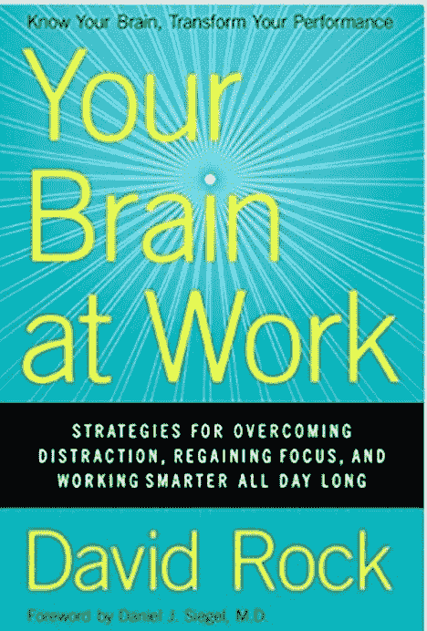

# 这是你的大脑在工作时发生的事情

> 原文：<https://medium.com/hackernoon/your-brain-at-work-c319be34f30e>

我最近读了大卫·洛克的《[你的大脑在工作](https://www.amazon.com/Your-Brain-Work-Strategies-Distraction/dp/0061771295)》。我的许多朋友都对这项工作的发现感兴趣，因为它深入研究了当你工作时大脑发生的事情，并适用于大众。我决定列出 16 大要点，也许会对你在工作中驾驭复杂的大脑有所帮助。

1.  当你有竞争的事情要做的时候，把它们都写下来，并区分优先次序。先解决最难的问题。新概念占用更多的空间。当试图在选项之间做出决定时，比较的最佳项目数是**两个**。当你试图在头脑中记住一个以上的想法时，记忆力会下降。
2.  最佳表现需要恰到好处的压力。当你有中等水平的去甲肾上腺素和多巴胺——兴趣和警觉——时，你会达到最佳表现。
3.  如果你陷入僵局，无法产生新的或创造性的想法，**让你的大脑闲置，**关掉需要精神警觉的事情，去散散步。你越快乐和放松，洞察力就越强。
4.  大脑有一个最小化危险(远离)或最大化回报(朝向)的原则。客场反应更强烈，会降低你的认知能力。压抑一种情绪会减少你对事件的记忆。 ***压抑一种情绪会让其他人不舒服。*** 标记可以减少边缘系统的唤醒。标签需要象征性的，而不是关于情感的长篇对话。
5.  由于镜像神经元(自闭症患者不存在)，群体环境中最强烈的情绪(远离)会影响群体中其他人在一起时的感受。
6.  孤独会显著增加死于中风和心脏病的风险。孤独会产生威胁反应，就像口渴、饥饿和恐惧一样。人们被分为朋友或敌人，敌人是积极暗示的默认缺失。如果有人被归类为敌人，他们被认为是一种威胁，你更自然地倾向于采取防御行动。 ***被群体排斥会激活与饥饿类似的威胁和疼痛反应。***
7.  在猎人聚集的时代，相信某人的话并全年交换/交换货物和服务是生死攸关的事情。因此，公平感是最基本的，也是行为的主要驱动力。公平感可能是主要的回报，而不公平感可能是主要的威胁。男人通常不会对遭受不公平待遇的痛苦的人感同身受，而女人会。惩罚不公平的人对我们的大脑是有益的。
8.  地位是社会行为的主要驱动力。人们会不遗余力地保护或提高他们的地位。 ***“啄食顺序的变化带来了数百万神经元产生方式的变化。”当在一段关系中，某人突然比另一方挣得更多或更少时，这是显而易见的。地位越高，威胁反应越强。如果你在和地位更高的人说话，那么这将被视为一种威胁。这种反应是发自内心的，皮质醇涌入大脑，损害了边缘系统。***
9.  当人们感到被排斥，或者甚至在社会上比其他人拥有的少时，就会产生痛苦的反应。由于地位下降的幅度如此之大，许多人选择不去冒可能会损害他们地位的风险。人们不喜欢犯错，因为犯错会降低你的地位。对人们来说，“正确”比任何事情都重要——包括生命本身。地位较高的猴子每天的皮质醇水平较低，更健康，寿命也更长。”当你的地位很高时，多巴胺和血清素水平会上升。在大多数会议中，大部分时间都花在个人地位的上升或下降上，不幸的是，这是一个零和游戏。 ***诀窍就是和自己玩对战。提高你自己，你的技能，而不是试图比你的同龄人更好，会让你看起来威胁更小。*** 通过交流你的进步(包括挑战)，你让他人感到轻松。
10.  地位、确定性、自主性、关联性、公平性对每个人都很重要，这些是你在与团队沟通时需要考虑的核心主题。
11.  **提供反馈很少是促进变革的正确方式**。在大多数情况下，反馈会给人们带来强烈的威胁。年度绩效评估每年有六天会降低绩效。 ***给出的反馈也是状态转移的信号(一个人比另一个人高)，他们的反应是立即驳回。你可以通过鼓励他们来帮助提高某人的地位，通过阐明你的目标来增加他们的确定感，或者通过确保他们正在做决定并提出他们的想法，而不仅仅是你的建议，来改变这种情况。重点要求人们关注自己的心理过程。***
12.  激活大脑右半球对于获得洞察力非常重要。专注于解决方案会产生欲望，并增加多巴胺，这对洞察力很有用。这不是大脑的自然倾向，因为解决方案通常是未经测试的，因此是不确定的。让人们有自己的见解，而不是提供建议，是让人们回到正轨的最快方法。
13.  胡萝卜加大棒的方法对孩子有效，但对成年人就没那么有效了。
14.  注意力是改变大脑的东西。如果你把人们的注意力集中足够长的时间，你就可以改变你的大脑。 ***首先，你必须创造一个安全的环境。其次，你需要帮助他人以正确的方式集中注意力，建立新的联系。最后，你必须让人们一遍又一遍地回来关注他们的新赛道。***
15.  许多身居高位的人拥有高度发达的智力，但在社交方面却很贫乏。**大脑中与自我意识、社会认知和共情相关的区域与大脑中专注于保存信息、规划和工作记忆的区域是不同的区域。**两者呈负相关。当一个区域活跃时，另一个区域处于休眠状态，如果你花很多时间在认知任务上，你的同理心能力就会降低，因为这个回路不会被经常使用。 自我认知的电路用于他人的知识，如果这一点得不到利用，将会有代价，因为理解他人将更加困难*。*
16.  葡萄糖进入大脑后的交流是分享信息的更好时机。艰难的对话应该倾向于在午餐后进行，而不是在午餐前。

> *“愿你的皮质醇保持在低水平，多巴胺保持在高水平，催产素分泌旺盛，血清素保持在一个可爱的水平”——大卫·洛克*

如果你想保持联系并阅读我的关于产品营销和走向市场的书，你可以在亚马逊[这里](https://www.amazon.com/Product-Marketing-Debunked-Go-Market/dp/1718968124/ref=sr_1_1?s=books&ie=UTF8&qid=1539049369&sr=1-1&keywords=product+marketing+debunked#customerReviews)找到它。