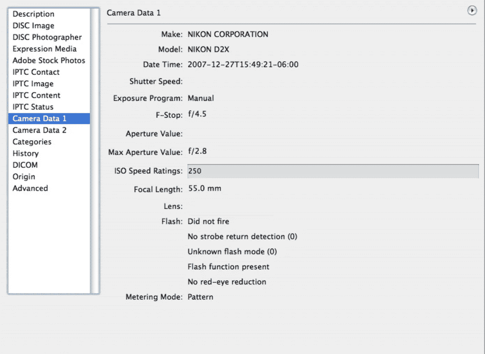
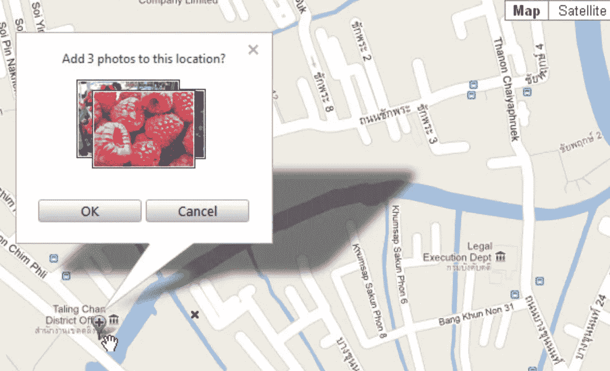
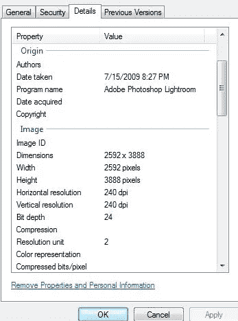
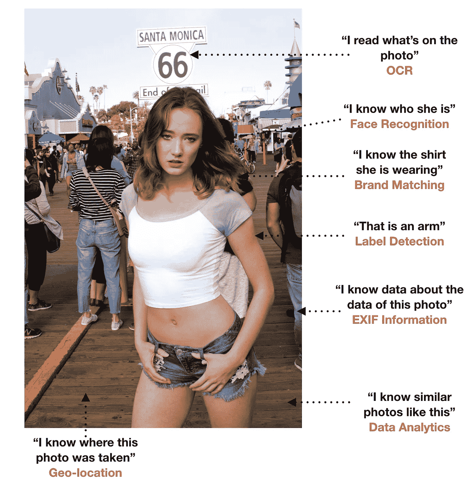
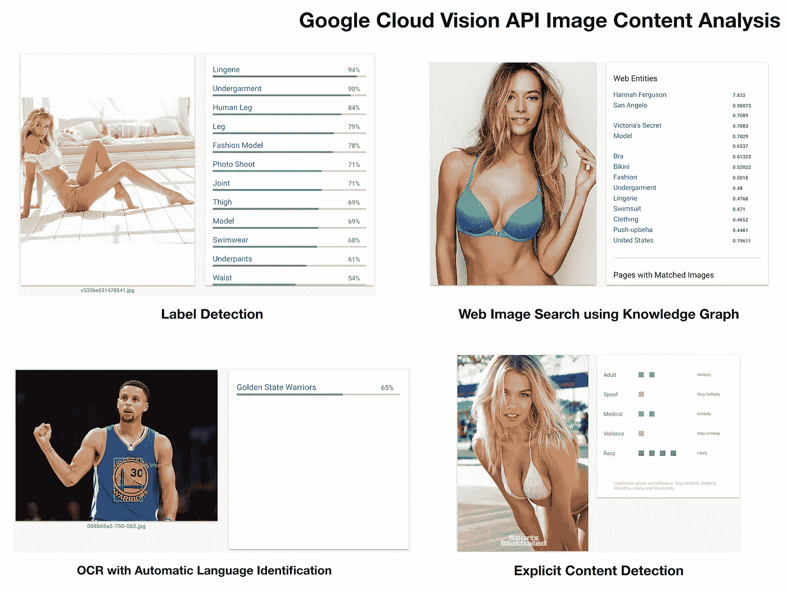

# 你的数码照片可以透露你的信息

> 原文：<https://medium.com/hackernoon/your-digital-photos-can-reveal-information-about-you-732783dd857b>

有句话叫“一图胜千言。”它的意思是一幅图像可以讲述一个关于主题或图片的故事。我们的照片唤起了我们的记忆，这本身就告诉了我们很多我们正在观看的东西。在数码摄影时代，这是千真万确的，因为用数码相机拍摄的图像也记录了关于图像的信息。问题是这些信息不仅对用户可见，对其他所有人也可见。乍一看，这似乎是无害的，但一旦一张照片被上传到互联网上的照片分享网站、社交媒体应用程序和博客，它就可以透露如此多的信息。

Photos are commonly uploaded to social media, websites and image sharing apps. The images can reveal information not just about the image, but even about the user. (Photo Credit: Vicente Tabora Photography)

对于那些不知道，用来记录图像信息的格式被称为可交换图像文件格式或 EXIF。这包含称为“元数据”的信息，它描述了关于数据的数据。该数据属于通常由摄像机供应商设置的特定细节。这包括相机型号、白平衡、ISO、光圈、快门速度、图像上使用的照片编辑软件等信息。记录的其他常见信息包括时间戳(日期和时间)、图像分辨率、文件名和文件大小等。它也可以是用户可定义的，以包括诸如图像的地理位置、温度、摄影师的名字甚至 GPS 位置的精确坐标之类的信息。用户还可以将他们的信息设置为不与图像一起记录或存储(取决于相机)。图像组织软件使用这些元数据来归档图像，并允许摄影师在数据库管理系统中对他们的图像进行分类。

Example of EXIF data revealing information about the camera used to take an image.

用户可能关心的一个问题是图像上的地理标记或地理位置记录。这是通过社交媒体上的智能手机应用程序来完成的，这些应用程序会自动使用你的 GPS 坐标来识别照片拍摄的位置。通常一个应用程序会请求用户允许标记照片位置。

An example of geo tagging from an app. (Source: Paintshop Pro)

以下是拥有 EXIF 数据的一些敏感问题:

*   它可以显示图像的原始缩略图。由于 EXIF 数据的原因，编辑过的成人图像(可能包含被遮盖或修饰过的裸体)可能仍会显示原始缩略图。
*   地理标签可以使用 GPS 坐标揭示一个人的实际位置。肯定不是为了那些想躲着别人的人。
*   它揭示了拍摄的具体细节，如时间和日期。如果你做出其他的声明，那么 EXIF 的数据可以证明你是错误的。
*   将会出现评论，并且可以阅读。如果你在评论栏写了任何负面的东西，其他人也可以看到。
*   如果你不想被联系，不要把你的电话号码作为元数据包含在图片中。如果你不想陌生人上门，家庭住址也一样。

EXIF 信息可以被删除，这是上传图像副本时经常出现的情况。像脸书这样的网站实际上把 EXIF 的元数据从图片上剥离了。然而，其他网站可能不会这样做，尤其是照片分享网站。您可以查看哪些 EXIF 信息存储在您的图像中，方法是右键单击它，然后为 Windows 选择“属性”，为 Mac 用户选择“显示信息”。可以在拍摄图像的设备(即照相机)上防止记录太多数据。DSLR 甚至智能手机相机上的设置可以禁止某些元数据与您的图像一起记录(请参阅您的设备手册或网站了解更多信息)。

EXIF information displayed by right-clicking a photo image in Windows is displayed in the “Details” tab. Notice the information shown. This is the metadata and if you scroll down you will see more. There is an option at the bottom of the tab that says “Remove Properties and Personal Information”. This allows you to delete the EXIF data before uploading a file for public sites.

以下是网络安全和防病毒供应商赛门铁克(Symantec)为 Windows 用户提供的链接，介绍如何删除 EXIF 数据(这只是一个信息来源，但搜索引擎可以揭示更多信息):

 [## 如何从照片中移除 GPS 和其他元数据位置

### 曾几何时，一张照片只能提供人们可以在实物印刷品上看到的信息——没有隐藏的数据…

us.norton.com](https://us.norton.com/internetsecurity-how-to-how-to-remove-gps-and-other-metadata-locations-from-photos.html) 

对于 Mac 用户，这里有一个从 OSX 日报删除 EXIF 数据的链接:

 [## 如何快速删除 Mac 上图像中的 EXIF 数据

### 用数码相机拍摄的照片，包括 iPhone、iPad 和 iPod touch，都包含一定程度的 EXIF 数据…

osxdaily.com](http://osxdaily.com/2012/12/05/how-to-remove-exif-data-from-images-quickly/) 

仅供参考:你也可以使用像 Photoshop 这样的图像编辑软件来完全删除 EXIF 的数据。有关更多详细信息，请参考您的软件文档。

然而，它并不仅仅以删除元数据而结束。一旦你的照片上传到网上，还有其他方法可以泄露信息。

在社交媒体上，当朋友给你的照片添加标签时，你的身份很容易暴露。对大多数人来说，这不是问题，他们确实喜欢被标记，因为这是他们的朋友。然而，一些应用程序正在使用人工智能在你朋友没有拍摄的照片中识别你。这可能令人毛骨悚然，但值得注意的是，像脸书这样的应用程序已经开发出足够智能的算法，可以知道图像中的人是谁。这被称为“人脸识别”，现在它被用来在上传照片时就标记谁提出建议。

Social media apps like Facebook have face recognition features that can identify users. (Source: CityNews Toronto)

人工智能和更强大硬件的发展正在催生一类新的智能设备。顶级科技公司如何做到这一点的一个例子可以在智能手机上看到。人工智能软件的主要推动者谷歌将这一点纳入了他们的 Pixel 智能手机。这利用了镜头应用程序通过拍摄照片来识别物体。同样，这种相机足够智能，甚至可以通过拍摄人脸照片来识别一个人的想法也是一个严重的问题。试想一下，通过拍照找出一个人的名字。这绝对是一个道德问题，可以被认为是侵犯隐私。

AI (Artificial Intelligence) capable apps will have features similar to that above.

谷歌也使用云来分析数据，包括图像。他们开发了用于内容分析的 Cloud Vision API，开发者可以将其用于他们的应用程序。其功能包括标签检测(识别图像中的内容)、知识图(关于图像的网络搜索信息)、OCR 或光学字符识别(应用程序可以识别图像中的文本)，甚至是显式内容检测(色情或不适当的观看内容)。这些都是使用数据分析收集洞察力的一部分。

Examples of Google Cloud Vision API (Source: Google)

随着我们的世界变得更加数字化，我们的生活方式也将如此。设备可以存储我们拍摄的照片的信息，这一事实需要用户谨慎对待。如果信息一般，可以无害。问题是如果信息太私人，这就是为什么用户应该小心他们在互联网上发布的内容。个人信息公开真的是用户的错。在将任何信息发布到 Internet 上之前，如果您不想公开这些信息，请仔细检查或验证，以确保只有您授权的人才能看到这些信息。如果只是为了社交媒体的目的，将社会安全号码或银行账户信息等信息放在你的在线用户资料上甚至都是不明智的。如果你不想分享你的位置信息，就不要在社交媒体上签到，或者在发布照片时禁用自动签到功能。

需要考虑的一件重要事情是，要小心在图像中包含哪些用户定义的 EXIF 数据。永远不要放那些对你或你的形象过于敏感的信息。电话号码和家庭地址可能不包括在内，除非是为了业务。

有了智能应用程序，收集图像信息变得更加容易。取决于如何使用它，它可以是补充一个好奇的人，或者更糟的是将数据提供给一个坏演员。有时我们可能不知道我们的设备在做什么，所以总是尽可能地事先了解您的设备如何共享和存储有关您的图像的信息。