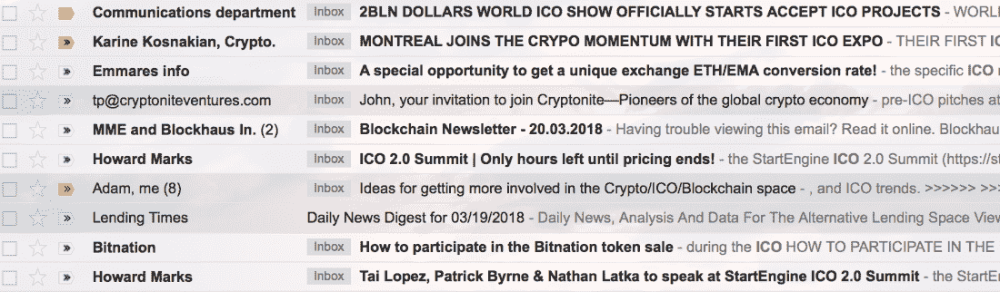

# 你的 ICO 公关糟透了

> 原文：<https://medium.com/hackernoon/your-ico-pr-is-awful-7ea5ca1c9a6d>

ICO 广告死了，你们都杀了它。你发布了太多穿比基尼的女孩，提供了太多快速致富的东西，而且 T2 对你的产品撒了谎。也许不是你们所有人，但是很多人。现在大家伙们把你关了。

作为一个相信代币销售真的是未来的人，我感到失望，但并不惊讶。代币销售经理使用了增长黑客和联盟营销中最糟糕的策略来支撑一系列 Kickstarter 项目。例如，我最近与 [KickICO](https://www.kickico.com/) 的负责人交谈，他告诉我他筹集了惊人的——也是不必要的——8000 万美元。与此同时，俄亥俄州的一个小而有价值的团队无法筹集到 1 美元，因为他们没有合理的方式来创造市场。那么，从一个记者的角度来看，如何睁大眼睛进入这个新世界呢？

# 没有好的秘密公关人员

坏消息是:你的公关很烂。我接触过的每个公关人员都不擅长加密。有很多公司，我不会挑出任何一家，但如果你有任何问题，请发电子邮件至 john@biggs.cc。让我告诉你:我接触的每一个公关人员，包括内部沟通经理，都很糟糕。这并不总是他们的错，因为这个领域是如此的新，但是他们中的许多人又是无能的。

正在发生的是一场完美的公关风暴。公关人员，尤其是那些觉得自己被排除在创业革命之外的老年人，正在把自己标榜为行业中的佼佼者。在初创公司公关和沟通方面的记录从差到中等之后，他们正在积极寻找 ICO 项目。他们还收取巨额溢价，因为他们知道你很绝望。不要听信他们的谎言。他们永远不会让你进入《华尔街日报》或《纽约时报》,你永远也不会登上 TechCrunch 的前台，登上 Reddit 这样的发烧友网站对你来说毫无用处。换句话说，你不能把你的推广工作外包出去。

# ICO 俱乐部第一条规则…

…就是不要谈论你的 ICO。我再说一遍:当你和记者接触时，不要谈论你的 ICO。代币销售 PR 的关键是根本不提代币销售。为什么？玫瑰花开了。普通记者在早餐和午餐之间会听到来自 ico 的 50 个推介，没有明确的方法来评估他们的价值，甚至团队的能力。看看我的个人收件箱——这只是我收到的垃圾邮件，甚至不是我的“工作”地址:

猜猜这些邮件都去哪了？直接扔进垃圾桶。为什么？因为这些要么是活动邮件，要么是关于如何用 crypto 赚大钱的讨论。这是最糟糕的垃圾邮件，最终会让整个行业陷入困境。

当你发送一封象征性的销售邮件时，你应该真正发送一封关于你的创业公司和你的产品的邮件。故事结束。如果你的产品不存在，就不要谈象征性销售。如果你的团队不存在，就不要谈象征性出售。如果你对自己的愿景不清楚，不能用 20 个字或更少的话简洁地描述出来，那就不要谈象征性销售。

# 如何讲述你的故事

1.  **打造产品。**这是第一步。让东西跑起来。在创业游戏的这个阶段，两三个人的团队应该能够创建一个 MVP。虽然我明白我们应该进入一个无风险投资的未来，但使用像 [Bubble](http://bubble.is/) 这样的应用构建器来构建这种工作是微不足道的。动手吧。
2.  **找出可以交谈的对象。**访问所有你喜欢的网站。找到写密码的人。给他们发一次邮件，如果他们不回复，就发微博。然后停下来，继续下一个。每给 100 个人发一封邮件，就会有一个人回复。像和老朋友说话一样和这个人说话。不要主动为他们写帖子，不要主动打电话给他们，不要要求和他们见面。不要支付印刷费用，也不要主动支付印刷费用。
3.  **积极主动。**为他们回答以下几个问题，并询问他们是否需要更多:

**创始人是谁，他们的背景是什么？**

**你的资金来源是什么？**

**你的牵引力有多大？(真实数字:月活跃用户或日活跃用户，而不是下载量或注册用户，或者你的交易量)**

**你和其他玩家的主要区别是什么？**

**描述项目的起源？**

用自己的话描述这个项目。

**4。重复一遍。一遍又一遍地这样做，直到你厌倦为止。然后雇一个真正的公关人，当你忙着做产品和赚钱的时候，他不会吸。**

或者，闭嘴。大多数代币项目根本就不应该宣传。如果你没有产品、团队或梦想，那么你最好只是静静地坐着，主要依靠电报室和 whale 网络来建设。例如，Agora 以参加塞拉利昂选举为荣，但很快就在网上遭到痛斥。他们应该怎么做？他们应该保持安静。此外，在我写了关于 Agora 的文章后，另一家公司刚刚给我发了电子邮件，声称他们公司是区块链摇滚名人堂的官方投票系统。这太愚蠢了。很多人认为，如果有人谈论了话题 A，那么他们肯定会在同一个场合谈论话题 B。这是错误的。此外，如果你声称的名声是为克利夫兰的一家博物馆投票，那么你就有更大的问题了。构建一个有效的产品并实现它。闭嘴，直到你真正为你所做的感到骄傲。

我已经追踪创业公司 12 年了，我知道你们想做什么。没用的。最终需要发生的是代币市场的大规模变革。那要花很长时间。在那之前，保持理智，理性行事，闭上你的大嘴巴。

这篇文章来自我的新项目， [TokenReporter](https://tokenreporter.substack.com) 。这是一份两周一次的时事通讯，拥有 5000 多名加密狂热者。