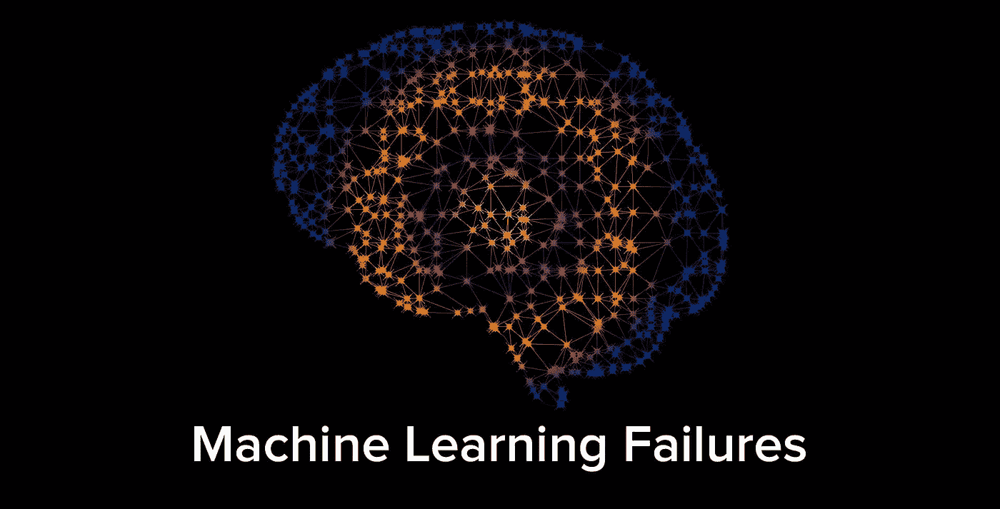
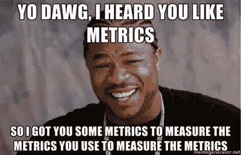

# 你的机器学习算法可能会毁了你的产品

> 原文：<https://medium.com/hackernoon/your-kickass-machine-learning-algorithm-may-ruin-your-product-54771e68f836>

## 虽然围绕机器学习的兴奋不是没有根据的，但并不是所有的进展都必然转化为改进的产品。本文列举了一些最常见的 ML 可能不适合的产品案例，并建议了一个避免这种失败的过程。

“机器学习可以改变你的业务”是我们最近听到越来越多的一句话，每个企业都想在这方面投入时间和精力，这是有道理的。

在过去的一年里，我有幸开发了以机器学习(以下简称“ML”)算法为核心的产品。我与其他产品经理、数据科学家和工程师交流过，他们似乎都对不断改进的算法脱颖而出的可能性着迷。

虽然这种兴奋不是没有根据的，但并不是所有的进步都必然转化为改进的产品。本文列举了一些最常见的 ML 可能不适合的产品案例。

*Source: memegenerator.net*

在我们深入研究之前，区分 ML 算法和 ML 乘积是很重要的。不用说，算法只是产品的一部分，两者在完全不同的尺度上衡量。一个好的 ML 算法可以通过诸如高精度和召回率的数学度量来识别。另一方面，好的产品通常是通过向用户提供价值主张的能力来衡量的。

# **ML 失败的常见产品案例**

1.  **非粘性产品&非电力用户**

“机器学习模型的好坏取决于它背后的数据”这句话被过度使用了，这是正确的，因为它也适用于所有的机器学习产品。

虽然每个产品都乐于让用户全天候参与，但这取决于产品的性质，可能根本不可能。即使是粘性产品，也有一些用户会一次性使用这项服务。这样的领域和用例非常不适合任何 ML 应用。

以一个允许用户预约医生的医疗保健应用程序为例。虽然患有慢性疾病的患者可能会经常使用这款应用程序，但一年患病几次的普通人几乎不会在应用程序中存储任何数据。

过于急切的聚类算法可能会发现，看了心脏病专家的人也会去看心脏外科医生。然而，下次你的胃不舒服时，一个“推荐给你”的弹出窗口会显示一名心脏外科医生，也许只是因为你之前为你的祖母预约了心脏病医生，这肯定会让你感到非常心痛。

**2。广告是主要收入来源**

让我们举一个传统在线新闻网站的经典例子。典型的用户流如下所示:

**传统流程—无建议**

*   用户通过谷歌或在地址栏中键入 URL 来访问网站主页
*   导航到顶级节页面
*   选择相关的子部分页面
*   点击相关文章链接进行查看

让我们假设，该网站提出了一个令人难以置信的 ML 算法，向其用户推荐个性化的文章，并在他们的主页上添加了一个链接到他们的部分。常见的流程可能如下所示:

**新流量——首页推荐文章**

*   用户访问网站主页
*   点击相关文章链接进行查看

就是这样。听起来很棒，对吧？通过减少用户流程中的两个步骤，用户体验得到了极大的改善，然而相应的业务后果很可能是灾难性的。请考虑以下情况:

*   大多数在线新闻网站的主要收入来源是在网站上向用户展示的广告
*   类别和子类别页面是两个高流量的页面，它们本身有大量的页面浏览量，通常会引导用户点击不止一篇文章
*   从信息流中删除这两个页面将会导致页面浏览量和广告展示减少，从而导致巨大的收入损失

**3。使用情况是最终用户 KPI**

“越多越好”是人类思维中常见的谬误，有时会与改进算法的核心价值主张相冲突。对于某些用户来说，手动操作的数量甚至做某事所花费的时间都可以作为衡量成功的 KPI。

*Source: memeshappen.com*

几乎所有的企业 SaaS 工具都是一个很好的例子。现在，我们可以以公司用来寻找候选人的招聘网站为例。

最终用户是招聘部门的员工，他们通常负责搜索候选人、查看简历/个人资料并与候选人联系。最终的成功衡量标准是成功招聘的人数。但招聘是一个漫长的过程，对其结果的反馈会有一个滞后期。因此，作为一个直接的代理，雇主倾向于通过衡量网站上的简历搜索和简历/个人资料浏览等活动量来监控员工的表现。

*Source: memegenerator.net*

这也延伸到他们对招聘网站本身整体有效性的看法。拥有最佳文本学习算法的网站能让招聘人员只需点击几下就能找到合适的候选人，但该网站可能并不总是最受雇主欢迎，因为它产生的搜索量或浏览量较少。这可能会导致该网站在这个竞争激烈的领域被同行抛弃。

这个 ML 失败的常见例子的列表可以很容易地写得更长，但是我想你现在已经有了大概的想法。那么真正的问题是，你实际上应该如何接近机器学习产品？我尝试在下面回答这个问题。

# **接近 ML 产品的方法**

大多数人容易忽略的关键步骤是，我们需要从业务成果的角度考虑 ML，而不是从花哨的算法或数据应用的角度。下面是一个 8 步骤的方法来实现你想要的商业结果。

1.  **了解 ML 用例**:如果你是机器学习的新手，告诉自己 ML 实际上可以帮助你解决的业务问题，你可能会发现这个[链接](https://a16z.com/2016/06/10/ai-deep-learning-machines/)作为起点很有用。
2.  **定义一个清晰的业务目标**:理解适用于你的业务的特定 ML 用例，如果你能够增强或自动化它，它将会带来价值。花时间清楚地定义你试图解决的问题陈述。
3.  **评估数据可用性**:你可能想用 ML 做很多事情，但是如果你没有正确的数据类型或者没有足够的可用数据，那么尽管你尽了最大努力，你还是会以失败告终。这可能是退一步，根据您的需要开始收集正确数据的恰当时机。
4.  **KPI、KPI 和更多 KPI**:确定你将跟踪的 KPI，以决定你产品的成败。包括任何相关的参与度指标，如页面浏览量或现场时间，因为它们可能会因您的产品而受到影响。不要忘记任何相关的关键业务 KPI，因为这里的一个失误可能会使你的产品成功或失败。
5.  **MVP 优先、beta 优先的方法**:来自实际用户的数据是主观的，比你的分析预测的结果更有价值。定义一个 MVP，您可以轻松推出并从中学习。根据定义，这排除了花费 6 个月的时间训练和重新训练你的模型。首先推出测试版，以增强用户的能力，如果结果不佳，你不会冒完全失去这些用户的风险。
6.  **获得定性反馈**:一旦进入测试阶段，就要给你的用户留下足够多的方式来给你反馈他们所看到的东西。主动通过电话和电子邮件来衡量人们对你的产品有多满意。
7.  **不带偏见地分析**:评估你的关键绩效指标的表现，结合从访谈中获得的定性见解，根据需要对用户进行细分。决定在这个阶段全面铺开是否有意义，而不要对已经投入到任务中的努力有偏见。
8.  **推广和监控**:如果以上所有选项都被勾选，则继续全面推广。即使在发布后也要持续监控 KPI，以确保业务风险最小化并及时发现。

有一些很棒的帖子扩展了这种方法，我强烈建议你在开始为你的产品做任何关于 ML 的工作之前也看看[这篇帖子](/@yaelg/product-manager-guide-part-1-what-machine-learning-can-do-for-your-business-and-how-to-9f7eb7dced05)。