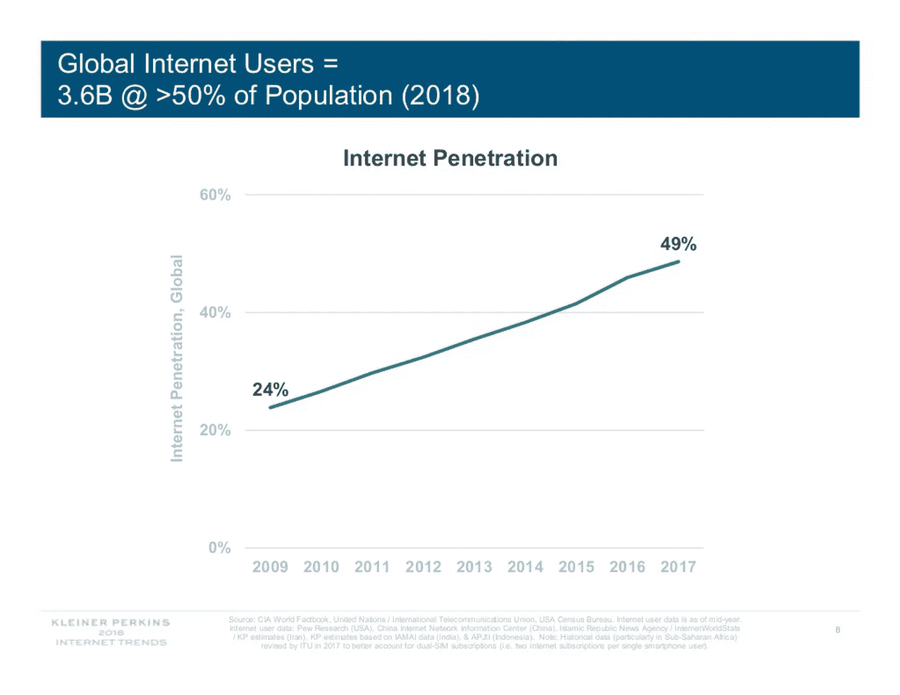

# 你的市场规模计算是错误的。

> 原文：<https://medium.com/hackernoon/your-market-size-calculation-is-wrong-540e8f46fbfb>

作为一名投资者，我几乎每天都在看幻灯片，虽然有很多关于如何让你的幻灯片更有效的建议，但几乎没有人谈到几乎每个幻灯片都存在的最大错误。你错估了你的市场规模。事情是这样的:

> 我们的产品售价 100 美元，而美国有 2000 万人购买我们的产品，所以我们的市场规模是 100 美元 x 2000 万人= 20 亿美元

这是不对的。数学本身没问题，但你计算的不是市场规模。相反，你计算的是你的总潜在收入。

潜在总收入是指如果每个潜在客户都购买了你的产品，你会赚多少钱。换句话说，就是如果你获得 100%的市场份额，你会赚多少钱。虽然这是一个值得了解的数字，但这是与你的市场规模相同的*而不是*。

市场规模是不同的。市场规模是指**目前**花在类似于你的产品上的钱的数量。如果你在做一个狗玩具，你的市场规模就是去年花在狗玩具上的钱。如果你做的是 B2B SAAS 销售平台，就是公司去年花在销售软件上的钱的总和。

潜在总收入是指如果你彻底击败你的竞争对手，你能赚到的最大金额。市场规模是你的竞争对手在你进入这个领域之前就已经赚了多少钱。

抓住它！？！？

现在这两个数字并不是完全独立的，理解它们之间的关系和它们的含义是很重要的。如果这两个数字之间的比率相差太远，你就是在向投资者发出信号，表明你并不真正了解你所进入的市场。我看到的最常见的情况是:

1.  潜在总收入>市场规模。
2.  潜在总收入超过市场规模的一半

对投资者来说，潜在总收入大于市场规模是一个很大的危险信号。你所说的是你的公司将会比你所有的竞争对手赚的钱加起来还要多。实现这一目标的唯一途径是您能够:

1.  拓展市场，将从未购买过像你这样产品的顾客包括进来。
2.  要求更高的价格。
3.  彻底击败你的竞争对手。

你至少需要做 2 件事，可能 3 件事都要做。尽管并非不可能，但这种可能性极小，因此除了最疯狂的投资者，其他人都会逃之夭夭。

潜在总收入超过市场规模的一半是一个潜在的危险信号。你所说的是你的产品和执行能力是如此突出，你将能够获得超过 50%的市场份额。如果你在一个新的市场，也许这是可能的，但如果你在一个竞争甚至还不太激烈的市场，何塞，那就别再投资了。

**你的潜在总收入应该不到市场规模的一半**，通常会更少。无论你有多优秀，你都不可能获得接近一半的市场份额。iPhone 只有 15.6%的市场份额。见鬼，**互联网**现在才刚刚达到 50%的市场份额。

from [Mary Meeker’s Internet Trends 2018](https://www.slideshare.net/kleinerperkins/internet-trends-report-2018-99574140/8)

你说“好吧”。“我知道市场规模与总潜在收入不一样，我的总潜在收入应该比我的市场规模的一半少得多，但是你没有告诉我计算市场规模的正确方法！告诉我怎么已经！”

对于大多数产品来说，很容易获得市场规模。你所要做的就是…谷歌一下。是的，没错，谷歌一下。由于市场规模的计算对金融界的人来说很重要，所以有太多的公司把所有的时间都花在收集数据和撰写不同行业的报告上。想知道市场研究公司是做什么的吗？？现在你知道了，所以你要做的就是找到一个和你相关的。比如[这里有一个 CRM 软件](https://www.statista.com/statistics/605933/worldwide-customer-relationship-management-market-forecast/)；这是另一个宠物食品。你可能需要为一份包含你的市场规模的报告付费，但这是值得的。这不仅有助于你个人对市场的理解，还能防止投资者认为你的套牌不切实际。

现在，除非你的产品如此新颖，以至于你真的在创造一个全新的市场，而且没有相关报道，否则我强烈建议你**不要试图自己计算市场规模**。这样做的原因是，这是世界上最容易的事情来检查事实。投资者所要做的就是谷歌一下，所以如果你计算出的数字与易于谷歌搜索的报告所说的数字不同，你就会立刻失去投资者。只需支付该死的报告费用，我知道这感觉像是一种浪费，但相信我，它不是。

好的，对于所有的撇油器，这是 TL；dr 摘要。你的市场规模不是通过你销售产品的价格乘以你认为你能接触到的客户数量来计算的。相反，为了确定你的市场规模，你可以在谷歌上搜索一份市场研究公司的报告。现在去修理你幻灯片，这样潜在的投资者就不可能说不了！

> 我是丑小鸭风险投资公司的合伙人，这是一家投资帮助老年人的技术的早期公司，也是纽约 Aging2.0 的大使。如果你正在努力使衰老变得更容易或更快乐，我想和你谈谈！