# 你的披萨不错:如何教 AI 评价食物质量

> 原文：<https://medium.com/hackernoon/your-pizza-is-good-how-to-teach-ai-to-evaluate-food-quality-d835a8c12e86>

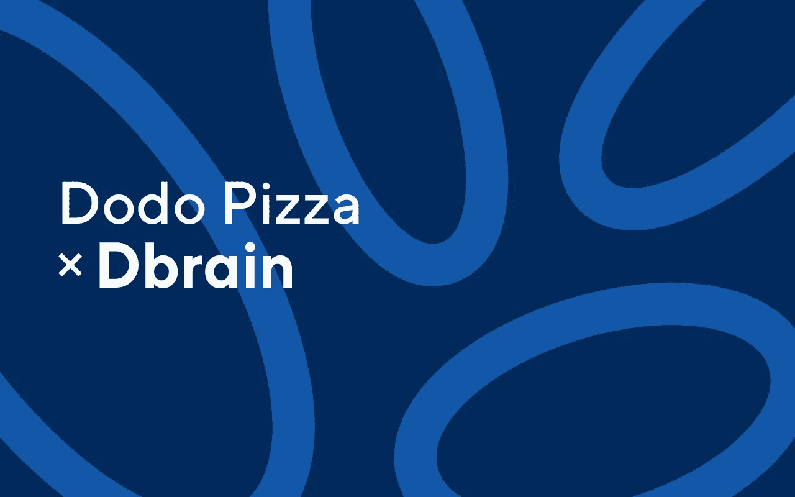

我们关于人工智能开发的系列出版物中的下一篇文章将研究俄罗斯最大的披萨连锁店“Dodo Pizza”的最新 Dbrain 用例。我们的首席数据科学家 Arthur Kuzin 解释了开发的人工智能如何通过电报信使对披萨面团进行 1-10 分的评分来进行披萨质量控制。深入了解如何教人工智能评估您的披萨！。

在这里，我将关注以下几点:I)仅从几个带标签的样本中获取整个数据集的标记；以及 ii)将 bbox 拉伸到对象的分割遮罩(将 bbox 的正方形遮罩应用于任何形状)。

# **主旨**

所以事情是这样的。多多比萨有许多活跃的顾客，他们同意分享他们对比萨质量的看法。为了简化反馈循环及其处理，Dbrain 开发了一个人工智能驱动的应用程序来检查披萨质量。这个应用程序在 Telegram 中被实现为一个聊天机器人，用户上传一张照片，然后得到从一到十的结果。

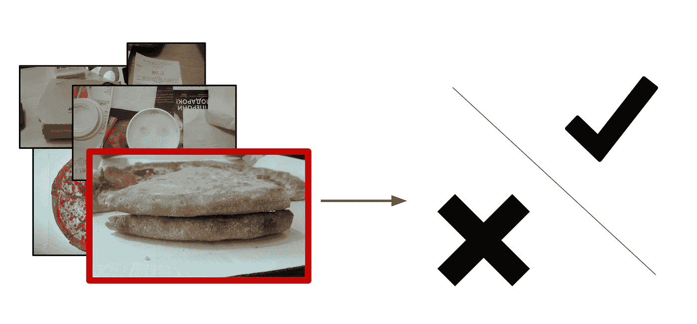

# **问题陈述**

当我们收到请求时，我开始开发一种算法，可以直观地确定面团的质量。问题是确定比萨饼烘烤过程何时被中断。外壳上的白色气泡似乎与变质的产品有关。

# **数据挖掘**

该数据集包括烤披萨的照片，也包括不相关的图片。如果食谱不正确，面包皮上会出现白色气泡。此外，还有一个由专家进行的面团质量二元标记。所以算法的发展只是时间问题。

这些照片是用不同的手机，在不同的光线条件下，从不同的角度拍摄的。有 17k 个比萨饼样本，而图片的总数是 60k。

因为任务非常简单，所以这是检验不同数据处理方法的好地方。所以，我们需要解决这个问题:

1.选择看到披萨饼皮的照片；

2.将所选照片中的地壳区域与背景区分开来；

3.在选定的区域训练神经网络。

# **数据过滤**

我自己标注了一小部分照片，而不是向其他人解释我真正需要的是什么，因为…你知道，如果你想把一件事做好，那就自己做:)下面是我所做的:

1.标记 50 张带外壳的照片和 50 张不带外壳的照片:

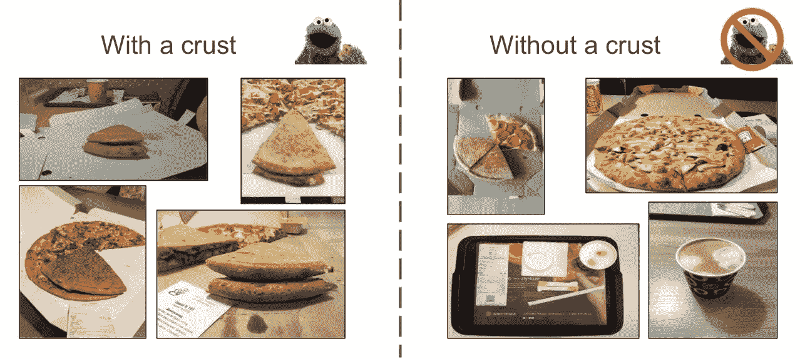

2.使用在 imagenet11k 上使用 places365 预训练的 ResNet-152 提取全局平均池后的特征([单击](https://github.com/deepinsight/mxnet/tree/master/example/image-classification))

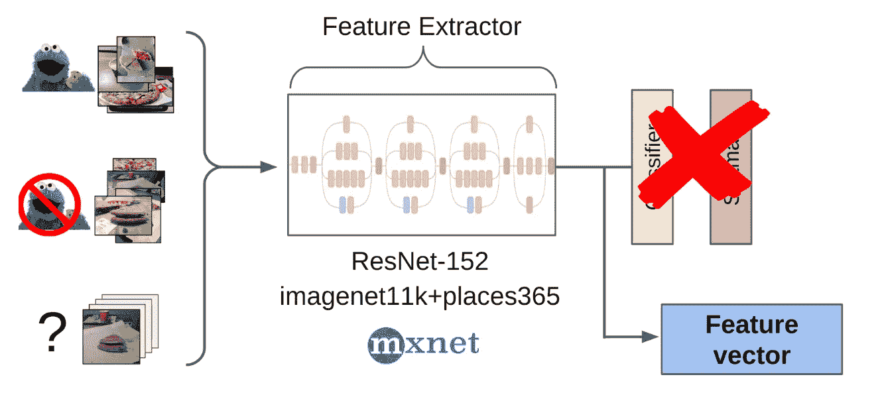

3.取两类特征的平均值作为锚

4.计算从这个锚点到剩余 60k 图片的所有特征的距离

5.确定前 300 个与正面类接近相关，距离最远的前 500 个是负面类

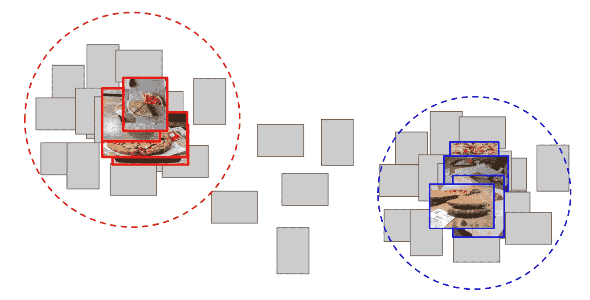

6.根据这些样本对 LightGBM 进行特征训练

7.使用此模型派生整个数据集上的标记

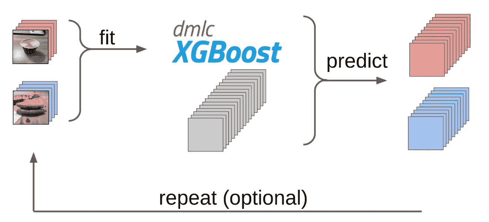

这与我在 kaggle 比赛中用作基线的方法大致相同。

# **前传**

大约一年前，我和叶夫根尼·尼日比茨基一起参加了“海狮”[卡格尔比赛](https://www.kaggle.com/c/noaa-fisheries-steller-sea-lion-population-count)。这项任务是在无人机拍摄的图像上计算海狗的数量。标记只是作为尸体的坐标给出的，但在某些时候， [Vladimir Iglovikov](https://www.kaggle.com/iglovikov) 用 bboxes 标记它们，并慷慨地与社区分享。

我决定通过[分割](/@keremturgutlu/semantic-segmentation-u-net-part-1-d8d6f6005066)来解决这个任务，在第一阶段只有海豹的 bboxes 作为目标。在几次训练迭代之后，很容易找到一些所有东西都不好的硬样本。

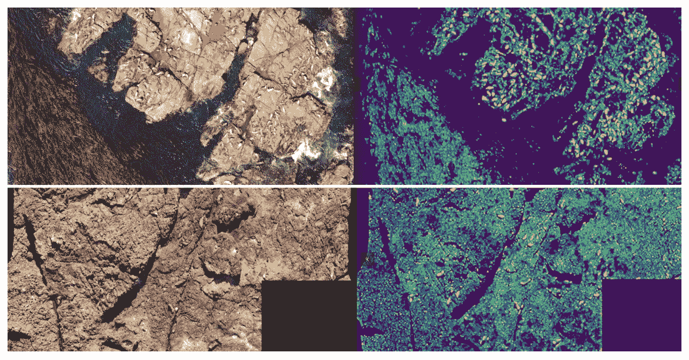

对于此示例，您可以选择没有封条的大区域，手动将遮罩设置为零，并添加到训练集中。因此，Evgeny 和我反复训练了一个模型，它已经学会了甚至为大个体分割海狗的鳍。

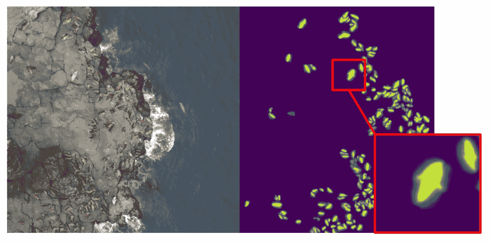

# **外壳检测和提取**

又回到披萨上了。为了识别所选择和过滤的照片上的外壳，最佳选择是将任务交给标记者。一般来说，一些贴标机对相同的样本有不同的工作方式，但那时我们已经对这种情况应用了共识算法，并将其用于 bboxes。这就是为什么我只是做了几个例子，并把它给了贴标机。最后，我得到了 500 个样本，特别是突出显示了外壳的区域。

为了识别所选过滤照片上的外壳，我制作了几个例子供贴标机使用。

然后，我将 Kaggle 海狮比赛中的代码更正式地应用到当前的过程中。在训练的第一次迭代之后，仍然清楚模型的错误之处。预测的置信度定义如下:

1-(灰色区域的面积)/(遮罩的面积)

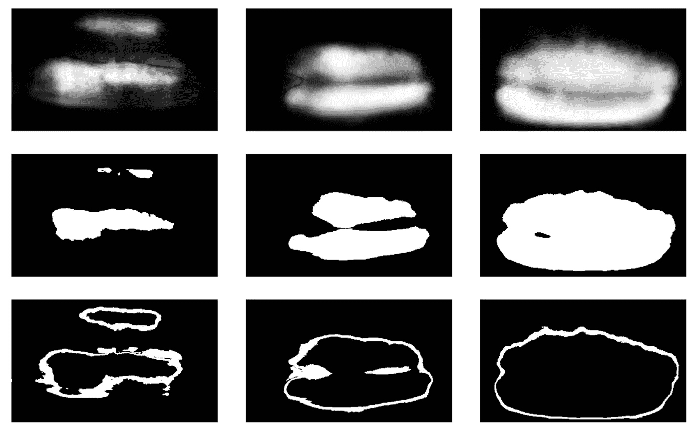

接下来，为了进行下一次迭代，使盒子接近面具，一个小集合用 TTA 预测了面具。这在某种程度上可以被认为是 WAAAAGH 式的知识[提炼](/neural-machines/knowledge-distillation-dc241d7c2322)，但称之为[伪标注](https://towardsdatascience.com/simple-explanation-of-semi-supervised-learning-and-pseudo-labeling-c2218e8c769b)会更正确。

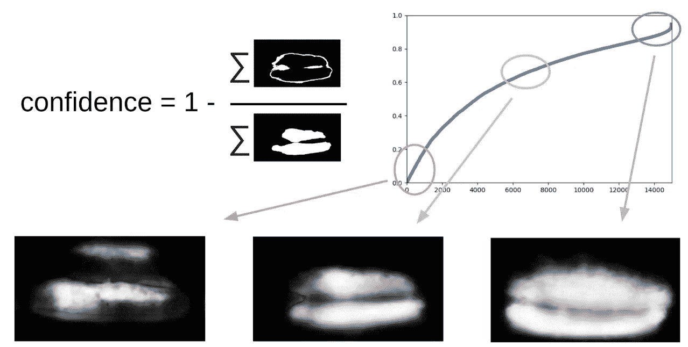

然后，我必须手动确定置信度的某个阈值，我们将使用该阈值来形成新的训练集。也可以选择标记出最复杂的样本，这样集合就失败了。我认为这将是有用的，并在消化午餐时自己标记了大约 20 张图片。

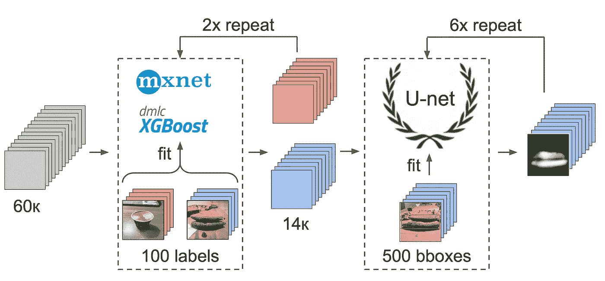

# **最终模特培训**

最后——最后的模型训练。为了准备样本，我用蒙版提取了地壳区域。我还通过扩张来稍微膨胀蒙版，并把它应用到图片上来去除背景，因为它不应该包含任何关于面团质量的信息。然后我从 Imagenet 微调了几个模型。总之，我收集了大约 14k 个合适的样本。因此，我没有训练整个神经网络，而只是训练最后一组 conv 层，以防止过度拟合。

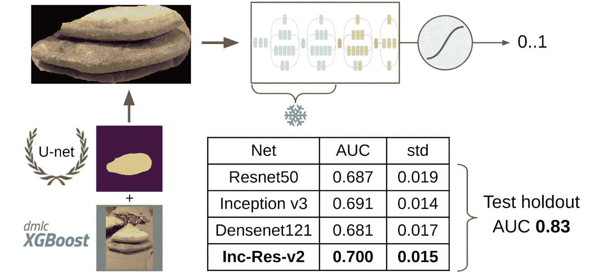

最好的单一模型是 Inception-Resnet-v2，其单一模型的 ROC-AUC 为 0.700。如果你不选择任何东西并在没有遮罩的原始照片上训练网络，那么 ROC-AUC 将是 0.58。

# **验证**

在我开发解决方案的时候，DODO pizza 带着下一批数据回来了，有可能在一个诚实的拒绝者身上测试整个管道。我们在上面测试了整个管道，得到 ROC-AUC 0.83。

但是，我们还是不能不犯错误。并考虑到它们出现的原因，再次对模型进行训练，取得了积极的效果。现在让我们看看错误:

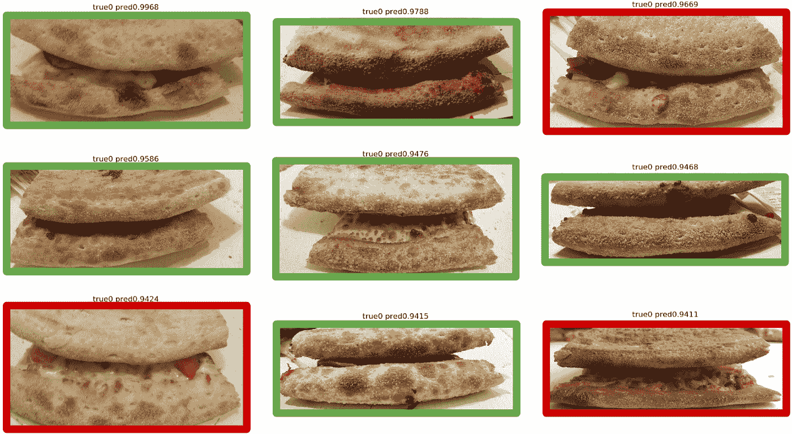

Top False Positive

这里可以看出，它们与面包皮标记错误有关，因为有明显的生面团变质迹象。

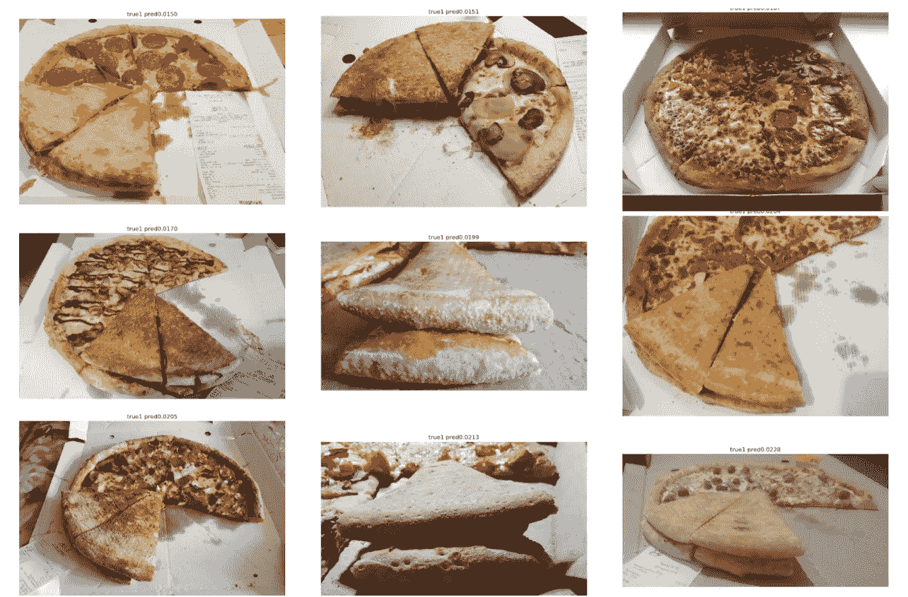

Top False Negative

这里的错误是由于第一个模型未能选择正确的观点，导致难以定义优质面团的关键特征。

# **结论**

我的同事有时取笑我用 Unet 通过分段解决了几乎所有的任务。但是我仍然希望他们会喜欢它，因为这是一个相当强大和方便的方法。它允许可视化模型错误并满怀信心地预测它们，这有时真的可以挽救局面。此外，整个管道看起来非常简单，现在有一堆可用于任何框架的存储库。

就这样。现在是时候吃块披萨放松一下了。干杯！