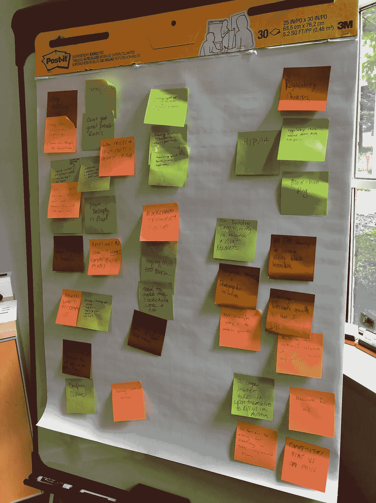

# 你的团队知道什么会杀了你。

> 原文：<https://medium.com/hackernoon/your-team-knows-whats-going-to-kill-you-63f171c50ad9>

## 做一次黑色天空头脑风暴，找出并拯救你的创业。

今年，我与人合伙创办了一家名为[正派](https://www.decent.com/)的公司，为自由职业者管理高额医疗保险计划。我们利用区块链让医疗保健变得更加实惠、透明和公平。正如我对[种子投资者](https://hackernoon.com/decent-com-just-raised-8mm-to-build-affordable-healthcare-for-all-554c15a739b6)所说，“我们正在用世界上最被夸大的技术处理这个国家最受监管的行业。会出什么问题？”

这些天来，我对这个问题有了一些很好的答案。

我花在担心我的创业公司上的时间有一半都浪费了；问题是我不知道是哪一半。我相信我们会成功，但是我们可能失败的方式太多了。我们会造没人要的东西吗？努力扩大规模？被竞争对手踩在脚下？我们可能会在深深的、不言而喻的焦虑中度过数年——许多创业团队都是如此。

但是有更好的方法。

上周，我们和来自 Maverick 的一些最聪明的投资者一起，进行了一次我称之为**黑色天空头脑风暴**的活动，以找出团队在担心什么，并将所有的焦虑转化为一个计划。

**黑天空头脑风暴适合谁？**

所有正在工作或想要创业的人，在他们旅程的任何阶段。尤其是那些有太多事情要做的人，以及有时盲目乐观地认为自己可以改变世界的人。如果这听起来像你，请继续读下去。

**什么是黑天空头脑风暴？**

“黑色天空头脑风暴”是一项练习，在这项练习中，你与团队成员(或者其他人)一起思考所有可能导致创业失败的不同因素。它结合了蓝天思维的自由探索和对可能出错的地方的清晰关注。这是你怎么做的。

1.  **安排一次与部分或全部团队成员的会议。**我建议至少 1 个小时，至少有 3 名具有独特职责的团队成员。确保包含那些不总是附和策略的声音。
2.  **分享一下你对失败的定义。**对我们来说，这意味着“在未来 3 年内，不能成为一家受人喜爱且快速增长的健康保险公司。”你也可以选择近期的事情，比如产品发布会或合作。
3.  确保每个人都有便利贴和笔。
4.  **启动定时器(我推荐 5 到 10 分钟)。让每个人默默工作，想出他们能想到的对你的企业的所有威胁。你追求的是数量——没有什么威胁是太荒谬的！**
5.  时间到了，把你的便利贴贴在担忧墙上，投票选出你最担心的事情。我建议每个参与者获得一票(所以如果有 5 个参与者，每个参与者获得 5 票)。
6.  **至少用 1 票谈论每个威胁，按票数递减顺序排列。**如果你没有时间了，这可以确保你覆盖到票数最多的人，但我建议你用投票来触及任何事情，这样所有的大问题都会被听到。你可能会提出问题并继续研究。
7.  **如果你发现一张大头照，枢轴。如果你没有，庆祝一下！**爆头是与会者在会议中或研究后一致认为不可逾越的风险。努力寻找它们是个好主意，尤其是在早期。

Here’s a Black Sky worry wall, pre-voting. Squint and you might see why healthcare is messed up.

**你会得到什么？**

*   **你会了解到你的团队担心什么(不担心什么)。这是关于发现新问题和优先处理已知问题。早期创业需要持续的乐观，没有什么比房间里的大象更能扼杀乐观，尤其是领导者似乎看不到的大象。**
*   你会得到一个优先列表，列出你焦虑的地方。准备、瞄准、开火同样适用于担忧。
*   你会创造一个安全的心理空间，让人们敞开心扉。谷歌发现心理安全是高绩效团队的一大特质。当你分享了你的担忧，谈论错误就容易多了。
*   你会在会议中解决一些顾虑。当你把几个聪明的大脑指向一个问题时，会发生惊人的事情。
*   制定一个好的计划会让你们兴奋不已。你知道那种感觉。啊，是啊。

我很兴奋看到人们用这个做什么。如果你有问题或想法，给我发电子邮件到[nick@decent.com](mailto:nick@decent.com)。