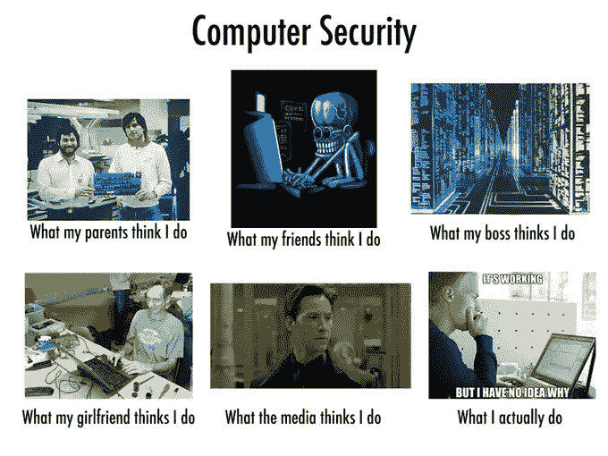
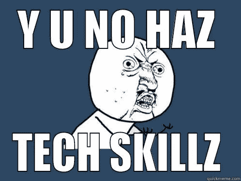

# 你的技术技能只能帮你这么多

> 原文：<https://medium.com/hackernoon/your-tech-skills-only-take-you-so-far-aa4f28283a82>

孤立、内向的程序员可能是现代文化中最常见的技术刻板印象。不管是有意为之还是环境使然，事实上这往往是对的。我们很多人都是在家里自己的电脑上自学不同的技术技能，而不是在教室或计算机实验室里。

我们花了无数个孤独的周末、下午和能量饮料来学习不同的编码语言，不同的工具如何工作，以及如何创建我们自己的工具。

但是现在你已经进入职场，你不能只依靠你的技术技能。那太容易了，不是吗？现在，你喜欢的编码语言对你来说就像英语一样容易，工作中最具挑战性的部分将是你在会议中做的事情，而不是在你的电脑上发生的事情。

当你的职业生涯发展到这一步时，你必须开始学习你的辅导员几年前就警告过你的那些软技能。

是的，从工作中抽出时间来培养其他技能，乍一看似乎有悖常理。不，它可能没有你的其他工作有趣。不，这可能不是你想象中的科技职业。

但是，无论你的最终目标是在内部团队工作，在开发机构工作，做自由职业者，还是创办自己的公司，成功的职业生涯都需要与他人合作。这是没有办法的。随着你职业生涯的进一步发展，你可能会惊讶地发现，你的专业技能开始变得不那么重要，更多与管理相关的任务开始接管你的日常工作。

随着你的进步和你的角色开始改变，要轻松调整，现在就开始关注。学习以下技能将有助于你在职业生涯中更好地运用你的专业知识。

# 长期思考

当你在学习编程或开始第一份工作时，你不一定要磨练你的战略、全局思维技能。你正在完成交给你的任务和指派给你的任务，而成功就在于遵循指示或建立一个期望的结果。让你的老板高兴，不要打破任何东西，你可能会做得很好。

然而，最终你可能会成为给出指示而不是接受指示的人，决定做什么而不是怎么做。这涉及到更多的战略，而不是战术或技术。这是一种不同的思维，需要一些时间去适应。

在科技领域工作时，为了磨练你的全局思维，尽量记得尽可能地缩小画面。考虑你的产品被使用的环境，涉及的情况和行为。

也试着了解你工作中相邻的专业。

例如，[产品团队和营销团队紧密合作](https://www.invisionapp.com/blog/design-marketing/)推出新产品和新功能。更多地了解你的营销团队使用的原则和他们遵循的策略将有助于你在合作时做得更好，这是另一项重要的[技能](https://hackernoon.com/tagged/skill)，我们将详细讨论。查看他们的营销工具，如 [HubSpot](https://www.hubspot.com/) 仪表盘，想象销售线索是如何成为客户的，或者亲自经历所有营销活动和渠道，这有助于让你在初次体验你的技术的人心中留下印象。

# 积极主动性

除了能够调查和评估全局，你还需要能够平衡准备和反应。尤其是如果你在一家初创公司工作，快节奏的环境在科技行业很常见。软件分发和修补不断发展的技术总是会导致计划复杂化，这经常发生在周五下午 4 点。

对问题的预测和反应——不管它们是否已经引起了复杂化——是自给自足、领导力和项目管理的关键。采用强大的 IT 战略和使用专用工具可以防止因安全补丁和类似问题导致的停机。

例如，使用[云管理套件](https://www.cloudmanagementsuite.com/)，您可以在重要软件和固件补丁可用时收到提醒，让您有机会在方便的任何时间和地点安排并高效分发更新[。如果你的职业目标包括承担更多的责任和管理，那么在多任务处理的同时有效解决问题就变得更加重要。](https://youtu.be/weRHyjj34ZE)

这也涉及到大量的观察和优先排序。为了主动发现并解决问题，你需要尽可能地了解你的工作环境。因为一个优秀的经理通常能在任何给定的时刻发现大量潜在的改进或问题，区分哪些是最重要的可以防止过度劳累和不知所措。

# 合作

最后，你需要善于与他人合作。这不仅仅意味着能够和你的同事交往。你们需要有效地合作，如果管理是你的梦想，那就有效地领导。

与同事在网上和网下的良好沟通会让每个项目变得更容易，所以保持清晰不会被忽视。同样，能够很好地解释和分解概念和系统也会让你成为那些在你下面工作的人或你自己的客户的更好的老师和导师。

如果组织不是你的强项，你会希望很快与任务管理工具如 [Trello](https://trello.com/) 成为朋友。否则，你将成为团队中落后并制造瓶颈的一员，没有人想成为那样的人。

# 跟上速度

说到在 it 行业工作，你的技术技能足以让你得到这份工作，但一旦你得到了这份工作，他们就为你提供了公平的竞争环境。在你的职业生涯中创造动力的是发展这些技能之外的技能，让你成为一个更好的合作者和领导者。