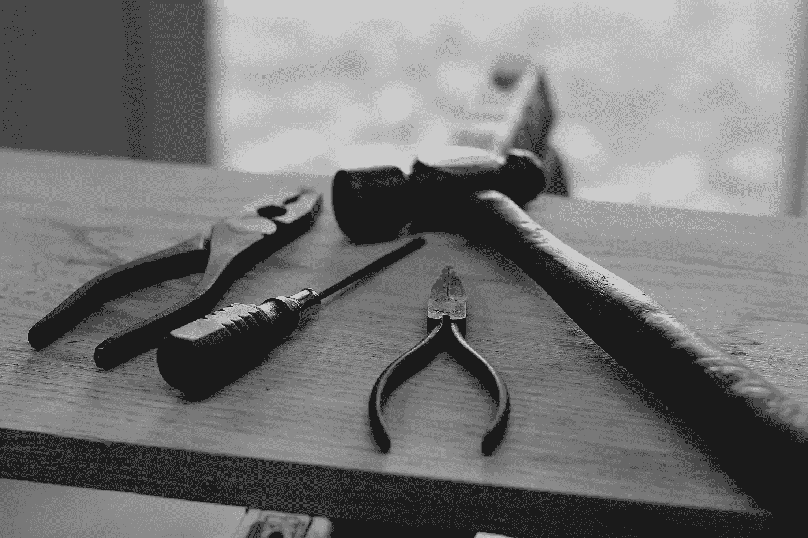

# 你的工具箱

> 原文：<https://medium.com/hackernoon/your-toolbox-d4eaf001c4f1>

在今年夏天寻找实习机会的过程中，我决定不再专门寻找[编程](https://hackernoon.com/tagged/programming)实习机会。我知道这对一个计算机科学专业的学生来说很奇怪，但是我这样做是因为我对编程之外的许多其他事情感兴趣。我遇到了非编程实习面试官的一个常见问题——他们会问我*“嗯，你知道这不是编程实习，这对你来说是个问题吗？我这么问是因为过去我们有过学习计算机科学的实习生，他们只想编程。”*

当我面对这个问题时，我是这样回答的…

我们都有一个[工具箱](https://hackernoon.com/tagged/toolbox)。如果你正在学习计算机科学，你盒子里的工具可能是编程。如果你是一个博客写手，你盒子里的另一个工具可能是写作。你盒子里的工具甚至可以成为你与他人交谈或不断挑选完美 Instagram 过滤器的能力。

例如，我是一名程序员，所以我的技能之一就是编程。然而，这并不意味着我只能寻找需要我编程的工作。编程对我来说就是一把锤子。锤子是一个非常有用的工具，但是我做的，或者想做的每一个项目，可能都不需要锤子。有些项目需要扳手、锯子等。

我已经接受了一份非编程实习。我将为纽约的一家公司从事社区建设、数据收集和内容更新工作。在学年期间(9.5 个月)，我努力使我的编程技能达到最好。我认为调整我的其他技能是很重要的，这也是我写博客并接受一份非技术性实习的原因。

重要的是要认识到我们的技能是我们工具箱中的工具，而不是定义我们的东西。我们可以根据需要从一个工具跳到另一个工具。

> 🔨🔧你箱子里最喜欢的工具是什么？🔧🔨