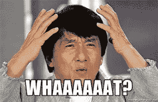
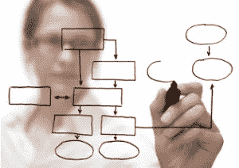
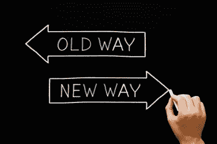
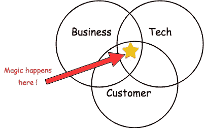

# 你把故事做错了！

> 原文：<https://medium.com/hackernoon/youre-doing-stories-wrong-bfd8623977c7>

“你一定是在和我开玩笑！别跟我说我不知道怎么写故事！”我无意中听到我的 scrum 团队中的一位 BA 收到了对他的故事的批评性反馈。

等等。后退一点。什么是故事？

朋友们，今天早上，在我位于悉尼 CBD 中心的公司生活的一个角落里，我们将谈论一些故事，好的，坏的，以及不光彩的事情。

在敏捷出现之前很久，在软件世界里——人们和企业以需求的形式指定他们想要什么。这些需求中的大部分都存在于需求文档中，获取、验证和确认这些需求的过程花费了很长时间。那是一个不同的世界。

快进到现在，随着市场需求的不断变化，能够适应市场需求变得至关重要。敏捷来了，它带来了像 scrum 这样的技术来建立有效的团队，同时交付[产品](https://hackernoon.com/tagged/product)增量，并且(希望)更快。

关于“故事”的故事是，它是一个要求。就像敏捷中的其他事情一样，开始这个项目的优秀人员确保它有一个公式。这很简单:

作为一个<user>，我想要<functionality>，这样</functionality></user>

正如你所看到的，有一个指向用户视角的焦点。很公平。这允许每个人(技术或非技术人员)掌握构建我们的项目所需的工作。

那么，如果故事相对容易创作，那么为什么这个人在工作中当有人告诉他他做错了时会大发脾气呢？

在你的故事中，你做错了什么？

# 你在写一个循环的故事

你可能在你的吉拉门票里见过这些。没有明确优势或驱动因素的故事。故事是这样写的:

作为一名顾客，我希望能够定制我的比萨饼订单，以便*。*

Mmm pizza..

想想这个。你想定制你的比萨饼订单，因为你需要定制？因为你这么说？因为产品负责人这么说的吧？

好处不清楚。大多数写故事的人倾向于在事后才写故事的好处部分。这真的很遗憾，因为这可能成就你的故事，也可能毁掉你的故事。

作为一名顾客，我希望能够定制我的比萨饼订单，以便我可以将非传统的浇头组合添加到我的比萨饼中。

现在，这个故事的观点是，顾客现在有能力选择通常不在一起的浇头，或者他们有能力在他们的比萨饼中加入各种各样的浇头。嘣！

# 你不知道该为谁写这个故事

所以你写一些重要但不相关的故事，比如:

作为解决方案架构师，我需要编写设计，以便团队可以开始工作。

如果你看到或尝试这样的故事，省省力气，把它写在你项目的待办事项列表中，或者列为吉拉的一项任务。这不是一个故事，兄弟！

# 你没有更新故事

担心是你应该更新故事还是其他人应该更新？规则是什么？

**没有规则！**让你的团队知道故事需要更新，不要等别人来做，你主动去做，你的故事只会变得更好。关注这些故事不仅仅是产品负责人和 BA 的工作。也是你的。如果他们对更新故事有点敏感，把它添加到评论区。

关于更新吉拉门票评论的警告。尽量避免通过混乱和冗长的信息进行曲解。你有没有看过一个吉拉的故事，里面有很多评论，你应该浏览这些评论才能理解其中的含义？加油！那只是不好的形式。试试这个——当你的小组达成一致或决议时，更新故事的主体，并附上任何必要的图表来支持它。

# 没有人理解你的故事

这是一个嗅觉测试。如果人们对你的故事反复提问，如果他们曲解了你的故事，如果他们没有对你的故事采取行动，如果他们避免这样做——迹象表明你的故事很糟糕！

我和沮丧的 BAs、产品负责人和 Scrum 大师有过无数次的对话。他们抱怨是他们的团队没有理解他们的故事，或者是团队太慢，或者是新的，或者是完全没有希望。

真的吗？

后退一点，如果我向你解释一个概念，而你不明白，那是我的责任。如果我再试一次，你还是不明白——它还是在我身上。如果我们再试一次，仍然不动，你不明白——它仍然在我身上。

要明确的是，如果你仍然不明白某个概念，我可以向你解释的次数是没有限制的——这仍然取决于我！正如一句谚语所说:“没有坏学生，只有坏老师。”

Mr. Miyagi is an example of a good teacher not only to Daniel san

# 那么如何让你的故事不臭呢？

## 使用图表

一幅画确实胜过千言万语！

现在根据你的需要有很多类型的图；他们并不都是平等的(没错！仅仅把盒子放在一起并把它们连接起来不会解决你的问题)取决于你试图解决的问题——有技术图、过程图、逻辑图。

我建议在这些方面做一点功课，因为它可以使世界变得不同！

再次强调，这里的重点是帮助沟通。如果你的故事迫切需要更好的解释，那么考虑用图表展示逻辑。

我最喜欢的是:

*   [**上下文图**](https://en.wikipedia.org/wiki/System_context_diagram) 用于高层上下文和理解区域如何交互；
*   [**活动图**](https://www.smartdraw.com/activity-diagram/) **，** [**流程图**](https://en.wikipedia.org/wiki/Process_flow_diagram) 用于捕捉流程工作；
*   [**状态图**](https://en.wikipedia.org/wiki/State_diagram) **，** [**序列图**](https://en.wikipedia.org/wiki/Sequence_diagram) —用于捕捉运动部件、消息和状态。
*   技术类如方案设计、[类图](https://en.wikipedia.org/wiki/Class_diagram)。

## 使用示例

使用一组现实生活中的例子来捕捉棘手的场景和预期的结果。

## 使用逻辑或规则表

避免容易被误解的冗长的规则(如果可以的话),使用规则/逻辑表。

例如:
你的比萨上的附加成本的逻辑表，取决于组合。

## 明智地使用验收标准

验收标准的公式为:

“鉴于<action>那么</action>

Look, no one is going to have a heart attack if you don’t follow the formula. The point of acceptance criteria is to capture the logic and interaction between the **业务** — **客户**—**技术**。

验收标准将很快告诉你这个故事是否被构建和测试它的人考虑得足够充分。

那么，业务—客户—技术之间的互动是什么呢？

# 镜头业务—客户—技术

下次你创作或看一个故事的时候，我希望你记住这三个镜头:商业——客户——和技术。

中间神秘的地方是魔法发生的地方。你想在这块地上操作；你想让你的故事出现在这部分。这里是您的故事考虑业务的地方，以便您了解其关键价值，在您创建解决方案时考虑客户的体验，并且您了解将允许您执行解决方案的技术环境。

The intersection between tech — business — and customer. In my mind, it looks like!

许多 Scrum 团队的错误在于他们过分强调一个镜头而忽略了另外两个。因此，当他们构建故事时，团队在许多方面都遭受了损失:
*他们在代码中遇到了他们没有预料到的特殊逻辑。
*从客户的角度来看，他们创造的东西使用起来很别扭。
*他们过度设计了某个价值很小的特定功能。
*他们努力扩大规模，因为他们变得依赖 scrum 团队成员的知识。

# 那么，你如何避免所有这些心痛呢？

下面是一些引导性问题的例子，可以帮助你引导这三个镜头。当你通读它们的时候，你可能会发现更多；关键是，现在你正从这些镜头往下看这个故事:

## 商业

侧重于解决优先级和范围问题。
*这个特性会给产品和公司带来什么不同？它会与他人竞争吗？是带功能性能的吗？审美？整体体验？
*该功能试图为团队解决的潜在驱动因素或问题是什么？现在市场上发生了什么？我们还能以什么方式帮助解决这个问题？
*这会给企业带来多大的重要性和价值？

## 顾客

解决客户体验、互动、触发因素和逻辑问题。站在客户或用户的角度，问这些问题:

*在引发这种情况之前，他们必须做些什么？(前提条件)(输入)
*如果我是客户，我希望在屏幕上看到什么？(输出)
*作为客户，我需要做些什么？(交互)
*这些行为对我来说应该是显而易见的吗？
*通过这个故事，我将解决哪些客户问题或烦恼？
*顾客的快乐之路是什么样的？
*客户可能会做哪些不太可能的情况？取消、选择退出等…
*原型有帮助吗？一个例子和图表会有帮助吗？

## 技术

由客户触发的寻址技术解决方案
*需要什么格式的报告/消息？有我应该坚持的现有规则和逻辑吗？
*用户这样做时哪个系统触发？
*一旦用户触发什么，需要发生什么交互？
*有什么业绩预期吗？
*从系统的角度来看，幸福之路是什么样的？
*当异常被触发时，对系统的期望是什么？
*解决方案架构在哪里？技术图表会有帮助吗？谁将阅读解决方案？

无论如何，这不是一个详尽的清单。仅将此作为指南。它旨在引发你的思维去考虑这三个镜头。

你怎么知道一个故事已经写好了？这可能需要另一篇文章，但是现在，我将用“哦，你会知道的！”来结束这篇文章

## 嘿！感谢阅读！我是 Juliet Lara，我写关于生活、学习、技术、创业和交流的文章。

## 如果你喜欢读这篇文章，那么请点击拍手来分享你的爱。他们给了我前进的动力:)

## 您可以通过 twitter @ julietlspeaks 联系