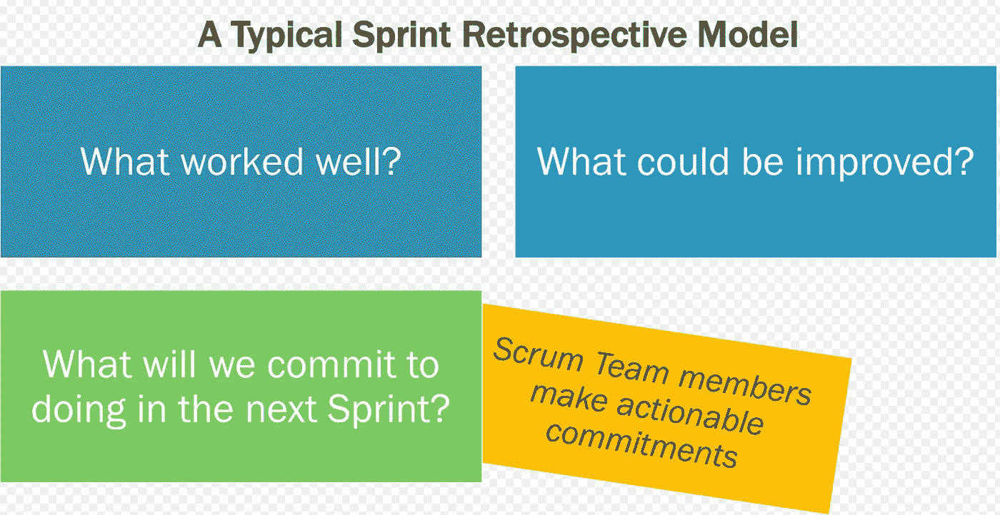
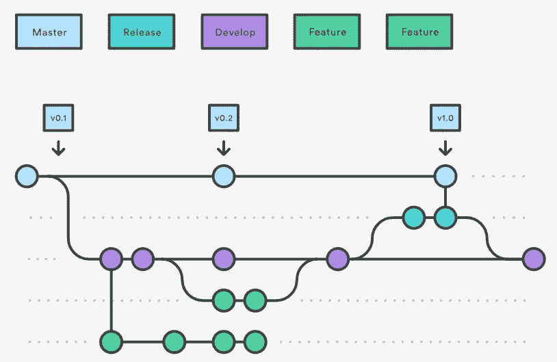
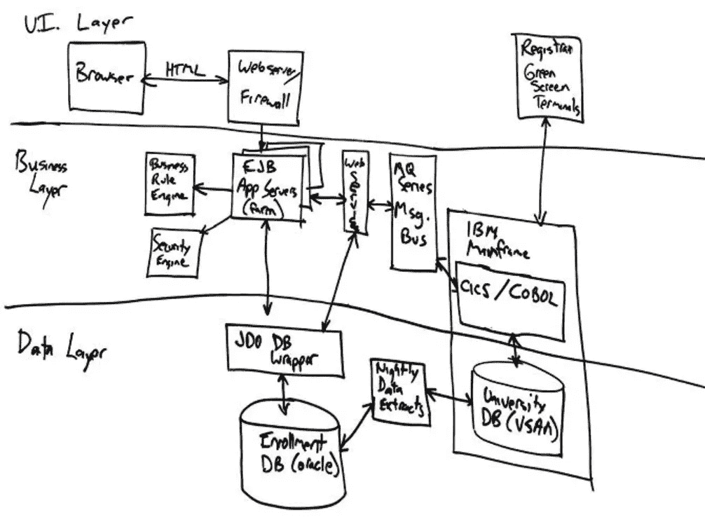
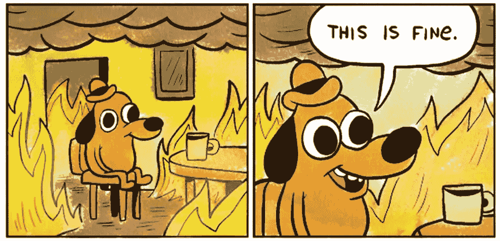
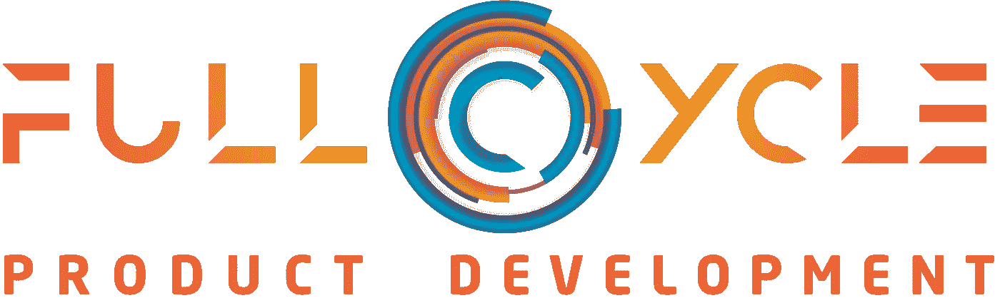

# 你没有支付软件开发的真正成本，这正在扼杀你的业务

> 原文：<https://medium.com/hackernoon/youre-not-paying-the-true-cost-of-software-development-and-it-s-killing-your-business-8d44b54be055>

在建立一个公司的时候，你经常要做出牺牲。永远没有足够的时间、金钱或才能来完成所有的事情。当然，你想以正确的方式来构建你的产品，但是你必须快速地构建一些东西，这样你才能筹集资金，或者推出新的功能，这样你才能获得大客户。没有时间计划了！我们必须快速行动！我懂了。

然后有一天，你终于站稳了脚跟。你已经获得了一些牵引力，你已经获得了收入，你正在快速增长。你一直在努力，努力，摧毁它。你已经到了。

现在你开始注意到有些不对劲了。您的工程师过去能够快速开发出新功能，但他们现在错过了最后期限，并且他们很难告诉您什么时候能完成工作。在生产过程中，事情变得越来越频繁，你会觉得自己一直处于救火模式。系统似乎变慢了，你的用户在抱怨性能和 bug。你的员工似乎筋疲力尽，也许你已经失去了一些人，你的新员工很难跟上速度。

**你现在陷入了技术债务的泥潭。**你为了达到现在的位置而走的所有捷径都在扼杀你的生产力、士气和业务。你逃避了支付软件开发的真正成本，现在债务到期了，*连同利息*。

我咨询过的几乎每家公司都在某种程度上存在这个问题。一定数量的技术债务是可以原谅的，但是你需要开始偿还它，否则你的生产力将会停滞不前。当然，这会增加开销，但是随着你的团队通过清除障碍获得动力，你会开始看到你业务的每个领域都有所改善。这是无法避免的，所以你不妨现在就开始。让我们讨论一些你可能没有支付软件开发真实成本的关键领域，以及一些你可以采取的重要步骤。

## 显色法

“我们做 Scrum，差不多吧”是我从我遇到的几乎每个客户那里听到的一句话。这通常意味着他们使用吉拉来跟踪任务，并将他们的工作时间限制在冲刺阶段。也许在冲刺阶段结束时，他们会发布产品。大概就是这样。

然而，他们忽略了敏捷开发的一个最重要的方面:**回顾**。敏捷开发的基础是基于反思和持续改进。抛开 Scrum、看板或 Mob 的所有其他方面。如果你不在每次冲刺后做回顾，你永远不会进步。是的，这需要时间，但是如果你不投资于你的成长，你将永远不会成长。

有效的回顾是一个反思、交流、集思广益和实验的过程。我们讨论了在最后冲刺阶段哪些进展顺利，哪些进展不顺利。我们以建设性和诚实的方式相互交流我们的挫折。我们集思广益，调整流程或沟通以进行改进，并承诺在下一次冲刺阶段尝试新的流程。失败的想法会被抛弃，成功的想法会融入到前进的过程中。

Credit Scrum.org

## 需求定义

产品管理和工程之间往往存在语言障碍。产品经理通常考虑用户利益，而工程师考虑技术实现。项目经理想的是高水平，而工程师则是低水平。这种沟通的中断会导致浪费大量的时间和精力来清晰地定义目标以及如何详细地实现它。

你的项目经理应该在一个有效的 [**用户故事**](https://help.rallydev.com/writing-great-user-story) 中捕捉功能的远景。然后，他们必须考虑各种用例的所有“假设”场景。我通常用一系列 if-then 语句来描述用户故事，这些语句尽可能多地考虑了边缘情况。您还应该包括验收标准，最好是以测试用例的形式。虽然你肯定想给开发人员留有发挥创造力的空间，但是对于成功是什么样子，不应该有任何模糊之处。

## 代码审查

在回顾之后，代码审查是软件开发中第二重要的仪式。这不仅仅是一行一行地遍历代码，而是解释用户故事，验证它有真正的成功标准，证明它正确工作，并确保代码符合标准。

我的代码审查过程如下:

*   **描述要解决的问题—** 审核功能要求，解释目的和目标。
*   **评审成功标准—** 评审与特性相关的测试用例。确保对“完成”有一个明确的定义。
*   **审查代码—** 解释架构和设计。寻找对编码标准和最佳实践的遵守。确保代码是干净的，并且有良好的文档记录。寻找改进架构、模块化、安全性和性能的机会。
*   **演示代码—** 展示该特性在测试环境中的预期效果。浏览测试用例，并证明该特性在功能上是完整的。
*   **审查测试和部署自动化—** 确保开发了某种程度的测试和部署自动化来支持该特性。展示自动化测试被集成到 CI/CD 管道中。
*   **在拉请求和任务中捕获注释—** 将代码评审中的注释粘贴到拉请求和原始任务中，作为代码评审成功完成的审计跟踪。

## 代码管理

当我接触新客户时，我首先会在代码库中寻找混乱的地方。我见过数百个从一开始就没有被移除的分支。我见过没有提交消息的提交。我见过开发人员不经过代码审查就直接提交给 master。我曾见过开发人员反对与产品不同步的修订。恐怖..*恐怖！*

对于初学者，**使用** [**Git 工作流**](https://www.atlassian.com/git/tutorials/comparing-workflows/gitflow-workflow) 。每个开发人员都应该为每个新故事创建一个新的特性分支。当一个特性完成时，它应该被合并到一个[开发](https://hackernoon.com/tagged/development)分支中。当一个发布被推向生产时，一个发布分支应该被创建为该发布的工件。在发布之后，特征分支应该被删除。

Credit Atlassian

**使用拉请求合并分支。不要直接进入主分支。在没有首先执行代码审查的情况下，不应批准任何拉取请求。**

**创建有意义的提交消息，并为分支使用描述性名称**。你的代码历史应该是可读的，就像你的代码。

## 体系结构

想象一下，如果你试图建造一座没有蓝图和地基的房子。你决定开始拼凑木板，因为你需要尽快把房子建好。如果你在建一个树屋，而不是摩天大楼，这可能行得通。软件也是如此。

*   **使用框架**，并坚持使用。让它们保持最新。不要多此一举，使用类似 [**Laravel**](https://laravel.com/) 、 [**Express**](https://expressjs.com/) 、 [**Rails**](https://rubyonrails.org/) 、 [**Django**](https://www.djangoproject.com/) 等框架。
*   **使用面向对象的设计**。组件之间的任何交互都应该通过 API 或对象接口来完成。可重用组件应该放在一个类中。
*   **抽象和保护数据库。**数据库交互层是最大的安全风险和重构工作的来源。创建坚实的数据层，这是编码和安全标准的圣地。不允许该层之外的任何数据库交互。
*   **使用 API 在主要组件之间进行通信**。如果可能，采用微服务模型。API 允许系统通过额外的主机和负载平衡器轻松扩展。
*   **尽可能使用设计模式**，例如 MVC/MVVM、工厂、单例、观察者等。
*   **使用面向对象[设计](https://hackernoon.com/tagged/design)的** [**坚实原则**](https://hackernoon.com/solid-principles-made-easy-67b1246bcdf) 。
*   **限制嵌套循环和递归**，一般注意 [**代码复杂度**](https://rob-bell.net/2009/06/a-beginners-guide-to-big-o-notation/) 。

## 数据模型设计

数据模型是软件的基础。如果有一个领域需要在早期关注，那就是创建一个清晰的、逻辑的、可伸缩的数据模型。由于每段代码都写入或读取同一组数据表，因此以后要改变您的数据模型非常困难。我发现对现有的代码库改造一个新的数据模型是最昂贵的维护。

*   使用合适的数据类型。例如，不要在 varchar 字段中存储数值或日期时间数据。
*   **使用视图从代码中抽象出数据模型。这允许你以后很容易地改变底层的数据结构，而不需要改变代码。**
*   [**根据可能的查询用法在表上创建索引**](https://dev.mysql.com/doc/refman/8.0/en/create-index.html) **。这大大提高了查询性能。索引最适用于具有重复值的字段。例如，包含颜色的字段上的索引将比日期-时间字段上的索引执行得好得多，在日期-时间字段上，大多数值都是唯一的。**
*   **使用结构化参考数据的参考表。**大多数数据模型包含具有一组预定义的可能值的字段。例如，汽车可能只有有限的几种颜色。引用表包含维度的所有可能值，以及描述每个选项的 ID 和任何相关元数据。
*   只要两个表之间存在多对多关系，就使用链接表。不要使用像 field1、field2、field3 这样的冗余字段。链接表应该包含两个表的外键，以及描述两个记录之间关系的任何元数据。例如，将人与汽车关联起来的链接表可能包含字段 years_owned 和 is_primary_driver。
*   **在发布报告时，创建报告表可以大大提高性能。**您应该避免在运行时执行复杂的计算。通过创建一个表来预缓存报告，该表包含填充报告所需的所有字段，无需任何附加连接。应该为主要过滤标准创建索引

## QA 和测试自动化

QA 并不意味着对一个新特性进行测试。这并不意味着遍历主工作流，只使用明显有效的输入。QA 是试图以一种彻底的、预先确定的、有条不紊的方式打破系统。

首先，您应该使用适当的模板创建测试用例，例如:

**测试用例 ID:** 一个数值，将被测试计划文档引用。它可能是吉拉任务的 ID。

标题:一个描述性的句子，通常以它测试的组件为前缀，比如 Login 或 Purchase。

**描述:**一个简短的段落，给出你正在测试的特性的上下文，以及它应该如何表现。

**前提条件:**设置测试用例必须做的事情，比如“必须以管理员身份登录”

**测试步骤:**执行测试用例的详细步骤。它们应该写得尽可能清晰和简洁，并且应该是“防误的”，这意味着任何人都可以在没有任何系统知识的情况下执行它们。

**预期结果:**如果测试通过，您应该期望看到什么。还是那句话，要写得清清楚楚，零歧义。如果没有达到预期的结果，测试就失败了。

当您创建新的测试用例时，您应该在测试计划文档中捕获它们。这通常是一个电子表格，列出了每个 QA 周期应该运行的所有测试用例。我使用一个 [**主模板**](https://docs.google.com/spreadsheets/d/1iM6SuMXEam7Ml64f9stgYjmi7nKrfyALiDQNlDyxpw0/edit?usp=sharing) ，我为每个版本复制它。当我们运行每个测试用例时，我们在工作表上设置一个通过/失败值，并在失败时链接到一个错误报告。作为我们部署过程的一部分，我们确保 QA 在发布之前已经交付了一个完整的测试计划。

在测试计划中，我指定测试用例是否适用于冒烟测试、完全回归测试和/或部署后验证。我还说测试是否已经完全自动化。我还包含了一个后续 bug 任务的链接，以防测试失败。

## 部署自动化和服务器配置

手动部署会带来难以置信的风险。如果您的开发人员(他们可能面临着按时发布的压力)忘记了一长串部署清单中的一个步骤，就会造成严重的破坏。他们必须确保部署正确的代码分支，提升数据库模式更改，部署参考数据，并在整个环境中一致地部署任何新的基础架构更改。出错的余地太大了。

您的所有部署和资源调配都应该编写脚本并实现自动化。使用类似于 [**厨师**](https://www.chef.io/chef/) 、 [**团队合作**](https://www.jetbrains.com/teamcity/) 、 [**詹金斯**](https://jenkins.io/) 或者[中的一种其他可用的](https://dzone.com/articles/21-automated-deployment-tools-you-should-know)连续部署工具。使用 [**Docker**](https://www.docker.com/) 、 [**Heroku**](https://www.heroku.com/) 、 [**Kubernetes**](https://kubernetes.io/) 或[vagger](https://www.vagrantup.com/)自动配置和扩展您的服务器基础架构。对于测试自动化，使用 [**Selenium**](https://www.seleniumhq.org/) ，[**Mocha**](https://www.npmjs.com/package/mocha)**+**[**Chai**](http://www.chaijs.com/)， [**phpUnit**](https://phpunit.de/) ，或者您选择的模拟语言。

## 监控和警报

当事情真的出错时(相信我，它会出错)，你怎么知道呢？你会等着客户打电话投诉吗？如果你被黑了或者被销毁了，你是想马上知道，还是在你的平台崩溃之后？

您应该为基础设施资源、URL 和 API 端点以及错误日志设置强大的应用程序监控和警报。对于错误日志，我是[**elastic search**](https://www.elastic.co/)**/**[**Logstash**](https://www.elastic.co/products/logstash)**/**[**Kibana**](https://www.elastic.co/products/kibana)**【麋鹿】**栈的忠实粉丝。如果你在 AWS 上，你可以把它设置为交钥匙服务。这个堆栈允许您以 JSON 格式发布带有标签和值的日志，然后您可以在 Kibana 中搜索和过滤这些日志。您可以基于日志数据创建仪表板、报告和警报。你不再需要登录服务器，扫描大量的文本文件来找出你的系统有什么问题。

对于端点测试，我使用了 [**Runscope**](https://www.runscope.com/) 和 [**NewRelic**](https://newrelic.com/) 。您可以创建简单的测试来命中您的关键 URL 和 API 并解析响应。然后，您可以创建警报，告诉您系统是否没有响应或返回错误。

## 安全性

安全性是软件开发的大妖怪。没有人能够绝对安全，投资于安全确实会阻碍敏捷性。这很不方便，但却是必要的。然而，我见过完全无视安全的公司，只能用胡萝卜或大棒来说服他们投资安全。要么他们必须符合 HIPAA 或 PCI DSS 以避免罚款，要么他们可以销售增强的安全性作为一个差异化因素。

我将安全性视为一组业务风险。安全风险主要分为三类:系统可用性、数据丢失或数据泄露。我为我的客户创建了一个风险登记册，其中包括所有可能出错的事情，以及它们在这三个方面对业务的影响。然后，企业对风险进行优先排序，我们努力堵塞漏洞。我总是参考安全编码标准的 [**OWASP Top 10**](https://owasp.org/images/7/72/OWASP_Top_10-2017_%28en%29.pdf.pdf) 指南，以及基础设施、数据库和物理安全的 [**PCI DSS**](https://www.pcisecuritystandards.org/documents/PCI%20SSC%20Quick%20Reference%20Guide.pdf) 标准。

## 证明文件

啊，文档，每个程序员生存的克星，对吗？我们不想创建束之高阁的文档，或者一写完就过时的文档。我们没有时间写文档，我们需要推送更多功能！

当你的公司成长时，你开始雇佣新人，你将如何培训他们？他们将如何发现这个系统是如何工作的？如果他们改变一些逻辑，他们将如何知道什么会被打破？如果你不投资文档，你将不得不使用你的其他开发人员的时间来培训每一个加入团队的新人。如果你在文档上投资一次，你可以用同样的投资获得许多新人。

在业务的各个方面，我都是敏捷的拥护者，文档也不例外。我是维基的忠实粉丝，比如 [**Confluence**](https://www.atlassian.com/software/confluence) ，用于获取可以轻松更新和引用的基本文档。尽你所能获取信息。截屏，录制视频，截屏，尽一切努力把它记录下来，这样其他人以后可以参考。没有时间开发复杂的架构图？在白板上画出草图，然后用手机拍下照片。

Good enough! (Credit Agilemodeling.com)

## 运营支持工具

所有的平台都需要维护。您可能有失败的计划任务、数据清理任务和用户支持任务，这些任务都需要读取/写入数据库。任何重复性的操作支持任务都应该通过简单的软件工具实现自动化。然而，大多数公司避免了构建工具的成本，但从长远来看，通过将开发人员从开发中抽离出来以支持系统，最终会花费更多。

## 结论

在公司生命周期的早期，你可以避免很多这种开销。你可以拼凑一个 MVP，然后快速上市。在接缝开始撕裂之前，您可以缩放到某个点。不过，最终你将不得不接受这个项目，并开始支付软件开发的真正成本。你等待的时间越长，翻新的费用就越贵。

你认为这些有多少适用于你？拜托，你知道，我知道，我们都知道。不要让这成为你:

Credit interwebs

# 刚推出！获取免费的产品开发工具包！

我已经整理了一个完整的包来帮助企业家、初创公司创始人和首席执行官学习如何建立技术产品和业务。我免费赠送的第一部分是一个可定制的产品开发工具包。它包括我和我的真实客户一起使用的所有模板，帮助他们从想法到执行。[拿过来！](http://www.buildtherightthings.com/toolkit)

# 我想这个鼓掌的事情很重要，所以如果你做到了这一步，请疯狂地点击！