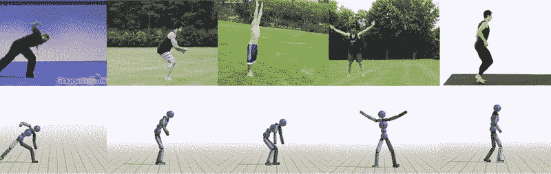
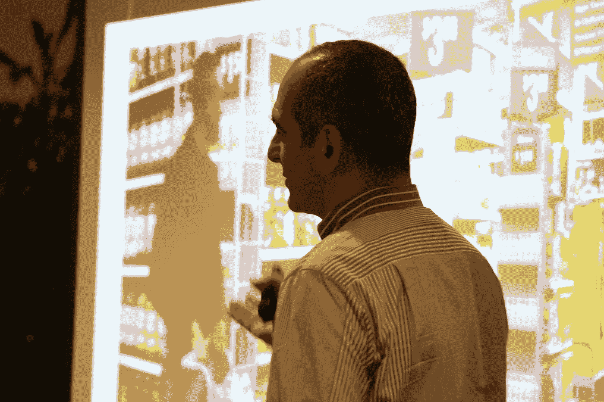
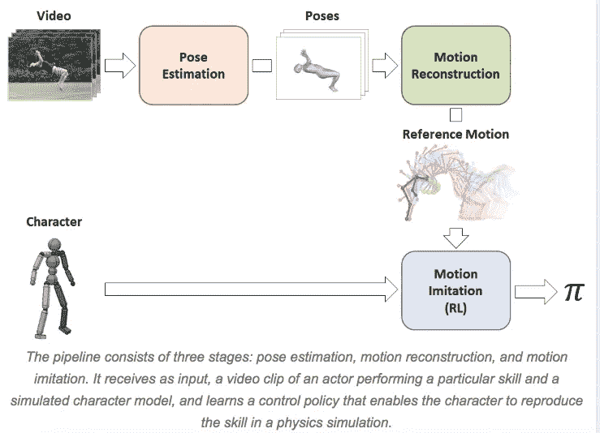
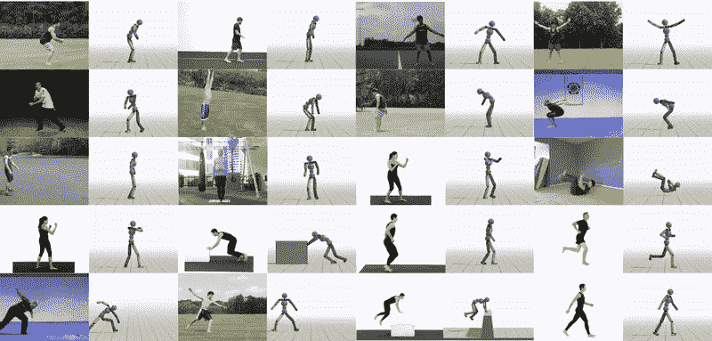
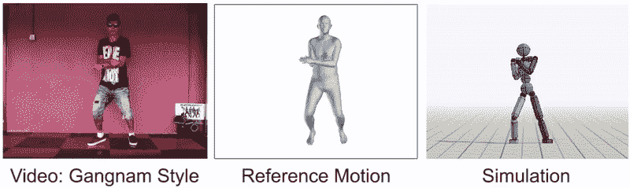

# YouTube 让机器变得非常智能

> 原文：<https://medium.com/hackernoon/youtube-is-making-machines-really-smart-48df30016d5b>

随着季后赛如火如荼地进行，每个人都在他们的演讲中散布棒球道歉，“我们只是在所有这些技术的第一局的底部，”Pano Anthos 在上周的机器人实验室论坛上宣布。在阐述他的观点时，Anthos 解构了一家 [XRC 实验室](https://www.xrclabs.com/)的投资组合公司，该公司利用计算机视觉来识别商店商品。“现在这项技术还不是很聪明，它需要亚洲的低薪工人来标记数据库中的图像才能工作，”Anthos 解释道。Ken Pilot 后来在与领先品牌分享他的经验时重申了这一观点，这些品牌仍在试图理解移动系统的影响，更不用说无人驾驶系统了。“未来的商店，”Pilot 描述道，“将会像亚马逊对在线消费者一样方便，让任何人都可以在任何时候找到他们想要的东西，而无需询问。”尽管这是他们的目标，但两位杰出人士都认为，公司仅仅为了技术而部署技术的过程中会有很多失误。晚会结束时，两位演讲者几乎是在暗示，开玩笑地指着一家机器人商店的店员，作为当前愚蠢状态的一个例子。

随着智能机器开始在各种各样的体力和智力追求方面超越人类，大卫·莱特曼称之为“愚蠢的机器人把戏”的太阳可能正在落山。2016 年 3 月，谷歌的深度思维软件程序 AlphaGo 击败了 reining 围棋冠军 Lee Sedol。围棋是一种起源于 3000 多年前的中国游戏，据说比国际象棋复杂 100 倍。李之前被认为是过去十年中最伟大的球员，获得了 18 个世界冠军。今天，AlphaGo 拥有排名冠军。

解构 Deep Mind 团队是如何跨越计算机科学家曾经不可能跨越的门槛的，可以为机器人学家提供可用工具的初级读本。根据 AlphaGo 网站的说法，“传统的人工智能方法，在所有可能的位置上构建一个[搜索树](https://en.wikipedia.org/wiki/Search_tree)，在围棋中没有机会。这是因为可能的棋步数量之多，以及评估每个可能的棋盘位置的强度之难。”相反，研究人员将传统的搜索树方法与深度学习系统相结合。“一个神经网络，即‘政策网络’，选择下一步行动。另一个神经网络是‘价值网络’，预测游戏的赢家。”然而，AlphaGo 的关键是让人工智能经历一个严格的“[强化学习](https://en.wikipedia.org/wiki/Reinforcement_learning)”方法，在那里它从游戏数据库中玩自己数千次。“我们向 AlphaGo 展示了大量强有力的业余比赛，以帮助它发展自己对合理的人类游戏看起来像什么的理解。然后，我们让它与不同版本的自己进行数千次的比赛，每次都从错误中学习，逐步改进，直到它变得非常强大。”

到 2017 年 10 月，人工智能变得如此强大，它绕过了包含职业和业余游戏的人类输入的强化学习过程，只玩早期版本的自己。新程序 AlphaGo Zero 以 100 比 0 击败了几个月前击败 Lee Sedol 的前一个程序，成为历史上最伟大的围棋选手。Deep Mind 现在正在寻求将这一逻辑应用于“一系列与围棋等游戏具有相似属性的结构化问题，例如规划任务或必须以正确顺序采取一系列行动的问题。例子可能包括蛋白质折叠、降低能耗或寻找革命性的新材料。”

强化学习技术不仅限于策略游戏，上周加州大学伯克利人工智能研究(BAIR)实验室的研究人员提交了一篇论文，使用 YouTube 视频训练类人机器人模仿动作。利用与 AlphaGo 类似的方法，BAIR 团队开发了一种深度学习神经网络，可以将在线看到的演员的动作近似为机器人的编程步骤。该团队在 Robohub.org 的帖子中解释道，“每分钟有惊人的 300 个小时的视频被上传到 YouTube。不幸的是，对于我们的机器来说，从大量的视觉数据中学习技能仍然非常具有挑战性。”为了访问这个训练数据的宝库，今天的程序员被迫购买和运送笨重的动作捕捉(mocap)设备来创建他们自己的演示视频。“Mocap 系统也往往被限制在室内环境中，只有最少的遮挡，这可能会限制可以记录的技能类型，”作者(Jason) Peng 和 Angjoo Kanazawa 说。为了应对这一挑战，彭和金泽着手创建一个无缝的人工智能平台，通过解开数小时的在线视频剪辑，让无人系统学习技能。

该论文指出:“在这项工作中，我们提出了一个从视频中学习技能的框架(SFV)。通过结合[计算机视觉](https://akanazawa.github.io/hmr/)和[强化学习](https://xbpeng.github.io/projects/DeepMimic/index.html)中最先进的技术，我们的系统使模拟角色能够从视频剪辑中学习各种技能。给定一个演员表演某种技能的单目视频，如侧手翻或后空翻，我们的角色能够学习在物理模拟中再现该技能的策略，而不需要任何手动姿势注释。”视频通过一个代理传送，代理将动作分解为三个阶段:“姿势估计、动作重建和动作模仿。”第一阶段预测主体初始姿势之后的帧。然后“运动重建”将这些预测重新组织成“参考运动”最后的过程用动画角色模拟数据，这些动画角色通过强化学习继续训练。这个平台实际上是彭和金泽的早期系统 DeepMimic 的升级版，用于动作捕捉视频。迄今为止，仅从普通在线视频中获得的 20 种不同技能的结果令人震惊，如下所示:

彭和金泽希望这种模拟在未来能够被利用，使机器能够在新的环境中导航:“尽管环境与原始视频中的环境有很大不同，但学习算法仍然为处理这些新环境制定了相当合理的策略。”该团队也对其进一步发展移动无人系统的贡献持乐观态度，“总而言之，我们的框架真的只是采取了任何人在解决视频模仿问题时都能想到的最明显的方法。关键是将问题分解成更易管理的部分，为这些部分选择正确的方法，并将它们有效地集成在一起。”

伯克利实验室谦虚地承认，大多数 YouTube 视频仍然太复杂，他们的人工智能无法模仿。彭和金泽异想天开地选择了跳《江南 style》作为其中一个跨栏项目。“我们仍然有所有的工作要做，”研究人员宣布，“我们希望这项工作将有助于激发未来的技术，使代理人能够利用大量公开可用的视频数据来获得真正惊人的技能。”毕竟还是第一局。击球手准备！