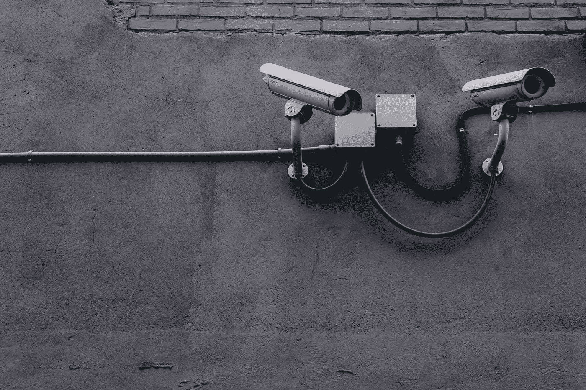

# 你一直都是产品

> 原文：<https://medium.com/hackernoon/youve-always-been-the-product-af22b8401e00>

## 早在脸书之前，你的个人信息就被买卖，只是没那么有效

“Two CCTV cameras on a gray wall” by [Scott Webb](https://unsplash.com/@scottwebb?utm_source=medium&utm_medium=referral) on [Unsplash](https://unsplash.com?utm_source=medium&utm_medium=referral)

# 你认为发生了什么？

这是关于我们个人数据的真相，它无处不在，除了我们自己，我们没有人可以责怪。

数据收集和数据共享早已成为我们生活的一部分。我们同意脸书的服务条款；我们加入了忠诚计划，我们整天在网上张贴和分享我们的好恶。

我们很久以前就放弃了自由，而且是自愿放弃的。

忠诚计划是迈出的第一大步。东西分？偶尔打折？我们成群结队地报名了。

我们还忽略了小号字体的说法，即他们从我们使用该卡中收集的信息和数据不属于我们。

我们中谁没有信用卡？现在没有一个很难过。

Visa、MasterCard 和 American Express 都会收集并出售您的人口统计和购买数据。

我们热爱我们的社交平台和移动应用。

你使用的每一个免费的网络服务都有 ***让你成为产品*** ，并有 ***把你的数据交给其他公司*** 。Twitter、[脸书](https://hackernoon.com/tagged/facebook)、Instagram、Reddit 和谷歌[都是包装在平台服务中的广告业务。](https://hackernoon.com/tagged/google)

即使你保护自己的隐私，尽量减少在社交媒体上的曝光，或者使用谷歌的替代品，你仍然生活在一个不断收集数据的世界里。

听说过 Acxiom、Datalogix、eBureau、CoreLogic、PeekYou 或 Rapleaf 吗？

他们都是数据经纪人，我保证他们对你的了解几乎和谷歌或脸书一样多，如果不是更多的话。数据经纪人从杂志出版商和报纸上收集你的订阅信息；通过浏览宠物供应链的购买历史，他们知道你更喜欢狗还是猫。从公共记录中，他们可以知道你开什么样的车，或者你是否已经宣布破产。

> 有趣的是，就在我搜索信息的时候，我发现了这个标题:[https://qz . com/213900/the-nine-companies-than-know-on-you-Google-or-Facebook/](https://qz.com/213900/the-nine-companies-that-know-more-about-you-than-google-or-facebook/)

如果你想对数据收集和它对我们的使用感到恐慌，搜索 Palantir 这个名字，阅读关于预测性警务和他们的其他政府倡议的内容。

脸书所犯的错误，也是自 2015 年以来不被允许的错误，是在数据可访问性方面建立了一个更好的捕鼠器。他们让访问大规模数据集变得非常容易，剑桥分析公司利用了这一点。

剑桥分析用了脸书。他们利用了这个系统。

虽然脸书在透明度、保护用户和拥有灵魂方面还有很多工作要做，但他们不对接下来发生的事情负责。

剑桥分析公司采取了其他人的做法，卖给我们更多的垃圾，然后…嗯…他们卖给我们更多的垃圾。他们利用数据和机器学习的力量来制作和优化信息(有针对性但规模较大)，以影响贫穷、未受教育的白人男性(其他人也是，但这是他们影响最大的主要人群)的意见。

> 只有呼吸困难的人才会看到剑桥分析公司(Cambridge Analytica)宣传的广告，然后看看唐纳德·特朗普(Donald Trump)的未来，并认为，没错，就是这条路。

所有主要的数字媒体平台都被用来传播剑桥分析公司的信息，这一点将会浮出水面，所以我们会把它们也拖到国会面前吗？

从政府或监管的角度来看，我们当然不应该，我也不确定我们应该对此做些什么。

剑桥分析公司应该为窃取用户数据而受到惩罚:他们对此有罪。但我们不能因为他们使用机器学习来测试消息传递的效率而惩罚他们，仅仅因为他们的最终结果是唐纳德·特朗普？

我们也不能把心理剖析精灵放回瓶子里，Cambridge Analytica 不是第一个使用这种定位的团队，他们肯定也不会是最后一个。

我们会责怪耐克用同样的策略卖给我们鞋子吗？因为他们是。

正如我一直在阅读这个“丑闻”，似乎有两个思想流派；要么我们很容易被操纵和欺骗，要么我们实际上没有那么好的可塑性(特别是当涉及到我们的政治倾向时)，这是夸大其词了。

坦率地说，我不知道我更相信哪一个观点。我所知道的是，我们正处于一个覆盖面广、信息传递更有效、政治两极分化的时代。这些都不会消失，也不容易解决。

我所知道的是花言巧语和干草叉帮不了我们。那么，少一点膝跳，多一点深思如何？

从短期来看，我们确实需要更多的透明度，并更好地教育我们自己，我们看到了什么，它来自哪里。

对消费者而言:

1.  要明白，你在网上看到的，除了你的亲朋好友之外的任何人，都是在试图向你推销某种东西。如果你理解了这种关系的交易性质，并据此行事，这并没有什么错。
2.  你不会听街上某个陌生人告诉你做几乎任何事情，那么你为什么要在网上做呢？做研究，追踪来源，获得一堆意见，然后最重要的是…为自己考虑，做出对你、你的家庭和你的需求最有利的决定。

对于脸书(和所有数字平台):

1.  在前面。告诉我们你在做什么。用通俗易懂的语言告诉我们。
2.  首先保护你的用户。你的商业模式是建立在能够帮助我们销售产品的基础上的，这很好，但是要证明你和你“信任的”合作伙伴没有利用别人。这里有一个提示，如果公司认为他们可以逃避某些事情，他们可能会尝试，所以要勤奋。
3.  商业是一回事，但民主更重要。如果这意味着对政治团体或政治信息的支出进行更严格的监管，那就这样吧。这些组织很狡猾，所以当他们试图规避系统时，要严惩。