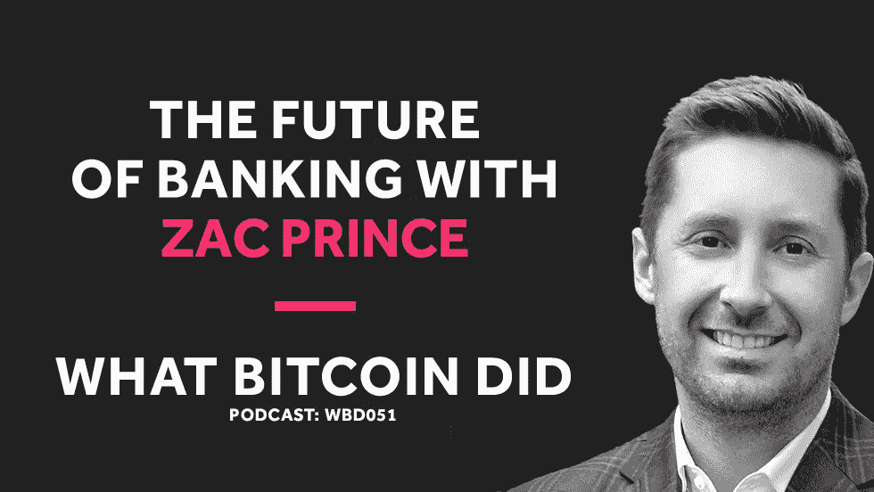

# 扎克·普林斯谈比特币银行业的未来

> 原文：<https://medium.com/hackernoon/zac-prince-on-the-future-of-banking-with-bitcoin-4e6706be8df4>

## 音频采访转录— WBD051

***注:*** *以下是我采访 BlockFi 创始人兼 CEO 扎克·普林斯的转录。我从翻译中使用 Rev.com，他们删除了嗯，错误和半句。我已经检查了转录，但如果您发现任何错误，请随时发送* [*邮件给我*](http://hello@whatbitcoindid.com) *。可以* [*在这里*](https://www.whatbitcoindid.com/podcast/zac-prince-on-the-future-of-banking-with-bitcoin) *听原声录音。*

*你可以在这里订阅播客* [*听所有剧集*](https://www.whatbitcoindid.com/podcast/) *。*

在这一集里，我采访了 BlockFi 的创始人兼首席执行官扎克·普林斯，这是一家提供加密货币充值的公司。我们讨论了比特币的信贷和债务服务、BlockFi 的工作原理以及加密银行业的未来。

联系比特币做了什么:
听:[**iTunes**](https://itunes.apple.com/gb/podcast/what-bitcoin-did-podcast-bitcoin-crypto-trading-strategy/id1317356120?mt=2)|[**Spotify**](https://open.spotify.com/show/0mWUJuONiilW5JSBBFZ0s7?si=5qcbjpjYSRyKpi8wycEZUw)|[**Stitcher**](https://www.stitcher.com/podcast/what-bitcoin-did)|[**SoundCloud**|](https://soundcloud.com/what-bitcoin-did)[**YouTube**](https://www.youtube.com/whatbitcoindid)|[**TuneIn**](https://tunein.com/radio/What-Bitcoin-Did-p1079869/)关注: [**网站**](https://www.whatbitcoindid.com/)

# **采访记录**

**面试日期:2018 年 11 月 21 日星期三**

> **“我认为，当我们谈论 20 年后的银行服务时，银行这个词不会被这么频繁地使用。”**
> 
> **—扎克·普林斯**

**[**彼得·麦科马克**](https://twitter.com/PeterMcCormack) **:** 嘿扎克，你好吗？**

**[**扎克王子**](https://twitter.com/BlockFiZac) **:** 嗨，彼得，很高兴见到你本人。**

**[**彼得·麦科马克**](https://twitter.com/PeterMcCormack) **:** 是的，很高兴见到你本人。谢谢你给我拿啤酒。**

**[**扎克王子**](https://twitter.com/BlockFiZac) **:** 当然。我们还有四个。**

**[**彼得·麦科马克**](https://twitter.com/PeterMcCormack) **:** 我给你发邮件要啤酒只是开玩笑，但现在我得到了，我真的很高兴。这是感恩节吗？你在感恩节喝很多酒吗？**

**[**扎克王子**](https://twitter.com/BlockFiZac) **:** 实际上昨晚我在一个假日聚会上喝了点酒。所以当你给我发关于啤酒的邮件时，我有点害怕，但我现在已经喝了两口啤酒，感觉好多了。**

**彼得·麦科马克 **:** 实际上，我感觉很糟糕，因为你妻子希望你回家过感恩节，不是吗？**

**[**扎克王子**](https://twitter.com/BlockFiZac) **:** 她确实。我想，我们应该在今晚 7 点钟录制，但是我们提前了，她对此非常感激。**

**彼得·麦科马克 **:** 但这确实显示了我们的奉献精神。**

**[**扎克·普林斯**](https://twitter.com/BlockFiZac) **:** 感恩节前夜，我们正处于熊市之中。**

**彼得·麦科马克 **:** 我们在工作。这对我没用。这不管用。但很高兴终于见到你，也谢谢你，因为你是播客的长期赞助商。**

**[**扎克王子**](https://twitter.com/BlockFiZac) **:** 对，绝对。我们很高兴支持这部剧，我们自己也是超级粉丝。**

**彼得·麦科马克 **:** 因此，我们或许应该为即将到来的指控做好准备。我这次面试是有报酬的，那么这次面试你给了我多少比特币？**

**[**扎克王子**](https://twitter.com/BlockFiZac) **:** 我觉得你给我们打了折扣。我们只给了你 25 个比特币。**

**[**彼得·麦科马克**](https://twitter.com/PeterMcCormack) **:** 所以，实际上，当你第一次赞助时，这很有趣，我看着它，心想，“不，我对这些信贷市场的东西不感兴趣，因为听起来真的很无聊。”实际上，我有时也收到邀请。人们愿意付费来上播客。只是在你成为赞助商之后，我听了 Pomp 的采访，然后我听了 Stephan Livera 的采访，我意识到这实际上是市场的一个非常重要的部分，而我对此一无所知。所以，我今天要做一个完全的新手，我想让你教我你所知道的一切。但是，首先，你能在 BlockFi 之前让我知道你的背景吗？你过去 20 年都做了些什么？**

**[**扎克王子**](https://twitter.com/BlockFiZac) **:** 是啊，当然。因此，我作为一名职业扑克玩家完成了大学学业，所以我很幸运地从学校出来时没有负债，并在大学里有了第一次风险管理和市场的经历。毕业后，我一直在风险投资支持的科技公司工作。我很幸运地成为广告技术领域两家成功公司的一员，其中一家被谷歌收购。最近，在金融科技领域(特别是金融科技的贷款方面)开始 BlockFi 之前，我有两家不同的公司。**

**[**扎克王子**](https://twitter.com/BlockFiZac) **:** 一、果园，它基本上处于网贷生态系统的中间，我们有数据产品、技术产品、监管实体；我们创建了一个经纪交易商和 RAA 和 ATS，我们与所有大型在线贷款机构、贷款俱乐部、SoFi、Prosper、Deck 以及购买这些贷款或贷款给这些公司的机构资本来源合作。在 Orchard 之后，我去了一家有零售整合战略的消费贷款公司。因此，我们基本上就像一个贝宝信贷或亚马逊信贷类型的产品，除了面向没有强大的信用评分或不在美国的个人，因此根本没有信用评分。**

**[**彼得·麦科马克**](https://twitter.com/PeterMcCormack) **:** 对。跟我说说扑克吧，因为我以前也玩扑克，而且玩得相当多。我年轻的时候玩过很多在线扑克，但不…我不知道你是否称之为职业，但我赚了不少钱。你是在线玩还是离线玩，在哪里都玩？**

**[**扎克王子**](https://twitter.com/BlockFiZac) **:** 耶。所以我说专业的时候做了一些引号，因为肯定是网上的。但是，基本上，在高中我们有一个男人的扑克之夜，只有朋友，我们会玩，我总是赢，因为我读了一些书，只是很投入。当我上大学的时候，我得到了我的第一张借记卡，我从这张借记卡中取出 25 美元，存入一个扑克网站，很快就把 25 美元变成了几千美元。在某个时候，我决定放弃我的工作学习，因为我没有赚到我认为我可以玩扑克的那么多钱。我玩过限注德州扑克，一次玩 8 到 12 桌，玩过派对扑克、扑克之星，还玩过当时所有的大型网站。人手不足，限注德州扑克全部在线。**

**彼得·麦科马克 **:** 你是在计划第二次吗？**

**[**Zac Prince**](https://twitter.com/BlockFiZac)**:**刚开始我会玩一点锦标赛，但随着经验的增加，我转向了现金游戏。**

**[**Peter McCormack**](https://twitter.com/PeterMcCormack)**:**因为我在玩 Victor Chandler，我在玩六人桌的$50 即玩即玩桌，我一次玩三张。我可能，不是很多，但我每天能挣 200 或 300 英镑。我得到了正确的数字，我得到了正确的赔率，只是为了开始赚钱，但没有花任何时间与我的家人在一起。它变得很容易上瘾，对吗？**

**[**Zac Prince**](https://twitter.com/BlockFiZac)**:**它会让人上瘾，你整天盯着屏幕，再加上……在美国，我相信 2006 年通过了一项法律，叫做 UIEGA，非法互联网赌博执法法案，他们基本上是这样制定的，金融机构不得向这些扑克网站汇款。这基本上使游戏变得枯燥无味，因为任何需要在网站上存更多钱的人都变得更加困难。**

**[**彼得·麦科马克**](https://twitter.com/PeterMcCormack) **:** 耶。我想我也开始遇到了禁区，我的比赛有点松散，但这有点奏效。但当我停止比赛几年后回来时，几乎是同样的策略，我几乎没有赢过。我发现这真的很难。你读过道尔·布朗森的《超级系统》吗？**

**[**扎克王子**](https://twitter.com/BlockFiZac) **:** 大概是吧。我看了那么多扑克书籍。**

**[**彼得·麦科马克**](https://twitter.com/PeterMcCormack) **:** 就是那场著名的 10 ^ 2，我在努力回忆发生了什么。有一个…哦，一张牌掉了，所以他们不得不重做一副牌，他们展示这些牌，他可能会输，但他赢了这手著名的牌，这是我做的第一本书。我觉得 crypto 里有很多扑克玩家。**

**[**扎克王子**](https://twitter.com/BlockFiZac) **:** 对，绝对。我的意思是，如果你被风险所吸引，并且你喜欢下注，那么从谁会成为在线扑克世界的先行者到谁会被密码行业所吸引，有很多明显的相似之处。**

**彼得·麦科马克 **:** 所以，你基本上是说我们都是堕落的赌徒？**

**[**扎克王子**](https://twitter.com/BlockFiZac) **:** 不一定堕落但乐于冒险对吧？我的意思是，很明显，crypto 不适合那些只想投资政府债券的人。这在风险谱上有点偏高。**

**[**彼得·麦科马克**](https://twitter.com/PeterMcCormack) **:** 是啊，现在肯定不是。天哪，我们已经经历了 10 个月的熊市，我幸存了下来，其他人也幸存了下来，但是…所以我认为，这是相当残酷的，事实上，你现在开始看到一些非常悲伤的故事和悲伤的推文。我想这已经向很多人证明了钱来之不易，对吗？**

**[**扎克王子**](https://twitter.com/BlockFiZac) **:** 是啊，时代不同了。现在和一年前不同了。我认为最终会有很多好的事情发生。这是一次学习的经历，但我也认为，显然，价格有点超前了。当涉及到你的财务时，你必须意识到你的目标和目的是什么，以及你的风险承受能力，并且在你进行投资时考虑周全，你为什么要进行投资，以及你计划如何管理投资。但是，是的，和一年前相比，这绝对是一种不同的…这是一种在房间里的不同感觉，如果你在参加一个会议或者去参加一个聚会。**

**[**彼得·麦科马克**](https://twitter.com/PeterMcCormack) **:** 耶。你去了很多早期聚会，不是吗？**

**[**扎克王子**](https://twitter.com/BlockFiZac) **:** 是的，这实际上是促使我创办 BlockFi 的部分原因，因为我的……在 2016 年初的某个时候，我妻子说，“你谈论比特币的方式太多了，我不想听，所以你需要去找一些可以谈论这个的朋友。”我看着 meetups 的构成从 2016 年到 2017 年初发生了变化。显然，这个领域吸引了更多的关注，除了一些最早的采用者之外，还有一些风险资本投资者和银行家开始参与进来。这也是促使我做出决定的原因之一，我必须亲自参与进来。**

**[**彼得·麦科马克**](https://twitter.com/PeterMcCormack) **:** 对。还有你老婆现在谈比特币吗？**

**[**扎克王子**](https://twitter.com/BlockFiZac) **:** 她其实是有的，一点点，远不如我。但在我开始 BlockFi 后不久，或者在我开始 BlockFi 的过程中，她开始投资自己。**

**[**彼得·麦科马克**](https://twitter.com/PeterMcCormack) **:** 好吧。所以她买了一些比特币？**

**[**扎克王子**](https://twitter.com/BlockFiZac) **:** 是的，她做到了。我还让她父母投资了比特币和以太。他们问我是否应该购买 Snapchat 的 IPO，我说，“如果你正在考虑购买 Snapchat 的 IPO，第一，我不认为你应该这样做，第二，我有更好的东西给你。”**

**[**彼得·麦科马克**](https://twitter.com/PeterMcCormack) **:** 哇，太神奇了。所以…**

**[**扎克王子**](https://twitter.com/BlockFiZac) **:** 几个月后，安吉拉的妈妈给我发了一条短信，说:“这项投资表现很好，但我想我开始沉迷于查看价格了。”**

**彼得·麦科马克 **:** 但是我们都做了。**

**[**扎克王子**](https://twitter.com/BlockFiZac) **:** 对，绝对对。**

**[**彼得·麦科马克**](https://twitter.com/PeterMcCormack) **:** 这些天我越来越沉迷于不查看价格，然后你回来看到它又跌了 1000 美元，你说，“耶，哦，太好了。”所以，我想问你一下熊市对 BlockFi 的影响，但我认为我们应该先打开公司的包装，先谈谈这个问题。那么你是在什么时候决定要创办公司的，它是如何从你脑海中的想法发展到我们现在在纽约有办公室和团队的？**

**[**扎克王子**](https://twitter.com/BlockFiZac) **:** 确定。所以，基本上在去年年初，我决定我必须在 crypto 做一些事情。在与一家银行打交道后，他们基本上嘲笑我在财务报表中把比特币和以太作为资产的事实，并几乎拒绝与我合作，我脑海中的灯泡熄灭了，我一直在网上贷款部门、债务和信贷市场工作的部门将被密码部门所需要，就像其他所有主要资产类别一样；鉴于我的背景，这是一件非常合乎逻辑的事情。**

**[**Zac Prince**](https://twitter.com/BlockFiZac)**:**我打电话给一家律师事务所，这家律师事务所是我在网贷领域合作过的，我说:“嘿，有没有一种产品我可以创造出来，而不会冒很多监管风险或手铐风险？从法律和法规遵从性的角度来看，有没有一个我们可以将它放入其中的盒子？”他们一同意，我就让我工作的地方知道我必须离开。**

**[**彼得·麦科马克**](https://twitter.com/PeterMcCormack) **:** 对，好的。所以第一件事，筹钱？**

**[**扎克王子**](https://twitter.com/BlockFiZac) **:** 工作一，打造团队。**

**[**彼得·麦科马克**](https://twitter.com/PeterMcCormack) **:** 打造团队？**

**[**扎克王子**](https://twitter.com/BlockFiZac) **:** 是啊，我得到了几个人，因为我有一些技能但没那么多。**

**[**Peter McCormack**](https://twitter.com/PeterMcCormack)**:**建立一个致力于来或者实际上已经开始建立的团队…你引导它了吗？**

**[**扎克王子**](https://twitter.com/BlockFiZac) **:** 耶。所以我们三个人用自己的钱启动了大约六个月，我们开发了一个 MVP，它基本上只是一个网站，在一个非常简单的应用程序中描述产品，以了解是否有人有兴趣用他们的密码借钱。然后，在那段时间里，我们也在努力筹集资金，最终，我们在去年 12 月成功筹集了一次静坐示威。**

**[**彼得·麦科马克**](https://twitter.com/PeterMcCormack) **:** 有多少投资人？**

**[**扎克王子**](https://twitter.com/BlockFiZac) **:** 那一轮大概有七八个投资人。它是由共识投资公司领导的。**

**[**彼得·麦科马克**](https://twitter.com/PeterMcCormack) **:** 对。好吧。**

**[**扎克王子**](https://twitter.com/BlockFiZac) **:** 我们有 SoFi，参与了 Point Judith，Capital PJC，这是波士顿的一家风险投资公司，康涅狄格州 Capital，这是香港的一家风险投资公司，还有一些天使投资人。我们有工作过的公司的前首席执行官，或者喜欢做风险投资的朋友。**

**彼得·麦科马克 **:** 那一轮是多少钱？**

**[**扎克王子**](https://twitter.com/BlockFiZac) **:** 那一轮 155 万。**

**[**彼得·麦科马克**](https://twitter.com/PeterMcCormack) **:** 好的。从那以后，你在 Galaxy 公司做了进一步的加薪，对吗？**

**[**扎克王子**](https://twitter.com/BlockFiZac) **:** 耶。所以我们在去年夏天筹集了 5250 万美元，由银河数码公司牵头。其中大部分被专门分配给贷款活动，而不是纯粹的股本。**

**[**彼得·麦科马克**](https://twitter.com/PeterMcCormack) **:** 如果你在放贷，你不可能筹集到少量资金，对吗？**

**[**扎克王子**](https://twitter.com/BlockFiZac) **:** 耶。我的意思是，基本上，产品就是钱，所以你需要很多钱。**

**[你会去传统的资本市场吗？记住，记住，我对此一无所知。但我所知道的是…我知道，比如说，银行，那些向我提供抵押贷款的商业银行，他们从别处借款，对吗？所以你可以从市场上筹集资金。作为一个什么都不知道的人给我解释一下。](https://twitter.com/PeterMcCormack)**

**[**扎克王子**](https://twitter.com/BlockFiZac) **:** 确定。所以你可以走几条不同的路，但你可以把这些桶想成，基本上，私人信贷市场，机构私人信贷市场，对冲基金，家族理财室，更多的公共信贷市场，就像债券市场，有银行，然后有散户。我们决定，我们认为最有意义的起点是第一个领域，私人信贷市场，这里有许多专门从事另类贷款的不同资产管理公司。他们中的许多人是我以前工作过的在线贷款领域的最大参与者，所以我们觉得这是最好的起点。**

**[**扎克·普林斯**](https://twitter.com/BlockFiZac) **:** 但随着时间的推移，我们将使融资来源多样化，并将其用于其他领域。我认为想到银行开始参与这一领域真的很令人兴奋，因为从监管角度和资本成本角度来看，这将使其更具弹性。因此，我们正在积极努力，我们将发布一些关于银行合作伙伴的公告，这些银行合作伙伴正在向 BlockFi 提供信贷，以促进我们正在进行的贷款，这可能会在年底前发布。**

**[**彼得·麦考马克**](https://twitter.com/PeterMcCormack) **:** 当你借钱给那些想贷款的人作为资本时，你是为了那笔钱而放弃企业的股权，还是仅仅是他们得到某种有保证的利息？**

**[**扎克王子**](https://twitter.com/BlockFiZac) **:** 看情况。你可以在很多不同的结构中做这件事。银河公司也在股权方面进行投资，所以他们就像风险投资公司一样，他们在企业中投资股权，然后他们单独创建一个工具，用承诺的资金来支持贷款。**

**[**彼得·麦科马克**](https://twitter.com/PeterMcCormack) **:** 对。**

**[**扎克王子**](https://twitter.com/BlockFiZac) **:** 基本上，它的运作方式是他们将获得回报，然后 BlockFi 从中提成。回到信封数学，如果我们对一笔贷款收取 8%的费用，可能会有 7.5%的折扣给 Galaxy 或其他投资者，0.5%给 BlockFi。**

**[**彼得·麦科马克**](https://twitter.com/PeterMcCormack) **:** 好的。所以你得到的利息很少，对吗？**

**[**扎克王子**](https://twitter.com/BlockFiZac) **:** 是的。因此，在贷款方面，在收入数字开始变得有趣之前，你需要很大的规模。因此，有大量资金可供借贷，并在一个可以促成价值数亿或数十亿美元交易的市场中进行借贷，这非常重要。**

**[**彼得·麦科马克**](https://twitter.com/PeterMcCormack) **:** 耶。因此，如果你借出 1 亿美元，你将从中获得大约 50 万美元。**

**[**扎克王子**](https://twitter.com/BlockFiZac) **:** 那是定向准确。**

**[**彼得·麦科马克**](https://twitter.com/PeterMcCormack) **:** 定向准确。是啊，是啊，所以我只是想了解你的业务规模是多少，以及时间线的轨迹是什么？因为你将会有保护信用，你预测这将会是一个五年内 200 亿美元的市场吗？你对此有什么样的预测？**

**[**扎克王子**](https://twitter.com/BlockFiZac) **:** 确定。因此，我们认为我们现在拥有的产品的潜在市场，例如，由比特币担保的美元贷款，作为抵押品，占我们贷款资产总市场缺口的 1%至 3%；这个数字来自公共股票部门的保证金债务与股票市值的比率。所以你可以回到…如果 crypto 现在有 1000 亿美元左右，我们认为我们可以借出其中的 1%到 3%。保证金债务的渗透率可能会高一点，因为加密是国际性的，所以如果你在一个通常无法获得低成本资本的市场中，获得低成本资本可以将渗透率推高一点。**

**[**扎克王子**](https://twitter.com/BlockFiZac) **:** 但是，事实上，我们建立一个非常大的公司的方式是通过多样化我们的产品组合，不仅仅是提供保证金贷款，还提供其他产品，创造客户关系和产品套件，我们可以做的不仅仅是由你的比特币支持的贷款。**

**[**彼得·麦科马克**](https://twitter.com/PeterMcCormack) **:** 对。好吧。所以我发现 BlockFi 真正有趣的两件事，我承认我在过去几周了解了更多，当你第一次做广告的时候。当你第一次做广告的时候，很明显，我看了一眼，我想，“好吧，这有点像贷款，”我并没有真正得到它。我只是没有从根本上理解它，直到我开始深入了解它的细节。我很喜欢它的两件事，第一，你可能不同意，但本质上，你是一个加密银行。**

**[**扎克王子**](https://twitter.com/BlockFiZac) **:** 正确。**

**[**彼得·麦科马克**](https://twitter.com/PeterMcCormack) **:** 好的。你觉得这样合适吗？**

**[**扎克王子**](https://twitter.com/BlockFiZac) **:** 100%。当我们使用这个词时，我们必须有点小心，因为它伴随着许多监管负担，特别是在美国，但是是的。**

**[**彼得·麦科马克**](https://twitter.com/PeterMcCormack) **:** 这是我很想和你说的，我们会谈到的。而且，我认为，真正有趣的是，你真的把加密合法化了，因为你在用加密创造传统的金融产品。我发现这非常有趣，因为这使它合法化，因为你将与许多传统资本市场合作，对吗？把加密和传统融合在一起，只是让它合法化。**

**[**扎克王子**](https://twitter.com/BlockFiZac) **:** 绝对。真正令人兴奋的是，你可以提供这些银行产品，因为你是在一个加密的第一世界中运营，在全球和数字规模上，这在传统的银行环境中是不可能的。因为一切都是由你所在的市场决定的，而且所有这些遗留技术系统都与流程的每个部分相关联。但是，如果我们能够从区块链和加密第一的思维出发，建立这种新的基础设施，仍然从旧世界引入资本，但真的只是重新思考如何交付这些产品，在哪里交付这些产品，以及如何交付它们来对抗比特币，那么，这就是我们真正感到兴奋的事情。**

**彼得·麦科马克 **:** 他不想在这里工作。我不知道你们是如何规划未来战略的，但我认为新兴市场实际上相当令人兴奋。**

**[**扎克王子**](https://twitter.com/BlockFiZac) **:** 对，绝对。**

**[**彼得·麦考马克**](https://twitter.com/PeterMcCormack) **:** 你将能够提供这样的服务……你知道，人们常说，银行服务就是为没有银行账户的人服务。但是，实际上，我从来不知道它到底是什么意思。你可以给某人的手机提供服务，但你现在实际上能够在新兴市场为那些在其他地方得不到服务的人提供服务，对吗？**

**[**扎克王子**](https://twitter.com/BlockFiZac) **:** 耶。在可预见的未来，更多的是私人银行业务，非正常的银行业务或银行业务不足，因为我们今天并没有真正为那些总净值不到 1000 美元的人创造产品，例如，他们只需要一个地方将他们的 5 美元储蓄存入 hap。但是，是的，在全球范围内提供信贷功能和低成本信贷功能是非常非常大的。因此，在传统市场，从美国以外借入美元是在 11 万亿美元和快速增长的市场。**

**[**扎克·普林斯**](https://twitter.com/BlockFiZac) **:** 这样公司和政府就可以进入美国信贷市场，因为它们便宜、规模大，而且容易买到，这是以前零售业从来没有的。因此，如果我们可以使用比特币作为一种机制，在通常无法获得比特币的市场上提供约 10%的成本信用，当然散户投资者也无法获得比特币，我们认为这对客户来说是一个非常有吸引力的价值主张，也是比特币非常有价值的用途。**

**[**彼得·麦科马克**](https://twitter.com/PeterMcCormack) **:** 对。好吧。好吧，让我问你几个问题，因为我有一些想法会在你说完后萦绕在我脑海里。所以我不知道这个美元海外市场企业市场，你说你想对零售开放。所以如果你打开它，比方说…给我举个好例子。什么是好的…阿根廷会是一个好例子吗？**

**[**扎克王子**](https://twitter.com/BlockFiZac) **:** 是啊，绝对是。**

**[**彼得·麦科马克**](https://twitter.com/PeterMcCormack) **:** 好的。因此，在阿根廷有人想借，它变得更容易，因为在线设施，对不对？在线设施在那里，我假设有一定的法规，或一定的许可证，你必须在阿根廷市场内经营。**

**[**扎克王子**](https://twitter.com/BlockFiZac) **:** 确定。**

**[**彼得·麦科马克**](https://twitter.com/PeterMcCormack) **:** 确定。好吧。有人想借钱。他们想借一万美元。假设在这种情况下，他们有比特币，他们有 20，000 美元的比特币，他们获得贷款，当他们有一个不是以美元计价的账户时，你如何让他们获得美元？**

**[**扎克王子**](https://twitter.com/BlockFiZac) **:** 所以，现在，我们正在做的是使用法币回稳币。因此，我们有能力为 GUSD、USDC、Packs 或真正的美元贷款提供资金。**

**[**彼得·麦科马克**](https://twitter.com/PeterMcCormack) **:** 对。好吧。如果他们使用的是在阿根廷有服务的交易所，他们可以兑换成当地货币？**

**[**扎克王子**](https://twitter.com/BlockFiZac) **:** 对，绝对。**

**[**彼得·麦科马克**](https://twitter.com/PeterMcCormack) **:** 好的。因此，在这种情况下，最大化主义者讨厌的稳定硬币，也是我一直想要讨厌的，实际上可以与比特币建立良好的共生关系。**

**[**扎克王子**](https://twitter.com/BlockFiZac) **:** 嗯，我认为它最终会推动更多的采用，因为它创造了一个提供这些产品和服务的机会，在这种方式下，它不一定总是主要是比特币。因此，如果有人没有银行账户，可能不属于 BlockFi 的潜在市场，但暂时远离 BlockFi，如果他们要进入一个金融系统，这不是传统的金融系统，我想我们可能会同意，现在让他们把所有的钱都放在比特币上是没有意义的。**

**[**彼得·麦科马克**](https://twitter.com/PeterMcCormack) **:** 当然是啊。**

**[**Zac Prince**](https://twitter.com/BlockFiZac)**:**因此，如果他们也有能力持有其他资产，难道他们不会更有可能开始利用这种新的金融体系来为他们正在做的大部分事情提供动力吗？**

**[**彼得·麦科马克**](https://twitter.com/PeterMcCormack) **:** 对。好吧。**

**[**扎克王子**](https://twitter.com/BlockFiZac) **:** 就像传统的法定货币一样，在它们还存在的时候，在它们被比特币接管之前？**

**彼得·麦科马克 **:** 我看到了，但你相信会发生吗？**

**[**扎克王子**](https://twitter.com/BlockFiZac) **:** 不知道。我不知道。我认为有很多事情可以告诉你，作为世界储备货币的美元，50 年后将不再是真实的。我发现很难理解从现在到那时会发生什么步骤，那会是什么样子，但我不排除这种可能性。**

**[**彼得·麦科马克**](https://twitter.com/PeterMcCormack) **:** 耶。所以，我的意思是，你可以说不仅仅是一家加密公司，你也是一家金融科技公司。对吗？**

**[**扎克王子**](https://twitter.com/BlockFiZac) **:** 对，绝对对。**

**[**彼得·麦科马克**](https://twitter.com/PeterMcCormack) **:** 好的。那么，你是否也看到了这样一种情况，即你可以在没有授权的情况下用密码抵押贷款？**

**[**扎克王子**](https://twitter.com/BlockFiZac) **:** 是的。是啊。我的意思是，我们打算明年推出的产品之一是信用卡，一种无担保的信用卡，你可以用比特币赚取现金，而不是美元或航空里程，这只是传统的无担保贷款。**

**[**彼得·麦科马克**](https://twitter.com/PeterMcCormack) **:** 我想要一个。**

**[**Zac Prince**](https://twitter.com/BlockFiZac)**:**我们有资金，我们了解信贷市场，我们有银行关系，我们有进入比特币世界的连接，我们知道我们的客户正是会对这类产品感兴趣的那类人；我们认为我们有很好的条件将其推向市场。**

**[**彼得·麦科马克**](https://twitter.com/PeterMcCormack) **:** 好了，哇。好吧，那真的很有趣。让我后退一步。所以，我想，让我们先谈谈产品和它是如何工作的，因为有一些…我们甚至不打算讨论我写下的问题，否则，即使这是超级有趣的。那么，跟我说说一个客户……一个客户有一定数量的比特币，他们想贷款，在线贷款的流程是什么？你检查什么？你做信用检查吗？**

**[**扎克·普林斯**](https://twitter.com/BlockFiZac) **:** 所以我们做一个公共记录检查，看看是否有人，基本上，如果我们在美国贷款，他们是否有联邦政府的留置权，因为他们欠他们税。除此之外，我们现在不看 fico 分数，也不检查其他信用变量。这个过程的工作方式是，有人来到我们的网站，通常他们会阅读大量关于一般贷款或具体贷款产品的教育类文章，然后他们会玩我们网站上的贷款计算器，以了解更多的功能和定价，以及它们如何应用。**

**[**扎克王子**](https://twitter.com/BlockFiZac) **:** 而且敷起来不到一分钟。例如，这就像在比特币基地上创建一个账户一样。他们收到一个决定或贷款提议。假设他们想继续前进，他们签署，发送他们的密码，他们将使用作为抵押品，然后我们要么电汇资金到他们的银行账户，或使用稳定的硬币资助他们的贷款，如果他们选择了这一选项。**

**[**彼得·麦科马克**](https://twitter.com/PeterMcCormack) **:** 你用的是一种叫做贷款价值的东西，对吗？LTV？而现在是 50%左右？**

**[**扎克王子**](https://twitter.com/BlockFiZac) **:** 耶，最多 50%。**

**[**彼得·麦科马克**](https://twitter.com/PeterMcCormack) **:** 50%**

**[**扎克王子**](https://twitter.com/BlockFiZac) **:** 这样你就可以在借钱的当天最多借你比特币价值的一半。**

**[**彼得·麦科马克**](https://twitter.com/PeterMcCormack) **:** 好了，我要把我的比特币寄给你，你会把它放在某个该死的冷库里吗？**

**[**扎克王子**](https://twitter.com/BlockFiZac) **:** 我们和双子座一起保管它，所以我们利用了他们屡试不爽的冷藏系统。他们有保险和监管指定和法律责任，他们保管着数十亿美元的加密资产，所以我们把一切都交给他们。**

**[**彼得·麦科马克**](https://twitter.com/PeterMcCormack) **:** 好吧，那么说我向你们借了 5000 美元，我送你们 1 万美元的比特币，一年前是半个比特币，现在是两个比特币。**

**[**扎克王子**](https://twitter.com/BlockFiZac) **:** 两个半。**

**[**彼得·麦科马克**](https://twitter.com/PeterMcCormack) **:** 我送你比特币，价格涨到 1000 美元会发生什么？**

**[首先，有一些通知级别，然后是官方的保证金要求级别，然后是最后一个级别，在比特币的价值低于我们借给你的金额之前，我们出售一点比特币。](https://twitter.com/BlockFiZac)**

**[**彼得·麦科马克**](https://twitter.com/PeterMcCormack) **:** 好的，好的。好吧。所以，在某些方面，这也像交易，对不对？你可以要求追加贷款保证金，你必须考虑价格。**

**[**扎克王子**](https://twitter.com/BlockFiZac) **:** 绝对。绝对的。**

**[**彼得·麦科马克**](https://twitter.com/PeterMcCormack) **:** 对。**

**[**扎克·普林斯**](https://twitter.com/BlockFiZac) **:** 你决定使用这样的产品是在做某种交易。对于我们的客户来说，通常不同的是，这更像是一种财富管理类型的交易，而不是“我第一次投资某样东西”。所以通常情况下……我们的大部分客户都是长期持有比特币的个人或公司。他们已经做出了交易决定，他们希望做多比特币，然后他们可能会在该头寸中获得大量内含资本收益。**

**[**Zac Prince**](https://twitter.com/BlockFiZac)**:**所以，即使今年比特币下跌了一点，我不确定你最初是什么时候购买的，但你可能仍然会有非常大的收益，但你需要一些现金来进行另一项投资或分散你的资产，或创办一家公司，或购买房子。通过不出售比特币，你可以节省税收支出，保持你的核心比特币地位，并仍然可以从未来的升值和比特币的价格中受益。**

**[**彼得·麦科马克**](https://twitter.com/PeterMcCormack) **:** 好的。假设价格暴跌，我不理会追加保证金通知。我的账户，在某个时候被清算了，我有深度和你的区别吗？**

**[**扎克王子**](https://twitter.com/BlockFiZac) **:** 不会，所以我们会一路小块卖比特币，替你还贷款。所以，这并不是说你有一天醒来，我们就像，“你的比特币一文不值，你还欠我们一大笔钱。”**

**[**彼得·麦科马克**](https://twitter.com/PeterMcCormack) **:** 如果你没有及时卖出，会不会对你造成风险？**

**[**扎克王子**](https://twitter.com/BlockFiZac) **:** 对，绝对。我的意思是，我们管理的风险是…我们面临的风险是市场上没有流动性，相对于我们借出的资金量，它的缺口让我们处于水下。**

**[**彼得·麦科马克**](https://twitter.com/PeterMcCormack) **:** 对。好吧。所以这是最大的风险。所以我想在某些方面，像任何初创公司一样，BlockFi 是对加密未来的一种押注，对吗？如果 crypto 死了，BlockFi 也会死。**

**[**扎克王子**](https://twitter.com/BlockFiZac) **:** 我们是一家设计悠久的密码公司。**

**[**彼得·麦科马克**](https://twitter.com/PeterMcCormack) **:** 好的。你自信是因为……？**

**[**扎克王子**](https://twitter.com/BlockFiZac) **:** 我觉得有很多事情让我自信。所以我回到了很久以前区块链资本公司的一张幻灯片，这张幻灯片让我产生了共鸣，讲的是比特币是一种鸭嘴兽。我仍然认为这是非常正确的。打个比方，当鸭嘴兽第一次被发现时，一群欧洲的科学家正在阅读这些发现通知，称之为扯淡。因为怎么会有一种动物有像鸭子一样的嘴，像海狸一样的尾巴，像水獭一样的皮毛，是温血动物并且会生蛋呢？它不存在。**

**[**彼得·麦科马克**](https://twitter.com/PeterMcCormack) **:** 耶。**

**[**扎克王子**](https://twitter.com/BlockFiZac) **:** 我认为比特币做的很多事情都比旧世界的同类产品要好。哪一个会是最成功的？我认为仍然是 TBD，但我认为他们中的任何一个都是一万亿美元以上的机会。市值仍远低于这一水平。所以，是的。当然，我们非常看好。**

**[**彼得·麦考马克**](https://twitter.com/PeterMcCormack) **:** 昨天我和彼得·范·瓦尔肯伯格从硬币中心出来，他说的一件事是他们是激进的硬币不可知论者。因此，即使你是一个比特币应用，我想这也没什么关系，因为你会为比特币提供产品，我猜，这些产品有适量的流动性。我想我听到了…是庞普说的还是斯蒂芬说的…你认为可能会有大股东想要清算，所以你是硬币不可知论者？**

**[**扎克王子**](https://twitter.com/BlockFiZac) **:** 我们作为公司是硬币不可知论者，是的。就我个人而言，我的加密投资组合明显偏向比特币。**

**[**Peter McCormack**](https://twitter.com/PeterMcCormack)**:**实际上，我还有一件事想问你，因为我在采访 Peter 的时候想到了你，我们谈到了州与联邦法律，以及对于汇款许可证，你必须申请……我记得他说有 52 个。因为有一个州，我不记得了。又一次，它出现了两次，他说，“蒙大拿”，这是一个你不必申请。所以，如果你必须在每个州申请执照？**

**[**扎克王子**](https://twitter.com/BlockFiZac) **:** 不是每一个单独的州，而是相当多的。因此，我们受制于与交易所类似的制度，这是一个州接一个州的制度，你必须了解不同的法律，你有 52 个不同的司法管辖区。但我们获得的许可证是贷款许可证，所以这是监管机构想要的相同类型的信息，你受到相同或相似程度的审查。但是在一些州，比如说，你是否需要贷款许可证的门槛是由你的收费决定的。**

**[**扎克王子**](https://twitter.com/BlockFiZac) **:** 这个想法是，基本上，如果你收费很高，我们希望你有执照，我们想知道你是谁，因为我们不希望你来到伟大的 x 州，剥削我们的居民。因此，在一些州，我们可以在没有执照的情况下经营，因为我们的贷款利率低于下限。但是，是的，我的意思是，在公司成立的前六个月，我们花了很多时间向监管机构解释事情，公开我们的商业计划和财务模型，以及监管机构可能想了解我们的全部信息，并获得我们需要的许可证。**

**[**Peter McCormack**](https://twitter.com/PeterMcCormack)**:**我发现的一件事是，监管者似乎比我想象的更开明、更有见识。当我看了 CFTC 的听证会，当我看了参议院在这里的证词，以及 Nouriel 和 Peter 的证词时，我印象非常深刻。人们，他们真的知道他们的东西，他们实际上…有一些人非常开明，对不对？**

**[**扎克王子**](https://twitter.com/BlockFiZac) **:** 对，绝对。我认为有好有坏。因此，我认为联邦层面的某些监管机构做得很好。我认为，总的来说，美国在不加强开发和创新方面做得很好，但也在努力清除那些绝对不好的东西，如骗局或欺诈。但州监管机构完全是另一回事，我们有过一些令人捧腹的交流。我的意思是，我们有一次被问到，“什么是法定货币？”**

**彼得·麦科马克 **:** 好吧，听着，我要为他们辩护，因为我没听说过法定货币，直到几个月前我开始学习比特币。我想，“你说法定货币是什么意思？这就像是我一生都在用的东西。”所以我不知道，直到…我们应该给他们机会吗？**

**[**扎克·普林斯**](https://twitter.com/BlockFiZac) **:** 也许有一点，但把它作为一个问题输入给执照申请人，而不是仅仅搜索它…**

**[**彼得·麦考马克**](https://twitter.com/PeterMcCormack) **:** 是啊，我猜也是。我的意思是，我想这是有区别的，这都归结于职业、抱负和资源。**

**[**扎克王子**](https://twitter.com/BlockFiZac) **:** 绝对。**

**[**彼得·麦科马克**](https://twitter.com/PeterMcCormack) **:** 如果你在国会，你可能会有一个研究团队，你也可能希望事业有成。如果 crypto 要成功，你可能想成为对它持开放态度的人的一部分。我想这种说法是完全不同的，我会说，“一锅鱼。”在英国。你说一壶鱼吗？**

**[**扎克王子**](https://twitter.com/BlockFiZac) **:** 对，我们肯定是这么说的，只是不一样而已。我在抱怨，但最终，监管机构给了我们许可证，一切都很顺利。只是…**

**[**彼得·麦科马克**](https://twitter.com/PeterMcCormack) **:** 对。因此，我们对该产品有所了解。我会讲太多细节，因为你在 Stefan 和 Pomp 那里做得很好，我会在我的演出笔记中分享这些。我想把注意力集中在一些其他的事情上。首先，熊市对你们有什么影响？**

**[**扎克王子**](https://twitter.com/BlockFiZac) **:** 所以，尽管经历了熊市，我们还是一直在增长，我认为熊市主要是因为我们把以前不存在的新产品引入了这个市场。所以，总的来说，我们的业务持续增长，但压力很大。我们是以价格下跌的资产为抵押贷款的。我们希望向客户提供良好的体验，追加保证金基本上从来都不是好的体验。这不是我们或我们的客户想要的。我们更希望那从未发生过。因此，这造成了我们必须管理的运营负担。**

******:**这是一种负担还是一种担忧，因为你还没有经历过一系列追加保证金通知的过程，你不知道人们会有什么反应？是未知的吗？****

****[**扎克王子**](https://twitter.com/BlockFiZac) **:** 有点……不是技术挑战。因此，这并不是说我们的系统不能在需要时出售比特币，也不能自动通知客户，而是我们希望提供的体验和某些边缘情况。假设我们非常接近某人触发某个触发器，但是他们已经启动了一个只有一个确认的交易。你是做什么的？****

****[**Zac Prince**](https://twitter.com/BlockFiZac)**:**正是这些类型的事情，以及我们提供一定程度的灵活性和客户服务的愿望，满足了人们对这类公司的期望，人们羡慕他们的客户服务，无论是亚马逊还是其他人，在这个高度动荡的熊市，新的生态系统中。因此，挑战更多的是这些东西，而不一定是它的技术方面或流动性方面。****

****[**彼得·麦科马克**](https://twitter.com/PeterMcCormack) **:** 因为这让我想到当你在机场的时候，有人到达那里太晚了，他们不能上飞机，他们失去了它，他们绝对失去了它。但是每个人都知道规则。每个人都知道你必须提前 40 分钟到那里。他们知道，但他们不在那里，他们很生气。我猜你可能会遇到同样的情况，他们知道规则，不幸的是，他们违反了规则，他们没有向他们的账户添加资金，你不得不出售他们的比特币，他们可能会因此感到恼火，可能会在某种评论网站上给你留下差评，我不知道，即使你遵循了确切的规则。你说的就是这种情况，对吧？****

****[**扎克王子**](https://twitter.com/BlockFiZac) **:** 耶。我们基本上采取了一种方法:“让这个人上飞机。我们不是——”****

****[**彼得·麦科马克**](https://twitter.com/PeterMcCormack) **:** 暂时。****

****[**扎克王子**](https://twitter.com/BlockFiZac) **:** 正确。但我认为我们会一直采取这种方式。我们将系统设计成有足够的空间。当我们清算人的时候，我们不收取罚金，所以我们没有任何动机，无论是哪种形式。这实际上对我们也不好，所以我们，某种程度上，有适当的动机去让那个人加入计划，而不是坚持我们在沙子上画的每一条线。****

****[**Peter McCormack**](https://twitter.com/PeterMcCormack)**:**你有没有发现什么你在创建 BlockFi 时没有预料到的用例？****

****[**扎克·普林斯**](https://twitter.com/BlockFiZac) **:** 我认为我们对在营销非常有限的情况下在美国以外收到的需求水平感到惊讶。因此，令人惊讶的是，我们在路线图上调整的事情之一是让产品在美国以外的市场比我们最初预期的更快。我可能认为人们主要会将它用于财富管理类型的目的，当我们查看我们的客户向我们提供的贷款的使用案例时，我们已经看到偿还更高成本债务的更高比率，并且还只是为休闲活动提供资金，这可能是我所期望的。但是，在很大程度上，我们的假设在很大程度上得到了验证，即哪些类型的人会想要使用该产品，他们主要将它用于什么目的等等。****

****[**彼得·麦科马克**](https://twitter.com/PeterMcCormack) **:** 我想，现在有些人可能会看着市场想，“哇，这些价格真低。我可以申请 BlockFi 贷款，然后购买更多比特币。”****

****[**扎克王子**](https://twitter.com/BlockFiZac) **:** 耶。我的意思是，如果你的主要动机是购买更多的密码，并且你想获得更多的密码，我们不是最好的选择。在 Bitmex 等公司，你可以获得比 BlockFi 等公司更多的杠杆。但如果你想这么做，而且你正在寻找一种长期、低成本、保守的杠杆形式。如果这些话不是太矛盾，那么我们是一个很好的选择。我们也看到了这一点。****

****[**彼得·麦科马克**](https://twitter.com/PeterMcCormack) **:** 好的。好的，我想，我真正想和你一起探索的领域，可能是最有趣的，如果我们，有点，看看银行的演变，让我们去互联网之前，高街银行…我不知道你是否叫他们，但我们在英国叫他们高街银行。****

****[**扎克王子**](https://twitter.com/BlockFiZac) **:** 那么，像投资银行还是像大型多元化银行？****

****[**彼得·麦科马克**](https://twitter.com/PeterMcCormack) **:** 不，不，不。就像一家银行，你和我去那里开一个账户。****

****[**扎克王子**](https://twitter.com/BlockFiZac):零售银行。****

****[**彼得·麦科马克**](https://twitter.com/PeterMcCormack) **:** 好吧。所以，我们打电话给那家高街银行，如果你需要一本支票簿或一张卡，你进入分行，你排队，你得到你所要求的。20 年前，或者可能是 15 年前，我们开始有了某种形式的网上银行，在那里你可以转账，但你仍然拥有同一个银行。然后用那些银行账户，说他们转移到手机，所以我也可以在我的手机上转账。我们有了所有这些，然后我们开始有了只有移动银行，他们没有分支机构。你注册了，这只是一种移动关系，而且这种关系还在增长。银行的下一个阶段是什么，也就是说，你认为银行业的下一个阶段是什么？****

****[**扎克王子**](https://twitter.com/BlockFiZac) **:** 我认为它的公司没有实际上作为银行的监管负担，你可以在中国等一些市场看到这一点，阿里巴巴、支付宝和蚂蚁金服提供类似银行的服务。亚马逊正在进军支付领域，有很多不同的金融科技公司正在扰乱银行基础设施的不同部分。现在，有了加密市场，你就有机会，在某种程度上，真正从第一个地方重建它，而不那么依赖中央发行的法定货币。****

****[**扎克王子**](https://twitter.com/BlockFiZac) **:** 这意味着，在我看来，你可以拥有一个比我们今天更具全球联系的金融体系，这个体系非常分散，在第一天就有赢家和输家，这取决于你出生在哪个国家。****

****[**彼得·麦科马克**](https://twitter.com/PeterMcCormack) **:** 对吗？那么，你能想象一个场景吗？我可以在 BlockFi 上开一个银行账户，我可以从我的雇主那里得到报酬，然后兑换成某种稳定的硬币，我可以从那里支付我的账单。你能看到吗？****

****[**扎克王子**](https://twitter.com/BlockFiZac) **:** 对，绝对。我还认为，在未来的某个时候，你可以从你的比特币账户中赚取利息，你可以获得不同类型的贷款产品，无论是信用卡还是更大的长期贷款，就像我们现在做的那样，或者是不同类型的贷款；你可以以比现在其他服务更低的成本和更快的速度向世界各地汇款。****

****彼得·麦科马克 **:** 所以，我想当你停下来以那种方式思考时，这可能是你更乐观的地方，因为你可以看到一个更好的银行系统。对吗？****

****[**扎克王子**](https://twitter.com/BlockFiZac) **:** 是啊，绝对是。我认为，20 年后，当我们谈论银行服务时，银行这个词不会被经常使用。我认为它只是一个公司的名字，就像亚马逊在网上购物或者优步在打车服务上所做的那样。我认为同样的事情也会发生在金融业。我认为加密将是其中的一部分，我认为会有一些赢家。你会说那个名字，然后就会有一个假设，很明显，那就是我做金融交易的地方。****

****[**彼得·麦科马克**](https://twitter.com/PeterMcCormack) **:** BlockFi。****

****[**扎克王子**](https://twitter.com/BlockFiZac) **:** 也许吧。****

****[**彼得·麦科马克**](https://twitter.com/PeterMcCormack) **:** 也许吧。****

****[**扎克王子**](https://twitter.com/BlockFiZac) **:** 有些人告诉我，如果我们有机会变得那么大，我们将不得不改变名字。****

****[**彼得·麦科马克**](https://twitter.com/PeterMcCormack) **:** 为什么？因为它不是…我不知道。****

****[**扎克王子**](https://twitter.com/BlockFiZac) **:** 这不像一个词。****

****[**彼得·麦科马克**](https://twitter.com/PeterMcCormack) **:** 或者类似蔡斯的？****

****[**扎克王子**](https://twitter.com/BlockFiZac) **:** 耶。这是…****

****彼得·麦科马克 **:** 我们到底需要什么？我们有劳埃德。是的，但是我们有一些……嗯，我们有苏格兰皇家银行。所以，我们有一些更大的名字。谁知道呢？谁知道呢？那么，时间表是什么……嗯，你能告诉我新产品的情况吗，推出这些产品的时间表是什么，BlockFi 会有什么发展吗？****

****[**扎克王子**](https://twitter.com/BlockFiZac) **:** 是啊，当然。因此，在接下来的六个月内，我们将推出几款产品。一是计息账户，至少对法币和比特币是如此。我们还将推出一种贷款产品，将你的 fico 评分考虑在内。因此，举例来说，如果你在美国拥有 800 分的 fico 评分，我们将为你提供在利润水平和利率方面略有不同的产品。从长远来看，我们将使用信用卡，无论是在美国，比特币作为你的现金返还，还是航空里程；或者在国际上，只是有一块塑料作为贷款的传递机制，我们现在通过电线或稳定的硬币融资。****

****[**彼得·麦科马克**](https://twitter.com/PeterMcCormack) **:** 对。好吧。所以看看一些传统银行，零售银行，你认为你对他们是一个威胁吗？****

****[**扎克王子**](https://twitter.com/BlockFiZac) **:** 不是今天。我们还很小。但是，毫无疑问，我的意思是你可以看到一个年轻人不考虑银行账户的世界。他们考虑与为他们提供金融服务的应用程序或在线技术公司建立关系。从这个意义上说，你可能一辈子都没有真正的银行账户。也许银行在后端为该公司做一些事情，这是拥有客户关系的前端，但我相信，你可以做你现在需要银行做的所有事情，而在未来实际上没有银行账户。****

****[**彼得·麦科马克**](https://twitter.com/PeterMcCormack) **:** 嗯，我想这只是一个自然的过程，金钱似乎是互联网上最后一个数字化的东西。我不知道你来自哪里，但我来自一个叫贝德福德的小镇，一个非常小的小镇，我们现在的大街与 20 年前非常非常不同。我很少去那里。我拿到生日卡就去，或者约个人喝咖啡？但是我不在那里买任何衣服；我没有在那里买书。高街变成了许多低价商店或慈善商店，这些天有许多空商店。但是我们还有…每家银行都有分行。****

****[**彼得·麦科马克**](https://twitter.com/PeterMcCormack) **:** 所以，我认为未来的情况是银行没有分支机构，因为它们不需要。因此，如果银行不需要分行，它就是一家网上银行，那么它的竞争力在哪里？****

****扎克王子 **:** 我想我们会兜一圈。我认为同样的方式，你现在看到像亚马逊这样的公司，他们只在网上购买全食，并开始开设一些亚马逊商店。无论是哪家金融科技公司，还是少数几家提供类似银行服务金融科技公司，都会兜一个圈子，然后说:“你知道吗？我们在网上，我们非常成功地以纯数字格式交付了我们的产品，但实际上，如果在选定的地点，他们可以出现并与某人交谈，或者我们的一些客户希望这样，我们的客户可能会喜欢它。我们已经建立了一个成功的大企业，为什么不去做呢？”****

****[**彼得·麦科马克**](https://twitter.com/PeterMcCormack) **:** 于是，一个 BlockFi 分支。****

****[**扎克王子**](https://twitter.com/BlockFiZac) **:** 耶。我是说，我们考虑过在这里办公。****

****[**彼得·麦科马克**](https://twitter.com/PeterMcCormack) **:** 我想这很有教育意义，对吧？****

****[**扎克王子**](https://twitter.com/BlockFiZac) **:** 耶。如果有人想过来亲自问我们问题，或者会见团队成员，他们可以这样做。事实上，几周前我们举行了第一次客户答谢活动。我们刚刚在办公室举办了一个披萨和啤酒欢乐时光之类的活动，大约有 150 人参加。****

****[**彼得·麦科马克**](https://twitter.com/PeterMcCormack) **:** 哇。****

****[**扎克王子**](https://twitter.com/BlockFiZac) **:** 我们就像，“哇，纽约的周二晚上。”****

****[**彼得·麦科马克**](https://twitter.com/PeterMcCormack) **:** 你提供了啤酒和披萨。****

****[**扎克王子**](https://twitter.com/BlockFiZac) **:** 确实如此。****

****[**彼得·麦科马克**](https://twitter.com/PeterMcCormack) **:** 那么，就你即将要做的事情、你正在做的事情以及整个行业而言，最让你兴奋的是什么？****

****[**Zac Prince**](https://twitter.com/BlockFiZac)**:**我真的对从 tether 过渡到加密生态系统中更有名的令牌化菲亚特感到非常兴奋。每当我们达到人们能够说，“是的，底部已经到位，我们已经到达另一边，我们可以专注于所有已经建成的酷东西，而不是价格下降”的时候，我都会感到兴奋我真的很兴奋看到过去一年半以来被吸引到这个领域的所有聪明人能够实现并给市场带来什么。****

****[**彼得·麦科马克**](https://twitter.com/PeterMcCormack) **:** 你对整个稳定币黑名单对抗比特币审查阻力有何感想？****

****[**扎克王子**](https://twitter.com/BlockFiZac) **:** 我对那方面没有超强的偏好或看法。我在与一些发行人的交谈中了解到，是的，这是一项功能，就获得他们所需的批准而言，这是至关重要的，但它实际上已经触发的可能性非常低，实际上为零。因为这些稳定的硬币发行者之一引发的成本将对他们试图建立的发行这些稳定硬币的业务造成毁灭性的打击。****

****[**彼得·麦科马克**](https://twitter.com/PeterMcCormack) **:** 你觉得稳定币太多了吗？****

****[**扎克王子**](https://twitter.com/BlockFiZac) **:** 对，绝对。****

****[**彼得·麦科马克**](https://twitter.com/PeterMcCormack) **:** 那么，哪个是——？****

****[**扎克王子**](https://twitter.com/BlockFiZac) **:** 在某个地方，总有人要赢。最终，会有一两个成为标准。****

****[**彼得·麦考马克**](https://twitter.com/PeterMcCormack) **:** 提醒我一下，哪些人是你的合作伙伴？****

****[**Zac Prince**](https://twitter.com/BlockFiZac)**:**我们有点……我们在和四大巨头合作，USDC 的 Paxos，true USD 和 GUSD 的 Gemini USD。****

****[**彼得·麦科马克**](https://twitter.com/PeterMcCormack) **:** 好的。我意识到时间，感恩节，我知道你的妻子希望你尽快回家。所以谢谢你这么做。在我结束之前，我有两个问题要问你。****

****[**扎克王子**](https://twitter.com/BlockFiZac) **:** 确定。****

****[**彼得·麦科马克**](https://twitter.com/PeterMcCormack) **:** 好的。首先，什么是感恩节，因为我不知道。所以，基本上，当我预定了这次旅行，我想我会在华盛顿和纽约各待两天。当我对我在纽约认识的人说我会在这里时，每个人都像这样，“不，我要去过感恩节。”我以前听说过，但我真的不明白为什么这么重要。****

****[**扎克王子**](https://twitter.com/BlockFiZac) **:** 我也不知道为什么是大事。我只知道今天是假日。你和家人聚在一起，吃火鸡、火腿，目的是尽可能多的填饱你的脸。然后，也许，在看足球的时候小睡一会儿。****

****[**彼得·麦科马克**](https://twitter.com/PeterMcCormack) **:** 听起来就像没有礼物的圣诞节。****

****[**扎克王子**](https://twitter.com/BlockFiZac) **:** 就像没有礼物的圣诞节。****

****[**彼得·麦科马克**](https://twitter.com/PeterMcCormack) **:** 没有礼物的圣诞节。****

****[**扎克王子**](https://twitter.com/BlockFiZac) **:** 得体的比喻。****

****[**彼得·麦科马克**](https://twitter.com/PeterMcCormack) **:** 好的，很好。在接下来的几周、几个月甚至几年内，BlockFi 将会出现什么，我们应该期待什么？****

****[**Zac Prince**](https://twitter.com/BlockFiZac)**:**我们将宣布平台的一些新的各种战略投资者和一些合作伙伴，这将使 BlockFi 产品更容易从加密生态系统的其他部分获得。因此，想想看，我在 XYZ 类型的存储中有我的密码，如果不移动它，我能够以真正无缝和集成的方式从 BlockFi 访问贷款或其他产品，会怎么样？所以，这些就是年底前你将从我们这里听到的消息；然后明年上半年推出一些新产品，就像我在节目中谈到的一些产品。****

****[**彼得·麦科马克**](https://twitter.com/PeterMcCormack) **:** 妙极了。嗯，听着…首先，感谢你成为赞助商，因为这很棒，它让节目继续下去。我真的很感激。感谢布拉德，我和他谈了很多，还有你自己。让我们通过让人们知道他们如何能找到 BlockFi，他们如何能与你们保持联系，你想听到谁的消息，你在那里很好，来结束我们的讨论。****

****[**扎克王子**](https://twitter.com/BlockFiZac) **:** 是啊，当然。我们希望听到大家的意见。我们的网站是 blockfi.com。我无法想象人们需要听到这些。我们每周都在节目中做广告。****

****[**彼得·麦科马克**](https://twitter.com/PeterMcCormack) **:** 我知道了。嗯，不，因为我在想，“我们演出的那个星期，我要不要做个广告？我在想，“你已经付了钱，我应该付。“我在想两件事，那就是我该如何向人们解释？”会有人指责我只允许你上节目，因为你在做广告，只是因为…你知道加密人有多消极和愤世嫉俗吗？****

****[**扎克王子**](https://twitter.com/BlockFiZac) **:** 是啊，当然。****

****彼得·麦科马克 **:** 我在想，“我该怎么处理呢？我那周会做广告吗？”我说，“我不知道。”好吧，反正我们也只是顺其自然，但他们知道要去 blockfi.com/whatBitcoindid.****

****[**扎克王子**](https://twitter.com/BlockFiZac) **:** 嗯，看吧，你比我更清楚。****

****[**彼得·麦科马克**](https://twitter.com/PeterMcCormack) **:** 好吧，我现在可能会重复剧本，但他们知道。但是他们如何找到你 Zac，他们应该如何与产品的进展保持联系呢？****

****[**扎克王子**](https://twitter.com/BlockFiZac) **:** 是的，你可以在推特上找到我。我的手柄是 [@blockfizac](https://twitter.com/BlockFiZac) 。你可以随时给我发电子邮件，我是 zac@blockfi.com。我们有电报频道和所有的，所有正常的交流渠道，我认为，我们通常都很敏感，所以不要害羞。如果您有任何问题、意见或想法，请联系我们。****

****[**彼得·麦科马克**](https://twitter.com/PeterMcCormack) **:** 才华横溢。好吧，谢谢你的到来，再次感谢你的赞助，谢谢你给我拿啤酒，我会让你回家陪你的妻子。****

****[**扎克王子**](https://twitter.com/BlockFiZac) **:** 是的，谢谢邀请我，也谢谢每一位经常听我们名字的听众，感谢他们多次听到我们的名字，并且没有对此有任何不好的感觉。****

****[**彼得·麦科马克**](https://twitter.com/PeterMcCormack) **:** 好的，太好了。听着，感恩节快乐。****

****[**扎克王子**](https://twitter.com/BlockFiZac) **:** 耶，谢谢。****

****联系比特币做了什么:
听:[**iTunes**](https://itunes.apple.com/gb/podcast/what-bitcoin-did-podcast-bitcoin-crypto-trading-strategy/id1317356120?mt=2)|[**Spotify**](https://open.spotify.com/show/0mWUJuONiilW5JSBBFZ0s7?si=5qcbjpjYSRyKpi8wycEZUw)|[**Stitcher**](https://www.stitcher.com/podcast/what-bitcoin-did)|[**SoundCloud**|](https://soundcloud.com/what-bitcoin-did)[**YouTube**](https://www.youtube.com/whatbitcoindid)|[**TuneIn**](https://tunein.com/radio/What-Bitcoin-Did-p1079869/)关注: [**网站**](https://www.whatbitcoindid.com/)****