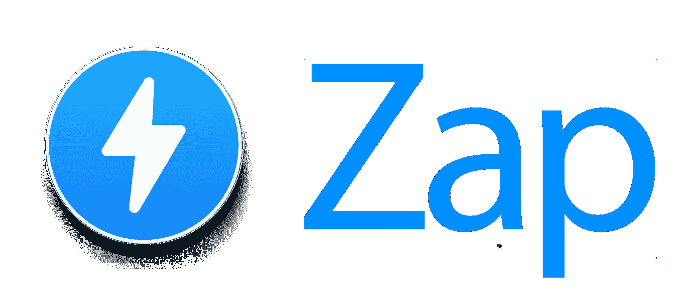

# Zap Store:访问将真实世界的数据引入智能合约的 Oracles

> 原文：<https://medium.com/hackernoon/zap-store-access-oracles-that-bring-real-world-data-to-smart-contracts-e8db533cd8ae>

区块链技术已经并将继续改变许多行业的结构以及这些行业内的流程。在许多情况下，区块链被用于消除中间人的行为，中间人可以进行、协助或监督双方之间的交易，并且区块链的应用还处于起步阶段的一个领域是数据的货币化。

Zap 商店将通过建立一个点对点的生态系统，让任何用户都可以成为先知，在这个生态系统中，所有类型的数据都可以提供给感兴趣的人。这样一个平台本质上是聚集了最有资格、最热情的各方来共享开发 Dapps 和智能合同所需的信息，以使系统高效运行，它还将

创造机会，利用任何连接到物联网(IoT)的设备编译的数据来赚钱

Zap 旨在通过以下三个核心目标实现这一目标:

**构建一个安全的来源未知的 oracle 网络** —任何拥有有用数据的人都应该有机会成为 Oracle 的一员，以便在没有其他利益方的情况下共享他们的信息。Zap 将整合区块链技术、智能合同和 Dapps 来处理链外流程，以创建这样一个平台。

**激励甲骨文的创建和管理** —为了维护网络和促进增长，ZAP 将奖励帮助创建、支持和/或使用甲骨文的用户。

**推动下一代嵌入式 dapp 的发展**—dapp 构成了通过智能合同与区块链相关的链外流程的支柱。它们是以太坊生态系统和 Web 3.0 范式的重要组成部分，在释放其全部潜力方面仍处于起步阶段。Zap 将创造的力量赋予了用户，通过货币化数据，用户将拥有涵盖广泛能力的全新一代 Dapps。

这些分散的应用程序提供了组织化的数据，智能合同可以根据这些数据做出决策。然而，为了让 Dapps 和智能合约收集数据并完成离线流程，用户必须手动贡献这些离线数据，Zap oracle marketplace 就是解决方案。

Zap 生态系统

Zap 是建立在由 ZapMarket 契约管理的提供商-订户模型上的，它充当数据出价和请求的注册处。它允许对等体相互通信，这样提供商可以将信息货币化，用户也可以接收信息。

用户使用 Web3 和 IPFS 与区块链和 Zap 的基本子系统进行交互，web 3 和被集成到一个公共客户端中。并且使用一组管理给提供商和卖方的合同来促进交易过程:

**供应商**

实时数据馈送

通过 ZapMarket 合同注册的以太坊地址

具有 ZapMarket 合同的 IPFS 密钥对公钥

通过 ZapMarket 合同注册的数据加密公钥

绑定到 ZapMarket 合同的 ZAP 数量

**订户**

通过 ZapMarket 合同注册的以太坊地址

用 ZapMarket 合同注册的 IPFS 公钥

使用 ZapMarket 合同注册的公钥进行数据加密

在 ZapMarket 合同中，根据现有供应商绑定的 ZAP 数量

除了这些合同之外，该架构还具有 oracle 绑定机制，当用户将 Zap 令牌绑定到特定 oracle 以订阅其数据馈送时，该机制会生成访问令牌，加密的对等数据馈送通过 ZapMarket 合同将信息货币化，ZapDataProxy 合同部署的离线 oracle 数据代理以及 Oracle 事件请求的 Merkling，并具有锚定以验证历史数据；Zap 网络提供的服务。

**Zap 令牌**

Zap 平台上的交易将使用 Zap 令牌进行支付，Zap 令牌是一种以太坊令牌，将用于货币化数据馈送和/或获得访问此类数据的权限。

为了引入几个经济因素，该团队选择不以直接的点对点方式建立支付，而是设计了深度智能合同，并推出了第一个将甲骨文绑定到网络的机制。

生态系统的这种结构充当了一种细化工具，并激励潜在有用数据的发现和公布，以及利用许多与预测市场相同的经济激励。

智能合约允许资金托管，也允许第三方投机者通过绑定神谕将自己插入生态系统。这些投机者不是提供或搜索数据，而是根据他们找到并绑定到未来有用的神谕的能力获得回报。

部分受 Simon de la Rouviere 关于策展市场的著作的启发，bonding 为用户提供了访问令牌，这些令牌用于查询神谕，或者被销毁以将 Zap 释放回用户。从一个代币生成的点数将由数据提供商描绘的价格/供应曲线决定。

使用这种新颖的方法，Zap store 正在努力成为智能合同数据的首要提供商。

**现实世界应用**

该团队看到金融行业、房地产和航运等行业正在将该平台投入实际应用。

保险公司可能能够开发能够在满足某些预定因素时执行赔付的自激励保险单。

房地产公司可能能够收集重要数据，如特定区域的实时热图，智能合同也能够自动执行所有权转让，以及租赁的权利、规则和法规。

航运公司可以从跟踪装运、库存和经济活动的智能合同的实施中受益匪浅。他们可以用来验证货物和付款可以在第三方保管，直到货物完成。此外，航运业因其产生的大量数据而闻名，其中一些数据已经被大量用于联合国分析。航运业可以将这些数据作为对其他行业的预测，以帮助更好地确定市场趋势。

GitHub 上已经有了公开的测试版 web 和移动应用程序，并在以太坊测试网上运行。基于来自社区的反馈，该团队改进了 oracle 创建过程，将许多可变因素留给最终用户，为数据和 Oracle 创造了一个真正自由的市场。

**有价值的信息**

硬币名称:Zap Store (ZAP)

总供应量:5.2 亿扎普

Ico 前价格:—2000 ZAP/ETH

Ico 价格:— 1 扎普= 0.85 美元

**社交媒体信息**

**脸书**

网址:——[https://www.facebook.com/officialzapstore/](https://www.facebook.com/officialzapstore/)

喜欢:2 540 个喜欢和 2 610 个追随者

过去 7 天有多少帖子/更新:-1 个帖子

**推特**

网址:[https://twitter.com/ZapOracles](https://twitter.com/ZapOracles)

追随者:1 286 名追随者

过去 7 天有多少条推文/转发:3 篇帖子

**电报**

网址:——[https://twitter.com/ZapOracles](https://twitter.com/ZapOracles)

用户:751 名成员

**电报管理员**

用户名:@acpzap

用户名:@Gynezyz

用户名:@benyoung

用户名:@比特币 _ 出售

**Reddit**

网址:——[https://www.reddit.com/r/ZapStore/](https://www.reddit.com/r/ZapStore/)

读者:315 名读者

**Youtube**

网址:——[https://www.youtube.com/channel/UCj53uS32K8UwQCytBwPqmtg](https://www.youtube.com/channel/UCj53uS32K8UwQCytBwPqmtg)

订户:667 名订户

**中等**

网址:——[https://media.zapproject.org/](https://media.zapproject.org/)

追随者:415 名追随者

过去 7 天有多少更新:—帖子

**领英**

网址:——[https://www.linkedin.com/company/zap-store/](https://www.linkedin.com/company/zap-store/)

追随者:1 301 名追随者

过去 7 天有多少更新:3 篇帖子

**GitHub**

网址:——[https://github.com/zapproject](https://github.com/zapproject)

过去 7 天有多少更新:1 篇帖子

**人员/团队信息**

姓名:尼克·斯潘诺斯

头衔:团队领导

姓名:尼克·艾伦

职位:产品总监

姓名:本·杨

职位:创意总监

领英:——【https://www.linkedin.com/in/benyoungnyc 

姓名:汤姆·圣洛朗

职位:技术总监

姓名:哈姆丹·阿兹哈尔

头衔:数据科学家

领英:——[https://www.linkedin.com/in/hamdanazhar/](https://www.linkedin.com/in/hamdanazhar/)

姓名:拉妮

头衔:合规顾问

LinkedIn:——[https://www.linkedin.com/in/oto-rem-s%C3%BCvari-1a5351ab/](https://www.linkedin.com/in/oto-rem-s%C3%BCvari-1a5351ab/)

姓名:史蒂文·杰洛斯

头衔:首席区块链架构师

姓名:库梅尔

职位:高级 Web 开发人员

姓名:马克·普罗费里斯

头衔:编辑主任

姓名:卡斯帕·阿比德加德·斯文森

职位:业务发展主管

姓名:埃里克·狄克逊

职位:战略和法律顾问

姓名:埃米尔·拉森

标题:业务发展

姓名:肖恩·斯卡帕蒂奇

头衔:社区经理

姓名:肖恩·斯卡帕蒂奇

头衔:社区经理

姓名:约翰·李莱克

标题:区块链战略家

姓名:安迪·戈尔茨坦

标题:金属

姓名:乔纳森·海曼

头衔:顾问

姓名:丹尼·扎特曼

标题:麻省理工学院

姓名:马特·霍兰德

领英:——[https://www.linkedin.com/in/matt-hollander-23b07b8/](https://www.linkedin.com/in/matt-hollander-23b07b8/)

姓名:Alex Dziejma

头衔:顾问

姓名:彼得·米克尔森

标题:北欧区块链协会

**公司地址:**

瑞士楚格