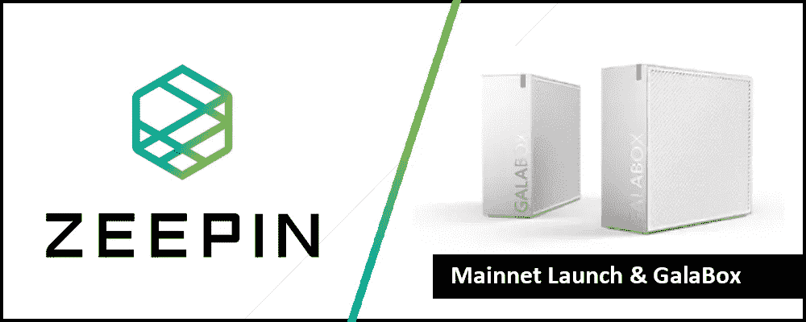
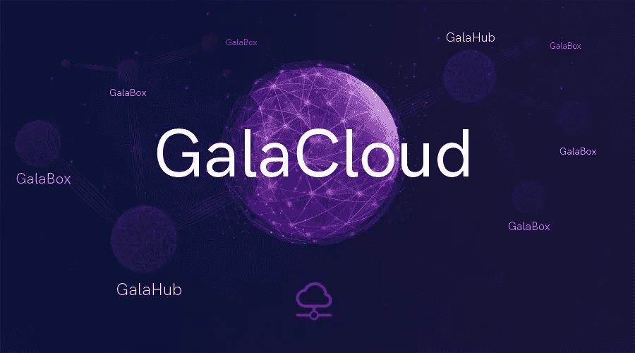
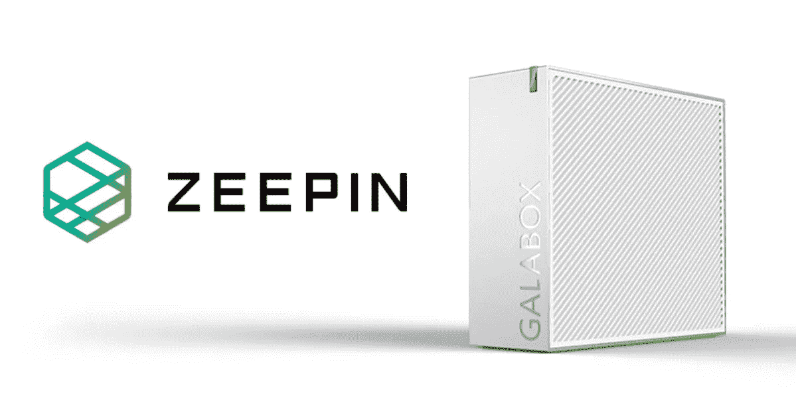
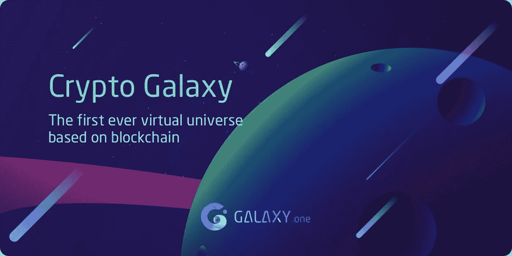

# Zeepin Mainnet 发布和 GalaBox 赠品

> 原文：<https://medium.com/hackernoon/zeepin-mainnet-launch-and-the-galabox-giveaway-83afe5a069f4>

***全披露*** *:本文无意作为投资建议。这只是我个人对 Zeepin 项目的看法。你应该总是做自己的研究。我是“文章小组”的一员，该小组奖励我写这篇文章，并支持我表达自己的个人观点。*

创意产业是一种不断增长的经济。数字[显示](http://www.thecreativeindustries.co.uk/uk-creative-overview/news-and-views/news-creative-industries-earn-uk-almost-%C2%A392bn)2016 年英国创意经济总值为 910 亿美元，而 2010 年的总值刚刚超过 610 亿美元。根据美国的数据，2015 年创意经济价值 7630 亿美元，和英国一样，在 1998 年至 2015 年间增长了约 40%。没有迹象表明该行业的增长停止了。

目前，该行业正面临一些问题，可能会减缓整体增长进程。各种各样的低效率，如:版权保护、分散的发行和不良的沟通会阻碍产业的进步。Zeepin 的目标是通过创造一个分布式的创造性新经济来解决这个问题。

Zeepin 已经在今年年初正式启动了它的项目。他们一直致力于开发 Zeepin 链，该链将作为一个分散的公共区块链，并允许开发人员在 Zeepin 链上创建和推出 dApps。

Zeepin 团队已经为他们的本地链开发了几个 dApps。ZeeWallet 已经推出，并与 Zeepin 链上开发的其他 dApps 兼容。目前，该团队正在努力开发以下 dApps: ZeeRights，通过在区块链注册版权来保护艺术家和他们的想法；ZeeSure，这将使艺术家能够为他们的资产投保；和 ZeeProof，它将验证版权。

8 月 31 日是 Zeepin 将正式推出其 mainnet 的日子。此次发布是 Zeepin 团队数月辛勤工作和奉献的结果。Zeepin 在近地天体网络上推出了其 ZPT 令牌。在其 mainnet 推出后，所有最初发布的 ZPT 将被换成主链 ZPT 令牌。锁定在钱包中的令牌不需要交换。

新的创意经济，需要处理和存储大量的数据。为了支持 Zeepin 的开发并促进数据处理和存储，Zeepin 引入了 GalaCloud。作为一个分散的数据存储云，GalaCloud 将发布 GALA 令牌，作为对托管节点的用户和使用 GalaBox 挖掘和存储设备挖掘 GALA 令牌的用户的激励。

拥有超过 400，000 ZPT 的社区成员可以参与并成为 GalaHub 节点。GalaHub 的选择过程正在全面展开，您还有大约 12 天的时间来参与(在撰写本文时)。ZPT 将被锁定 18 个月，在此期间，你将能够从 GalaHub 所有者每周分发的节日奖励中获得一笔被动收入。每周，GALA cloud 总费用的 20%将分配给 GalaHub 所有者。此外，Zeepin 基金会将向 GalaHub 所有者提供十倍于锁定 ZPT 的补偿，以 GALA tokens 的形式分发给节点，按月发放。Zeepin 基金会正在寻找 49 人成为 GalaHub 的所有者。可以报名了，通过这个链接:[https://galacloud.io/#/index/galaHubIntroduction.](https://galacloud.io/#/index/galaHubIntroduction.)

如果你有兴趣获得 GalaBox，你可以参加以下赠品。Zeepin 向愿意锁定 5250 个 ZPT 或 5500 个 ZPT(取决于他们参与的分销阶段)的 Zeepin 持有者赠送了总共 1 万个 GalaBoxes。赠品的第一阶段已经成功结束，195 名参与者锁定了 4990 ZPT 以换取 GalaBox。所有锁定的 ZPT 将在 18 个月后被释放给它们的主人。

您仍然可以参与第 2 或第 3 阶段。第二阶段将从 8 月 16 日开始，持续到 20 日。GalaBoxes 预计将于 2019 年第一季度运出给新主人。

如果你一直想给自己的星球命名，现在是你的机会了。Zeepin 团队创建了这个名为 CryptoGalaxy 的新 dApp，它由 GALA 令牌提供燃料。这个由区块链驱动的第一个虚拟宇宙的用户可以探索银河系，在行星上开采矿物，并将它们转换成 GALA。

为了庆祝这款 dApp 的推出，Zeepin 每天将向在 CryptoGalaxy 钱包中持有 ZPT 的 CryptoGalaxy 用户赠送 15 万英镑的 GALA。促销活动将从 8 月 10 日持续到 12 月 31 日。该团队将继续为 CryptoGalaxy 开发新功能。如果你想了解更多关于 CryptoGalaxy 的信息，你可以访问他们的[网站](https://cryptogalaxy.one/)，你也可以在这里下载[初学者教程。](/@zeepin/cryptogalaxy-tutorial-guide-for-beginners-a84f72283b3)

随着 mainnet 的推出，GalaCloud 的推出以及游戏 dApp CryptoGalaxy 的开发，Zeepin 正在稳步增长。向他们的项目添加新功能补充了他们的主要 Zeepin 链。此外，GalaCloud 的加入将为原始 Zeepin 链带来新的维度。由于最近的新闻，mainnet 发布和 GalaBox 赠品，ZPT 似乎没有像其他替代硬币一样在价格发展方面受到重创。只有时间才能证明这个项目是否会继续为社区提供新的创新功能。通过为我的文章做这个项目的研究，Zeepin 肯定是我关注的一个项目，可能会投资。给个充分的披露，我参加过 ICO 但是在写这篇文章的时候，我已经不再持有任何 ZPT 代币了。

**媒体渠道**

Zeepin 网站:【https://www.zeepin.io/ 

GalaCloud 网站:【https://galacloud.io/#/index/galaCloud 

Cryptogalaxy 网址: [https://cryptogalaxy.one](https://cryptogalaxy.one)

泽平电报:[https://t.me/zeepin](https://t.me/zeepin)

泽平推特:[https://twitter.com/ZeepinChain](https://twitter.com/ZeepinChain)

*订阅我的频道:*[*Medium*](/@cultcrypto)*，*[*Twitter*](https://twitter.com/CryptoShowdown)*和*[*Steemit*](https://steemit.com/@cryptoshowdown)*如果您喜欢我的文章，并希望了解区块链、加密货币项目和新闻。也可以看我在*[*LinkedIn*](https://www.linkedin.com/in/donjohanson/)*上的文章。

如果你对本文有任何疑问，请在下方评论区评论。掌声也欢迎，谢谢！*

**隐密摊牌**