# Zeepin (ZPT):用区块链改变创意产业(投资者的视角)

> 原文：<https://medium.com/hackernoon/zeepin-zpt-changing-the-creative-industry-with-blockchain-an-investors-perspective-4e4d6d9fef81>

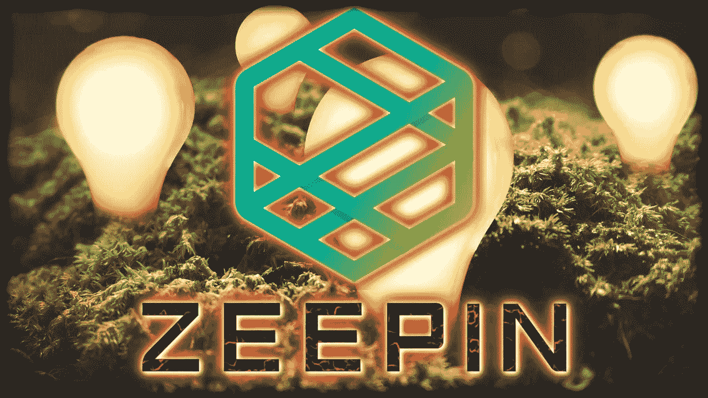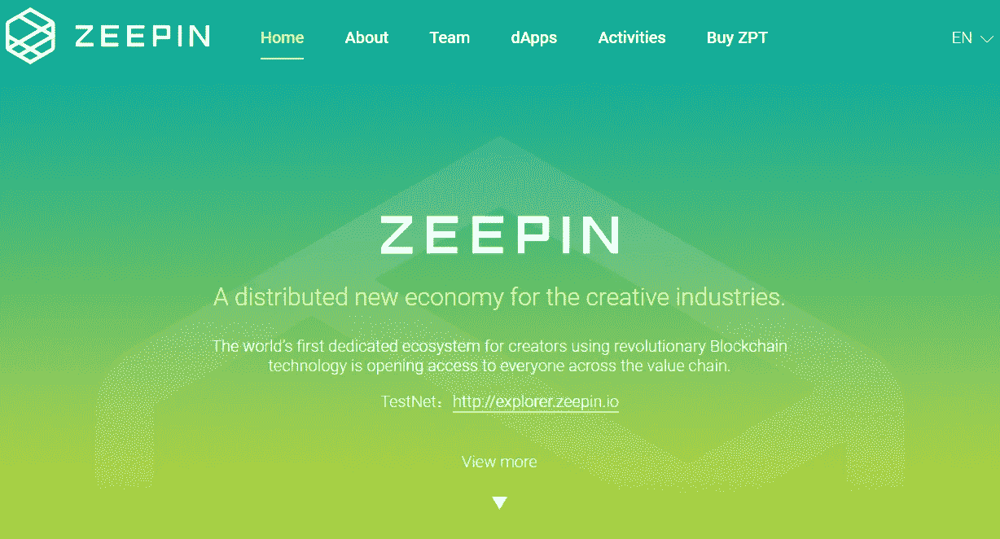

Zeepin 将自己描述为“创意产业的分布式新经济”

什么是创意产业？

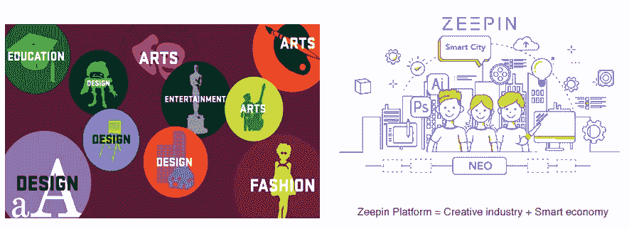

创意产业正在将任何创意货币化。因此，你可能是一个艺术家，画出好画或录制好音乐，或者你可能是一个能写出好程序的技术奇才，或者甚至是一群正在从事一个项目的人，创造一个游戏或教育系列。任何原创的内容都可以拿来出售或出租来赚钱。从你的原创作品中赚钱的过程被称为创意产业。

很多人没有意识到创意产业有多大。目前，创意产业每年带来近 2.5 万亿美元的收入。不是百万或十亿，而是万亿。这几乎是目前整个加密货币市场市值的 10 倍。比一些国家的总收入还多。而那个巨大的市场就是 Zeepin 的目标领域。

Zeepin 是一个旨在帮助创意创作者将其创作货币化的项目。无论是一本书、一首歌还是一个游戏，Zeepin 都是一站式商店，将提供财务服务，如会计服务、版权服务，基本上是他们成功运营所需的一切。

整个基础设施，如版权服务、金融服务等..将在一个符号化的生态系统中运行，并使用智能合约等区块链技术来开展业务。

区块链和创意产业的结合，本质上就是 Zeepin 项目的意义所在。

Zeepin 来自一家名为 Arting365 media 的母公司，这是一家总部位于中国的创意内容公司，已有超过 15 年的历史，拥有超过 120 万用户，并与梦工厂等大公司有过合作。

Zeepin 不仅仅是 Arting365 的一个分支，因为如果它是一个分支模型，Arting365 的工作人员将是与 Arting365 不同的工作人员，Arting365 的人将只是帮助监督和建议这个项目。但在这种情况下，开发 Zeepin 的团队实际上是构建并仍在运行 Arting365 的同一团队。这是一个拥有丰富经验的团队，他们已经证明他们可以在这个市场上建立一个成功的公司。

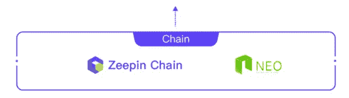

就他们的技术而言，Zeepin 将拥有自己的区块链，称为 Zeepin Chain。这是近地天体生态系统的一部分，在我看来，这是目前加密空间中最好的生态系统。希望使用 Zeepin 服务的后续项目，如游戏等..将在 Zeepin 上构建为一个分散式应用程序/ Dapp。

现在区块链本身只是内容创作者启动项目的基础技术。例如专辑、歌曲、游戏等

为了额外为用户提供服务，如版权服务、金融法律服务等，Zeepin 将推出自己的 Dapps 来提供这些服务。

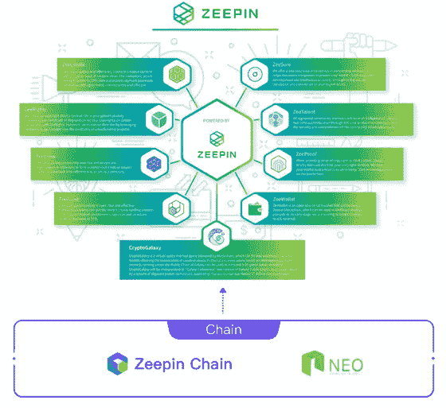

到目前为止，他们宣布了 9 个他们正在创建/已经创建的 Dapps 来为行业提供服务。现在，所有这些本地 Dapps 服务都将使用 ZPT 令牌。举例来说，如果用户使用名为 Zeerights 的版权服务，他们需要支付 ZPT 代币。如果他们使用 ZeeTalent 招募队员，他们需要再次支付 ZPT 代币。因此，该项目不仅为平台使用 ZPT 令牌，这是大多数平台(如以太坊或 NEO)确保令牌使用的主要方式，除此之外，Zeepin 还有 9 个 Dapps 为其用户提供基本服务，这些服务将在 ZPT 令牌上运行。而 9 Dapps 只是起步，他们计划随着时间的推移发布更多的 Dapps，为用户提供更多的服务。因此，对于代币投资者来说，肯定会有很多代币使用案例。

我只想快速浏览一下他们目前在平台上构建的一些原生 Dapps 服务，这样你就能感受到这些功能对用户有多重要。

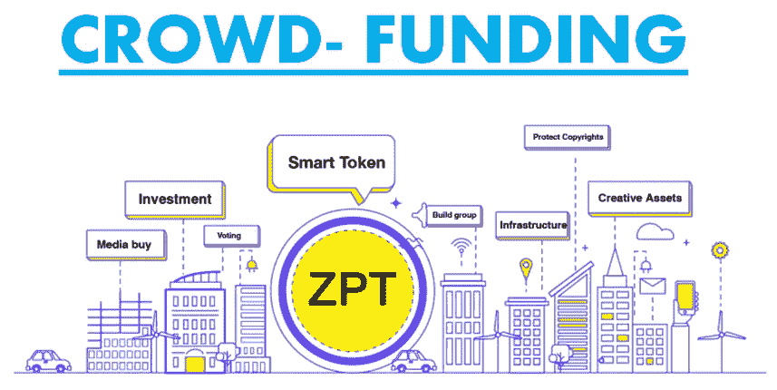

提供的第一项服务是由 Dapp ZeeFund 提供的众筹服务。对于那些不知道什么是 it 众筹的人来说，每个新项目都需要资金来创建内容、支付法律费用等。众筹是一个即将到来的项目(例如正在创建的视频游戏)可以从相信该项目的早期投资者那里筹集资金的过程。作为捐赠或投资项目的回报，早期用户可以获得一些好处或优势。众筹服务(如 Kickstarter)最近变得非常受欢迎，甚至其他区块链项目(如 Loom 和他们即将推出的 cryptozombie 游戏)也在使用 Kickstarter 来筹集项目资金，承诺捐款的人将获得特定功能的特殊访问权限，如 beta 测试等。对于那些不了解这个项目的人来说，以太坊的第二层平台解决方案是一个专门创建加密游戏的平台，但即使他们是一个专门创建区块链游戏的平台，他们也没有众筹服务，他们自己必须脱离链条，使用 Kickstarter 等非区块链服务来筹集资金。所以，Loom 没什么问题，我认为它是一个伟大的项目，但意识到并提供像众筹这样的服务会让你看到一个从头开始构建的好项目与另一个像 Zeepin 这样的好项目之间的差异，zee pin 已经在该领域有 15 年的经验，已经非常清楚他们的用户到底需要什么。

因此，众筹是新项目筹集资本非常需要的服务，Zeepin 通过 Dapp Zeefund 提供这项服务，当然，它将使用 ZPT 代币作为筹款货币。随着 Zeepin 社区的发展，这将是有吸引力的，因为像任何平台一样，当你建立一个 Zeepin 的应用程序时，你会立即向他们成千上万渴望投资的用户宣布你的项目，而不是在 Kickstarter 这样的平台上独立推出，你必须从头开始营销和提高你的新项目的知名度。

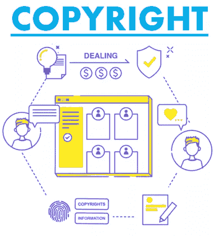

Zeerights 是 Dapp，它将为创作者的内容提供版权保护服务。这是不言自明的，我相信每个人都能看到这项服务有多重要。

问题是，我见过 Po.et 这样的项目在区块链领域提供版权服务，我也见过其他平台，如 Loom、Chimaera、金恩，它们允许内容创作者在他们的平台上创建原创内容，但听起来是常识，Zeepin 是我看到的第一个所有东西都在一起的区块链项目。这是一个构建你的 Dapp 的平台，但是它也提供了所有必要的服务来使项目实际运行。

在区块链中，你会多次看到一个项目吹嘘自己的技术实力，例如交易速度等..这些特性经常被吹嘘，因为项目背后的人是技术人员、编码人员和开发人员。但是，当我们在这个频道上回顾像 VeChain 这样定制了企业功能的项目，以及现在 Zeepin 这样定制了创意产业功能的项目时，我们一直在说的是，当涉及到大规模采用时，人们在考虑使用哪个平台时，不会仅仅根据吞吐量或延迟来做出决定，他们会考虑平台提供的实用程序以及它满足他们需求的能力。这就是为什么像 Zeepin 这样的平台会在长期内做得非常好，因为它们考虑得足够周到，能够包含特定的功能来迎合他们的利基客户。

其他 Dapps/服务包括 ZeeSure Asset Insurance，它使用 ZPT 代币作为嵌入式智能合同的交易媒介 ZeeProof，它用于提供版权证明而不泄露版权内容 ZeeTalent，它有助于招聘服务等..目前总共有 9 项重要服务被重点介绍，将来还会有更多。

我实际上一直想做一个 Zeepin 审查，但我一直推迟的原因是因为他们的 mainnet 将于 8 月份(下个月)发布，并且在此之前会发布一个更新的白皮书，所以很快就会发布。上一个白皮书版本是在 2017 年底，所以它已经过时了，并且将会发生很多变化。因此，这就是为什么我一直推迟这个项目的审查，希望在进行审查之前得到更多的澄清。

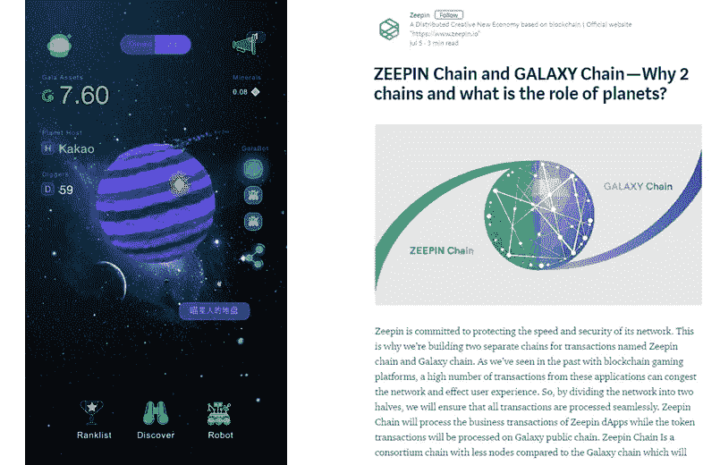

昨晚，不到 24 小时前，Zeepin 发布了一条重要信息，内容涉及他们即将为 mainnet 推出的区块链结构，以及第二种货币 GALA currency 的使用。所以这是一个大新闻，它没有给我们所有的信息，但它确实给了我们这个项目走向的一个大画面，而且，我觉得这个信息在某种程度上是潜在的时间敏感的，因为 ZPT 令牌独特的低定价，我将在后面谈到。出于这些原因，我决定今天是做这个 Zeepin 审查的日子。

所以你们大多数人可能知道，Zeepin 实际上在它的平台上推出了一个加密游戏，叫做 Cryptogalaxy。这是一个工作游戏，用户可以购买行星，并在行星上开采加密货币。随着你开采更多的矿，你可以买到更多更好的矿工，他们可以开采得更快，等等。所以基本上就是一个挖矿游戏。Zeepin 之前确实暗示过 Cryptogalaxy 不仅仅是一款游戏，它是 Zeepin 系统的游戏化版本。因此，我们知道这将是重要的，但我们不确定它将如何工作。直到现在。

昨晚发布的这篇文章解释说，在 mainnet，Zeepin 平台将由两个而不是一个区块链组成。泽平链和银河链。这些都是他们当前白皮书中没有的新信息，目前只在本文中提供。

拥有两条链的原因是为了确保网络的速度和安全性。Zeepin Chain 将处理 Dapps 的商业交易，而 Galaxy Chain 将证明这些交易。Zeepin 链将比 Galaxy 链拥有更少的节点，这将提高处理商业交易的效率。

这样一来，加密星系就不仅仅是一个游戏了。游戏中的庆典代币将成为你可以交易的真实货币。而且行星也充当网络节点，帮助网络达成共识。所以节点上的挖掘变成了系统的挖掘，奖励就是这样分配的。此外，ZPT 和 GALA token 之间将产生经济协同效应，因此用户可以在游戏钱包中投入 ZPT token 来生产 GALA token(就像 NEO 和 GAS，除了你可以以 0.03 美元的价格进入 NEO)，或者如果他们拥有一个星球，他们可以锁定 ZPT 星球，这将增加该星球的采矿 GALA 产量。这也将提高地球的转售价值。所以在下一个游戏更新中，行星(也就是节点)将可以用代币交易。

这确实很聪明，因为这意味着节点的数量是有限的，并不是每个有令牌的人都可以成为节点。你需要买一颗行星，这真的会抬高行星的价格。也会有主节点的计划，也是基于行星的，细节将很快公布。

我喜欢这个将采矿和打桩过程游戏化的概念。首先，它很有趣，但也很容易理解过程和容易实现。最后，但游戏化，他们可以限制板/节点的数量，并相应地管理通货膨胀。目前行星释放的速度已经非常高，新的行星在几秒钟内就被抢购一空。此外，即使在当前游戏中，购买行星和掘地者也需要大量的庆祝代币。

这种需求预计会变得更高，因为他们还宣布了游戏中的新功能，例如升级挖掘机的选项等..可能会使用游戏币。任何货币都会受到需求的影响。使用越多，需求越高，这就是为什么我们总是在任何项目中检查令牌，在这种情况下，庆祝令牌不仅有用途，而且游戏本身的有限功能也将创造需求，例如行星可能会随着其实用性的增加而花费更多的令牌。每个人都喜欢被动收入，所以赌注选择将非常有吸引力。我真的很期待在新白皮书发布时查看这些数字。

我通常不会在审查完一个项目后写后续文章，因为还有很多其他项目要审查。但在这种情况下，我将亲自跟进这个项目，所以如果你想让我做一篇后续文章，请在下面的评论中告诉我，如果有足够的请求，我会在了解全部细节后进行跟进。

回到 Zeepin 这个项目，Zeepin 将引入一个“信用评分”来激励平台上积极的内容和行为。

用户的信用评分会受到以下因素的影响:

I .参加社区活动的频率

二。完成的作品或版权数量

三。ZeeRights 的交易量

四。帮助推广和销售众筹产品

动词 （verb 的缩写）ZeeCreate 创意项目
vi 的参与者。其他积极的活动…

信用评分为正的用户将获得奖励，如基金会每年发放的 ZPT 代币。

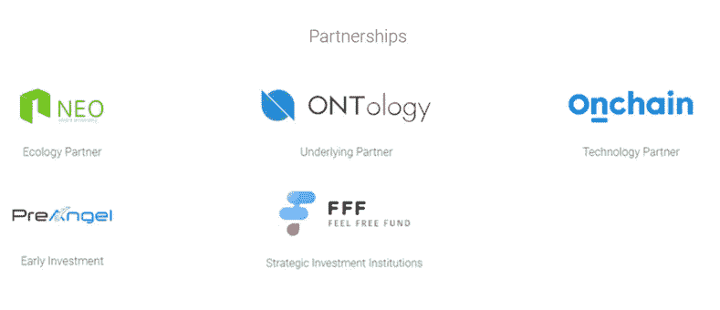

这些是他们的伙伴。Neo，Ontology，Onchain 都是大家比较熟悉的名字。Onchain 是 NEO 技术背后的母公司。Neo 是生态系统的中心，其他伟大的项目如 ONT、SwitchNeo、Zeepin 等都是生态系统的一部分，而 Ontology 实际上是 Zeepin 最亲密的合作伙伴。事实上，Zeepin 的 mainnet 区块链结构显然是模仿 Ontology 的区块链，而不是 Neo。

在我看来，近地天体生态系统是太空中最强大的生态系统之一。这些项目之间有很多相关性和伙伴关系，在这个生态系统中有很多非常好的项目。社区非常强大，当项目时机成熟时，它们通常会获得很大的吸引力。此外，在项目早期投资，例如在 mainnet 启动之前，总是存在项目无法启动的风险。这就是为什么像以太坊这样已经有很多业务的成熟平台是一个更安全的投资。但正是那些尚未推出 mainnet 的早期项目有可能带来更高的收益。所以高风险高收益。

在 Zeepin 的案例中，两个主要风险是市场渗透和实际的区块链技术。然而，就其产品的市场渗透率而言，我们知道它很可能会成功，因为他们基本上是 Arting365，并且已经在行业中拥有超过一百万的用户和联系人。就他们的技术而言，他们是以运行良好的本体 mainnet 为模型的，他们也已经有了一个运行在他们平台上的游戏 cryptogalaxy。所以他们的平台运行良好的几率很高。因此，这些考虑降低了像我这样的象征性投资者投资这个项目的风险。

这不是财务建议，只是我与你分享我的思考过程。

此外，有两家资本投资公司对它们进行了投资，正如我常说的，这是个好消息，因为这些是专业投资公司，他们是做研究的专业人士，他们在评估方面肯定比我更有能力，所以如果我在一个项目中看到资本投资者，这对我来说是一个令人放心的迹象。

最后，Zeepin 现在吸引我注意的最后一点是它当前的价格。

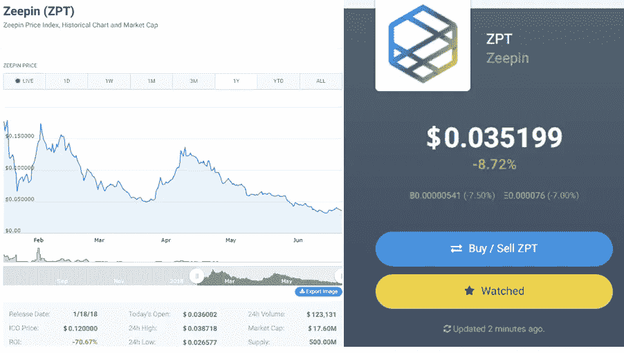

目前，ZPT 令牌是坐在 0.035 美元，这是便宜的。让我给你看一个叫 ROI 的东西，让你看看它有多便宜，以及我为什么对这个项目感到兴奋。

最近在熊市中，在我试图筛选出哪些小盘股真的值得购买时，我注意到了一个叫做“利息回报”或“ROI”的东西。所以在 Coincodex 上，也就是我用来检查定价的网站，投资回报率列在表格的左下角，就在图表的下面。

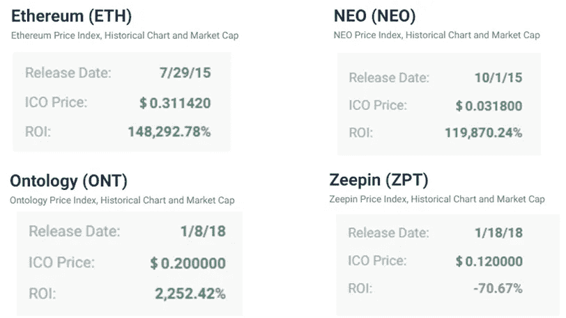

现在，大多数基本面良好的好硬币都有正的投资回报率。以太坊和 NEO 等知名大硬币的投资回报率超过 100，000%。如果你在 ICO 买入，这就是你现在看到的百分比收益。即使是像本体这样基本面良好的新币，投资回报率也超过了 2200%。所以这都是非常积极的数字。事实上，尽管处于熊市，大多数加密项目的投资回报率都是正的。如果它是一个像以太坊一样的项目，有 148，000%的巨大投资回报率，我不指望它会是 50 倍或 100 倍，投资回报率已经太大了。它可能还会涨，但不会涨 50 倍。因此，我在熊市中一直在寻找的是一种基本面良好但投资回报率较高的硬币。实际上很难找到。但我找到了泽平。

我觉得 Zeepin 有很好的基础。它的投资回报率是-70%。太疯狂了。这枚硬币现在比它的 ICO 价格低 70%。很少有好硬币跌破 ICO。我对任何负的投资回报率都很满意，但 70%真的很引人注目。所以像这样一个项目，一个有着 15 年历史的成功公司，在一个数万亿美元的行业中。近地天体生态系统中更著名的突出项目之一，mainnet 和 staking 选项指日可待。我个人认为这是 Zeepin 的一个很好的切入点，它的市值只有 1740 万美元。如果你计算一下，这相当于以 0.30 美元的价格进入 NEO。所以再次请，这不是专业意见，只是我与你分享我的想法。整个频道和我的评论就像我在 crypto 上的个人博客。这不是财务建议。总是自己做研究，自己做决定。

所以伙计们，这就是我，这就是为什么我现在真的很喜欢 Zeepin。非常感谢你阅读这篇文章。请在下面的评论区告诉我你对 Zeepin 的看法，也请告诉我你是否希望我在完整的细节出来后写一篇后续文章。

如果你喜欢这篇文章，请给我们一个赞，这样其他人也可以找到这篇文章。

无论你在哪里，祝你有个愉快的一天和一个愉快的周末，我会很快再见到你们的！