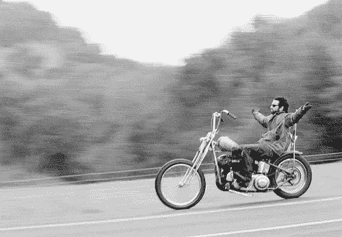

# 禅与数字产品维护的艺术

> 原文：<https://medium.com/hackernoon/zen-and-the-art-of-digital-product-maintenance-92b0f6aba424>

罗伯特·m·皮尔西格的书《禅与摩托车保养的艺术》是我过去十年最喜欢读的书之一。快速维基摘录；*在书中，叙述者描述了他的朋友约翰·萨瑟兰的“浪漫”生活方式，他选择不去学习如何保养他昂贵的新摩托车。约翰只是希望他的自行车能尽善尽美，当出现问题时，他经常感到沮丧，不得不依靠专业技工来修理。相比之下，“古典”叙述者有一辆旧摩托车，他通常能够通过使用理性解决问题的技巧来诊断和修理。*

皮尔西格的整个事情就是不断地摸着你的车的脉搏，定期微调它，使它表现良好。它显然包含了更深层次的真理——如果我们能够充分了解自己，认识到不再为我们服务的行为或信念的症状，我们就可以通过敏感将自己从这些症状中解放出来。意识。这是世界上最伟大的实干家、思想家和改变世界的人梦寐以求的一种精神状态，在某些情况下，他们已经做到了。

I can’t remember where I first saw this picture but I’ve shown it multiple times in super-serious presentations. The big-wigs love seeing this in a Powerpoint. I love it. When I read the book I kind of imagined the main character in the book being this dude.

在《道森·安德鲁斯》中，我经常被称为“毛绒绒的”(毛绒绒意味着缺乏可触摸性和可测量性，以及感情和梦想的泛滥)。当[安德鲁](https://www.linkedin.com/in/andrew-fulton-37243048/)在数字、销售和严肃的事情上与路威相反的时候，[乔丹](https://twitter.com/jordanmoore)和我坐在我们快乐的马车上谈论哲学。我们很高兴将这些顶级思想家背后的方法引入我们的公司。我们是创业的新手——我可以说我们做得很出色，但这是真的——我们是新手。我曾经建立过一个小公司，但是和我们和 DA 的公司完全不同。因此，当谈到让我兴奋的部分时，如果我们想以我们想要的速度持续增长，我们就必须在这一部分精心打造一种哲学。顺便说一句，我不是在说网站上的价值观页面——(这些东西很重要，我也不是把它们一笔勾销——我是说还有更多。)

要成为世界上最好的产品团队之一，我相信我们需要采纳的理念是我们的朋友罗伯特·皮尔西格的理念；

把手放在脉搏上。

微调。

我真正的抱负是把它作为思考生活的一种方式，以及构建数字材料的一种方法。

我们常说构建数字产品不是火箭科学。我们从不自称是最聪明的。我们只是在引擎盖下寻找对企业最重要的数字，并进行微调。从那里，我们保持我们的手指在脉冲上，并继续微调。我们避免雇佣英雄——那些寻找大爆炸的家伙，他们总是停滞不前。我们不使用花哨的幻灯片，而是从第一天起就带客户走进里屋。这意味着他们看到了丑陋、错误和怀疑。这也能从第一天起建立信任，没有人能瞒得过你。结果是一个真正的协作团队，没有人浪费任何时间试图成为一个英雄。实际上这很神奇。

为了实现这一目标，我们一直强烈关注“1%”。进步是通过日复一日地做好小事来实现的。当你每天都给你的球队赢得比赛的机会时，这种感觉会变得很好。也许这就是动力的感觉？我认为更多的是，也许是进步。

See in-depth graph above for mathematical explanation. I’m pretty sure this is what we aim to do. (this is the height of my design abilities — I managed to blag a Sketch license so I could review design, aka brush up on my Microsoft Paint chops.)

> 微调是我学到的发展数字产品的核心。

作为一名过去的战略家，我对数字产品战略的方法曾经是拯救公司的超级创意。我习惯了杰克·丹尼尔拍拍我的背，带我飞来飞去，炫耀将为他们的资产负债表带来数亿美元的最新见解。我逐渐意识到，数字产品不是那样工作的——它们存在于基层。他们*是*草根。当谈到发展数字产品时，你可以把所有筹码都押在黑色上(杰克·丹尼尔的方法)，或者押 1 美元，学习，调整，再来。微调是我学到的发展数字产品的核心。

## 现实生活中的例子；

*让我们试着用实际例子来证明这一点。*

去年，乔丹(联合创始人/史上最伟大的设计师)在玩具反斗城网站(the。com！…只有 15 亿美元的收入！！！).他们想要建造/修复的东西的清单很长，安德鲁(联合创始人，医学博士)大胆地提出只解决清单上的 20%，但承诺从整个堆中获得他们期望的相同回报(帕累托定律)。为了实现这一点，我们必须确定关键的竞争优势；但是就像发动机内部一样(我想——从没见过发动机内部，抓住这里的摩托车比喻)，我们必须把手弄脏，尝试一些事情来理解发生了什么。乔丹没有重新发明一切，而是尝试了纽扣的大小、颜色和形状。他到处调整顾客旅程。一边走一边测试。结果是收入增长了 15.8%。我让你做数学。

我们真正了解到这一点是在与妮斯一起工作的时候——这是我们合作的第一个项目。当我和[克里斯](https://twitter.com/Armstrong)一起去画大图品牌的东西，寻找压倒性的想法/洞察力来拯救世界的时候，安德鲁正在 Kissmetrics 里捣鼓数字。当我们沉迷于注册时，他沉迷于顾客终身价值的理念。最终获胜的论点是，如果我们签了几个月后就会取消的人，那么注册就没有任何意义。关注这个市场是没有意义的，因为他们对企业来说是不可持续的。这个小调整变成了大调整——我们现在看到的是一个完全不同的市场。克里斯的功劳是，Niice 现在是时代、Airbnb 和苹果设计系统不可或缺的一部分——退订的可能性略有下降！

> 我从中学到了一个重要的教训——你选择改变什么往往比你如何改变更重要。

微调是一门艺术，很复杂。你必须知道，改变一件事情可能会花费你十天的代码变化(这就是为什么我们所有的设计师编码/理解他们的变化影响的代码库)。你必须知道你期望这种改变能带来什么样的改进，并权衡这种改变所投入的时间和成本。您需要在多次调整中多次这样做，以了解您的选择。你需要在一天中，在你做出的每一个产品决策中，不断地这样做。不管客户的现金状况如何，作为工作室，我们有责任做出**最高价值**的决定。价值=结果-我们的成本。这是一个简单的咒语，但它开始让我们与众不同——机构害怕真实性。

> 我感兴趣的是，这何时成为一种生活方式。将绒毛排队…

如果你今年与我交谈超过十分钟，你无疑会听到我宣讲正念练习。这一年改变了我的生活。我在这方面仍然很糟糕——老实说，我很少能一次“不思考”十秒钟。从精神上来说，我是一个无畏的冒险家，潜入我的内心深处去理解这个疯狂的东西是如何运作的。当要把这些碎片重新组合在一起时，我感觉就像在幼儿园里笨手笨脚地做最简单的事情。但令人惊奇的是，即使是一个完全的怪人也给我展示了疯狂的结果。从表面上看，它们只是微调，但它们的影响是灾难性的。
实际例子…

*   我花了一年时间在社交媒体上指责“假的”，以掩盖我无法承认自己的怪异。(哇——刚刚意识到“自己”这个词的双重含义——引用时间)

> 拥有你自己的怪异。
> 
> —卡姆·斯图尔特(我)

*   恐惧是日常的恶魔。勇敢感觉真他妈的棒——这是进步的命脉。
*   真相会让你自由。今年我面对的每一个恐惧都没有我最初想象的那么可怕。面对真实的恐惧会带来真相。真理带来自由。自由导致裸泳。

The first ever DA website had a video of a few gals in the 70’s skinny dipping. (I still prefer this version!)

*   恐惧产生焦虑。焦虑是不正常的——它是你的身体告诉你去解决一些事情。不要满足于焦虑。做你的工作。
*   焦虑是通过掩盖恐惧而形成的。和恐惧交朋友，焦虑就消失了。正念帮助你面对恐惧，同情它们，解构它们，并意识到床下没有怪物。从来没有你想的那么可怕。
*   生活是美好的。这个*是尽可能好的*。如果我们能停下来闻闻玫瑰的香味，那就太好了。
*   消极的想法=消极的生活。如果你的大脑是一个 24/7 播放电影的电影屏幕，它会是什么样子？那会是什么感觉？看了会有什么感受？解决这个问题，鼓起勇气重写你不喜欢的剧本。不要太专注于怀疑、恐惧、这个世界要完蛋了的想法，它们很重要，但不需要占用你所有的屏幕时间。心怀感激，慷慨大方，练习换位思考，享受小事情——这是比担忧更好的打发时间的方式。
*   存在就是被感知。(这不是我从正念中得来的，是从一本我几乎看不懂的叫《云图》的神奇的书上偷来的……大概是谁从佛祖那偷来的。)
    按照这个逻辑，只有通过别人的眼睛才能了解自己。所以，如果你想学会爱自己，并真正与你的经历联系起来，关键是学会避开周围人的目光。结果是共鸣和爱，感觉不可思议。美丽的绒毛。
*   小胜利比大胜利更容易获得。专注于它们，重大的胜利就会神奇地出现。
*   你的大脑和你的身体一样需要锻炼。善待它。从听它开始——它会告诉你它需要什么。

让我们结束这一切。

我相信无意识/无意识是一种癌症，消耗着惊人的人口统计数据。如果我们不修好它，我们就完了。(我尽量不使用攻击性的语言(妈妈)，但这个是用心使用的；)

值得庆幸的是，我看到一小部分人([做讲座](https://twitter.com/DoLectures)、[改变自我网络](https://twitter.com/AlterEgoNetwork)、[吉姆·麦克奈什+公司](https://www.neish.co)、[米尔斯](https://twitter.com/millsustwo)、[奥利·奥利·牛自由](http://open.spotify.com/show/6guyX1Q8ZiS…g4TWSe2Ci9lI8sXQ)，仅举几个最近最喜欢的例子)正在寻求真实，并唤醒他们周围的世界。他们能够做如此伟大的工作，因为他们有足够的勇气接受他们所面临的现实。他们做事是因为他们致力于克服恐惧。他们没有以任何方式征服他们，他们每天都在怀疑自己，不同的是他们对此做了些什么。

我相信学会把握脉搏和微调是我们人性的关键，也是我们在这里的短暂时间里拥有最好的旅行的关键。

菲尼托。

—

📧
*当我写作时，我总是从道森·安德鲁斯时事通讯——‘会议纪要’上发出来。如果你想永远不错过这场疯狂，* [*报名参加*](http://bit.ly/Camcastyodeleheehoo) *简讯。*

🎧
*如果你想在开车的时候听我说话——播客上来——*[*cam cast*](http://bit.ly/CamcastSpotify)*。(正式苹果版即将推出！)*

🐦我现在真的很喜欢推特。

😲
*非常奇怪的巧合，我无法融入这篇文章——皮尔西格去世一年后，我开始写这篇文章，2017 年 4 月 24 日(发现拖延者！).所以，如果允许我把一篇不光彩的文章献给一位天才，而又不显得像个混蛋，这是给你的，罗伯。*