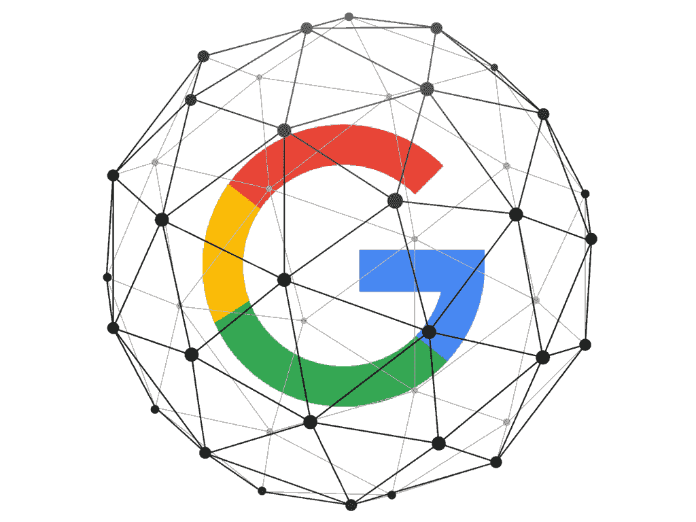
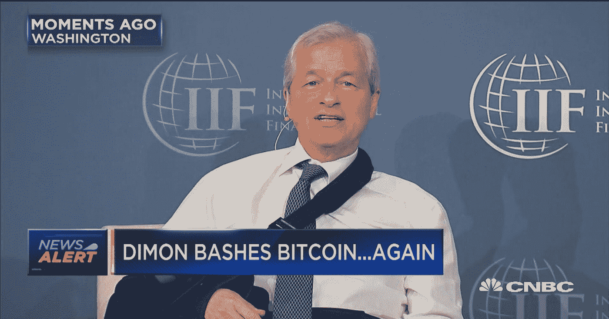
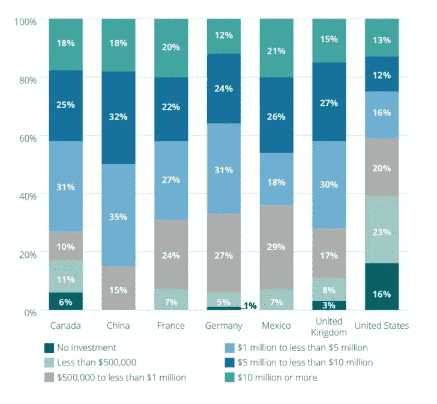

# 零兴趣俱乐部:谁和为什么对加密不感兴趣？

> 原文：<https://medium.com/hackernoon/zero-interest-club-who-and-why-is-not-really-into-crypto-cd53129cf64e>

当我们听到人们说“ICO 是个骗局”时，它甚至不再是新闻了。随着去年欺诈硬币的发行，每个人都有点习惯了这种说法。然而，有一类人对加密货币的看法实际上很重要。当维基百科的首席执行官兼创始人[向媒体](https://www.coindesk.com/wikipedia-has-zero-interest-in-ico-says-jimmy-wales/)表示对 ICO 毫无兴趣时，它引起了关注。

# 大型猫科动物中还有谁不喜欢 ico，为什么？

吉米·多纳尔·威尔士并不是唯一一个公开表示对 ICO 不信任的科技界领袖。事实上，这似乎是一件事:偶尔一个大公司的首席执行官不得不站出来批评 ICO、区块链和加密货币。还有谁不太喜欢 ICO 和区块链，为什么？

## **谷歌**

困扰整个区块链社区的问题是，为什么谷歌没有对区块链做任何事情？作为最具创新力的公司之一(如果不是最具创新力的话)，谷歌不愿意带区块链更上一层楼至少是很奇怪的。

关于谷歌对区块链和 ICO 的态度的真正讨论始于该公司效仿脸书，禁止加密货币的广告和 ICO 的推广。web 被一个问题折磨:Google 是不是很不喜欢 ICO？

没有官方证据证明谷歌高管说他们不特别信任 ICO，但是，这可能是行动胜于语言。当像谷歌这样的公司对一项重大创新漠不关心，并采取措施禁止 ICO 推广时，它给了我们一些很好的思考。

**为什么谷歌不是特别喜欢 ICO？**

谢尔盖·布林(Sergey Brin)表示，“老实说，我们可能已经失败到了最前沿”。他没有解释为什么会这样，但是我们可以自由地去尝试和猜测。也许，谷歌给了技术时间来证明自己，而当他们在等待的时候，其他人正在“快速移动并打破东西”。

也就是说，[美国消费者新闻与商业频道出版物指出](https://www.cnbc.com/2018/07/09/brin-says-google-failed-the-bleeding-edge-blockchain.html)谷歌仍然可能在未来加入一些非常有前途的区块链产品。有人说，谷歌也可以认真重新审视其 ICO 禁令。我们走着瞧。

## **脸书**

当脸书禁止平台上的加密广告时，人们对该公司对技术的态度有各种各样的猜测。有人说是因为脸书不太喜欢 ico。其他人认为这表明该公司计划推出自己的加密货币。

这项禁令立刻成为新闻——理所当然。来源:[https://images . coin telegraph . com/images/740 _ ly 9 JB 2 ludgvszwdyyxbolmnvbs 9 zdg 9 yywdll 3 vwbg 9 hzhmvdmmlldy 8 yowi 4 MTU 1 ot q 2 mmrintmyqwmtm 2 dkzmzzhode 0 my 5 qcgc =。jpg](https://images.cointelegraph.com/images/740_Ly9jb2ludGVsZWdyYXBoLmNvbS9zdG9yYWdlL3VwbG9hZHMvdmlldy8yOWI4MTU1OTQ2MmRiNTMyZmQwMTM2MDkzMzZhODE0My5qcGc=.jpg)

脸书官方对此事的解释很简短:

> *“我们希望人们通过脸书的广告继续发现和了解新产品和服务，而不用担心骗局或欺骗。也就是说，有许多公司正在宣传二元期权、ico 和加密货币，但它们目前并没有诚信经营。”*

然而，这并不一定证明脸书完全不信任区块链和最初的硬币发行。事实是，肯定有很多骗局正在进行，所以这个决定几乎没有问题。

当然，现在[当禁令逐渐从平台](https://www.coindesk.com/facebook-relaxes-ban-accepts-crypto-ads/)撤销时，我们更没有理由得出脸书不喜欢加密货币的结论。

有传言说，该公司甚至正在用这项技术推出一些大东西。动机很明显:脸书[害怕错过](https://www.wired.com/story/whats-the-deal-with-facebook-and-the-blockchain/)(但请记住，这只是一种猜测)。

> 错过的风险太大了，不容忽视——以防密码传播者是正确的，区块链技术被证明比互联网革命更大。

《连线》杂志的专家艾琳·格里菲斯

## 摩根大通

众所周知，摩根大通(J.P. Morgan)首席执行官杰米·戴蒙(Jamie Dimon)讨厌比特币，但喜欢区块链(或许，更明智的做法是，不要把他纳入零利率群体，而是加入爱恨俱乐部)。戴蒙一再表示，比特币是一个骗局，肯定会被政府摧毁，但他也补充说，区块链作为一项技术，是非常有前途的。

此外，摩根大通的技术团队甚至正在开发一个庞大的区块链解决方案。据英国《金融时报》报道，这可能是区块链跨境支付和衍生品结算平台 Quorum 的改进版。

# 俱乐部越来越小了

随着区块链的增长和 ICO 市场的发展，公司很难保持零利息的态度。他们不可避免地发现自己处于这样一种境地:无论他们喜欢与否，在区块链投资都是至关重要的。以防万一。

事实上，[德勤研究证明](https://www.coindesk.com/deloitte-3-out-of-4-big-companies-see-compelling-case-for-blockchain/)平均每 4 家公司中有 3 家认为区块链是他们业务中极具吸引力的技术解决方案。

德勤询问了 1000 名受访者，他们是年销售额超过 5 亿美元的全球公司的代表。34%的人表示他们已经开发并推出了区块链解决方案，41%的人表示将在不到一年的时间内推出。

*对该技术进行了投资的金额，据* [*德勤研究*](https://www.coindesk.com/deloitte-3-out-of-4-big-companies-see-compelling-case-for-blockchain/)

我们如何看待这些结果？

这里有三件事很明显。

1.  我们将在今年或明年看到很多区块链的创新。应该会很有趣。
2.  竞争越来越激烈，那些希望保持技术领先的公司现在必须创新。
3.  即使几家大公司及其首席执行官仍然持怀疑态度，区块链也不会走向任何地方。

# 然而，这并不完全是好消息

2017 年和 2018 年被证明是区块链疯狂的一年，正如我们从统计数据中看到的那样，这种情况可能会继续下去。虽然这样的发展肯定会带来令人兴奋的改进，但我们也会看到许多空洞的承诺，听到背后毫无意义的推销。

*龙区块链只是事件发展出乎任何人意料的又一证明。*

2018 年 1 月， [SEC 主席 Jay Clayton 警告公司](https://techcrunch.com/2018/01/25/sec-warns-against-public-companies-adding-blockchain-to-their-name/)从现在开始，他们必须更加小心地将“区块链”一词固定在左右两边。这在区块链和 ICO 社区引发了大量讨论，但在一家饮料公司长岛冰茶更名为 Long Blockchain 并在短短一天内股价上涨 500%后，每个人都知道有些不对劲。

# 所有这些象征性的东西都不清楚

几年前，当 Triggmine 刚刚起步时，代币对我们大多数人来说就像一种奇异的水果。而现在，有…

[打赌你很难想象在今天的数字世界中流通的不同代币的数量]

1771 年。就是这个数。至少， [Coinmarketcap](https://coinmarketcap.com/all/views/all/) 是这么宣称的。事实证明，这些代币的用途至少是可疑的。“买我们的代币，”他们说。“成为数字赢家。”“展望未来。”“不要错过机会”。我们都知道它是如何运作的。

## 区块链项目的主要缺点是，它们很难提供数学和经济依据来使它们的令牌具有吸引力。

# 最后的想法

为了保持 ICO 和区块链的良好声誉，监督企业主的意图是否合法是合乎逻辑的。不过有一点是显而易见的:零利率俱乐部迟早会消失。区块链已经不容忽视了。