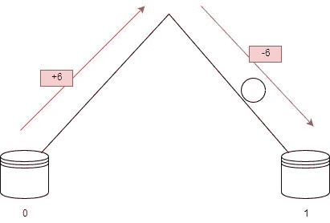
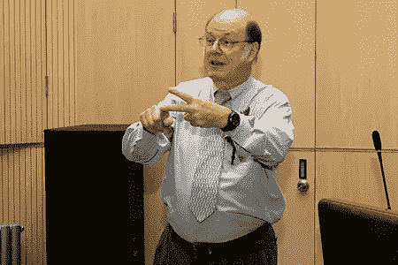

# 零功耗计算—如何使用零功耗执行计算

> 原文：<https://medium.com/hackernoon/zero-power-computing-how-to-perform-calculations-using-zero-power-e2b4bfcd4d7e>

Photo by [Markus Petritz](https://unsplash.com/photos/-LFe6Prglw4?utm_source=unsplash&utm_medium=referral&utm_content=creditCopyText) on [Unsplash](https://unsplash.com/search/photos/computer?utm_source=unsplash&utm_medium=referral&utm_content=creditCopyText)

M 奥尔德法则正在消亡。曾经有[无数](https://www.extremetech.com/computing/256558-nvidias-ceo-declares-moores-law-dead) [条](https://www.technologyreview.com/s/601441/moores-law-is-dead-now-what/)在[这条](https://www.electronicsweekly.com/news/moores-law-still-law-2017-09/)上。我们不能一直把晶体管装进给定的空间单位，期望 CPU 的能力每年都翻一番。

芯片做得越来越小，产生的问题就越多。认为这一规则会永远存在是天真的，我们正在耗尽空间，这将导致问题。幸运的是一场暴风雨即将来临。理论上可以用**零功率**进行计算。本文将解释这是如何实现的。

在 20 世纪 50 年代，计算机科学家想知道是否有可能建立一个经典物理的精确模拟。不是“接近”模拟，但 100%准确。

在解决这个问题时，他们发现了一些有趣的事情:

**牛顿物理定律是可逆的**

假设你在另一个世界看到一个篮球运动员手中的球。在这个世界上，摩擦是不存在的。在接下来的几个例子中，记住**在这个世界中，摩擦是不存在的。**球落下后，从地面反弹到与开始时相同的高度。

Gif by [Michelle Sherrina](https://twitter.com/Sherchle) on [Giphy](https://giphy.com/gifs/basketball-dribble-dribbling-3o6ZtpY1ws3DohMK1W). Gif depicting a headless basketball player bouncing a basketball.

现在让我们在这上面放一些任意的数字。假设球获得 6 个单位的能量到达地板。

当球接触地板时，它会再次弹回——使用 6 个单位的能量。

在这个纯牛顿物理学的世界里，定律是可逆的。

如果我们把球落下拍成电影。球在时间上向前看和向后看是一样的。

让我们来看看来自同一个世界的另一个例子——摘自《用量子猫计算》一书。

让我们假设你在斯诺克桌上有两个相同颜色的球。一个球撞击另一个球，你拍下了这种互动。如果你把电影倒过来看，它会和它向前看一样有意义。如果你把这部电影给某人看，然后问他们“哪个球击中了另一个球？”他们不知道答案。

看看下面的球。我们不知道球是如何到达那里的，只知道它在那里。我们不知道它是否被放置，踢，摔，甚至传送到那里。

Photo by [Ben Hershey](https://unsplash.com/photos/VEW78A1YZ6I?utm_source=unsplash&utm_medium=referral&utm_content=creditCopyText) on [Unsplash](https://unsplash.com/search/photos/ball?utm_source=unsplash&utm_medium=referral&utm_content=creditCopyText). Image depicting a motionless tennis ball on the floor.

我们不知道这个球是从 40 英尺还是 50 英尺的地方掉下来的，我们没有这个球的任何信息。

从上几个例子我们可以看出，信息和能量之间有一种有趣的联系。

虽然每个单独的动作都是可逆的，但如果我们加入更多的球，就不可逆了。假设我们以之前的斯诺克为例，但这次我们在游戏开始时观看了一次休息:

Image from [Giphy](https://giphy.com/). Image depicting a break in pool.

我们总能分辨出哪个是未来，哪个是过去。未来是更多*无序*的未来。

正如[热力学第二定律](https://www.wikiwand.com/en/Second_law_of_thermodynamics)所说:

> 系统中的无序度总是在增加，其结果是不可逆的。

无序这个术语通常被称为*熵。*热力学和熵的这些规则对我们很有用，因为熵是在*信息中测量的。*

这里需要注意的是，热力学、可逆性和信息之间的关系都是基于计算本身。不是运行计算机或运行监视器所需的电力。

1961 年，罗尔夫·兰道尔在 IBM 任研究员时发现，有些计算不需要消耗能量。他发现计算和物理现实是统一的。用他自己的话说:

Photo of Rolf Landauer from [here](http://ethw.org/Rolf_Landauer)

*“信息不是脱离实体的抽象实体；它总是与物理表现联系在一起。它用刻在石碑上、旋转、充电、穿孔卡片上的一个孔、纸上的一个标记或其它等效物来表示。这将信息的处理与我们真实物理世界的所有可能性和限制联系在一起。”罗尔夫·兰道尔*

可逆性和热力学之间有联系。我们在热力学和信息之间有联系。因此，我们在可逆性和信息之间建立了联系。

作者约翰·格里宾描述了一个有趣的思维实验，以更好地了解这种思维的整体情况。

Figure 1 — Image depicting a ball on a box with the number “0” under it. There is another box with the number “1” on it over a hill.

这里的 0 和 1 代表二进制位。小山代表切换二进制位的物理方面。当球越过山坡，落到另一边时，它会将二进制位切换为 1。

反之，它会将二进制位切换为 0。

穿过山丘的球看起来像这样:

Figure 2- image depicting a ball going up one side of the hill using +6 energy and going down the other side of the hill using -6 energy. The ball eventually toggles the switch to 1.

球在被推上山时获得任意数量的能量，并在下山时释放这些能量。

有效地说，翻转二进制位不消耗任何能量。这是一个重要的声明。约翰·冯·诺依曼曾经说过“拨动开关需要能量”,但是我们的小实验表明不消耗能量是可能的。

尽管拨动开关(将球从一边移动到另一边)不需要花费什么，但是检查球在哪里需要花费一些东西。检查开关在什么位置需要花费一些钱。

计算行为本身可以不花钱，但其他一切都可能要花钱。

电脑完全由这样的开关组成。如果像这样拨动一个简单的开关不需要任何成本，我们就可以拥有由零成本的门组成的整个电路板。

## 盖茨

让我们来看看一些逻辑门。

逻辑门是一种决策工具。你给它一些输入，它给出一个输出。与门是比较简单的逻辑门之一。

And gate taken from my post on logic gates, [here](/brandons-computer-science-notes/mathematical-logic-f53f9c60d8d9)

逻辑门只能接受 0 或 1 作为输入。与门输出 A 和 B 的乘积，或者换句话说，它只在 A **和** B 为 1 时输出 1。

Truth table taken from my article [here](/brandons-computer-science-notes/mathematical-logic-f53f9c60d8d9)

在所有其他情况下，当 A 和 B 不都是 1 时，与门将输出 0。

如果我们遇到一个与门，输出为 1，我们肯定知道 2 个输入为 1 和 1。

如果我们遇到一个与门，输出是 0，我们不知道输入是什么。它可能是 A = 0，B = 1 或 A = 1，B = 0 或 A = 0，B = 0。

当输出为 0 时，我们不能*反转*与门来找出输入是什么。

可逆计算机必须由可以反转的逻辑门组成。与门不是可逆的逻辑门，所以在这里没有用。为了建造一台能够复制经典物理的计算机，计算机的部件也必须是可逆的。

## 可逆程序

1973 年，查尔斯·班纳特在 IBM 工作时，创造了几个简单的可逆计算机程序。前半部分进行计算，后半部分撤销计算。用他的话说:

Photo of Charles H. Bennet. Image from here

*“前半部分会产生想要的答案……通常还有一些其他信息……后半部分会通过逆转产生信息的过程来处理外来信息，但会保留想要的答案。*

这让我相信，任何计算都可以通过累积通常会被丢弃的所有信息的历史来呈现为这种可逆的格式，然后通过与生成它的过程相反的过程来处理这些历史。为了防止反向阶段破坏期望的输出以及不期望的历史，在开始反向阶段之前，将输出复制到空白磁带上就足够了。复制到空白磁带上在逻辑上已经是可逆的。查尔斯·伯奈特

简单地说，流程如下:

*   计算答案
*   把答案写在某个地方
*   反转所有计算以回到原始状态

贝内特的工作纯粹是理论性的。然而，埃德·弗雷德金设计了一个可逆的逻辑门来制造计算机。

## 弗雷德金·盖茨

弗雷德金闸门是一种*通用*闸门。这意味着任何逻辑或算术指令都可以使用 Fredkin 门创建。任何逻辑电路都可以用弗雷德金门电路制造出来。这意味着任何计算机都可以完全由弗雷德金·盖茨制造。

如果你不确定逻辑和门，看看我以前写的文章[这里](/brandons-computer-science-notes/mathematical-logic-f53f9c60d8d9)。

Image of a Fredkin gate from [here](https://www.wikiwand.com/en/Fredkin_gate)

维基百科对弗雷德金·盖茨的工作方式有一个很好的解释，这里稍加改动。

Fredkin 门将三个输入(A、B、C)映射到三个输出(P、Q、R)。C 输入直接映射到 R 输出。如果 C = 0，则不执行交换；a 映射到 P，B 映射到 q。

否则(如果 C = 1 ),输出交换。a 映射到 Q，B 映射到 P. C，**总是**映射到 r

如果向后运行，它会自动撤销。如果这个 Fredkin 门的输出被馈送到另一个 Fredkin 门的输入(P 到 A，Q 到 B，R 到 c ),则第二个 Fredkin 门的输出与第一个 Fredkin 门的输入相同。

## 结论

如果我们建造一个完美的弗雷德金门，我们将得到零功耗计算。计算将不再消耗能源。这可以改变一切。区块链消耗的能量足够[为一个国家](https://www.technologyreview.com/s/609480/bitcoin-uses-massive-amounts-of-energybut-theres-a-plan-to-fix-it/)供电。想象一下，区块链消耗的能量接近于零，唯一的限制就是内存问题。

移动电话的电池寿命将是现在的 10 倍。手机不再需要在计算上浪费能量，它唯一浪费的能量是保持屏幕打开。但是，凡事都有好的一面，也有不好的一面。

制造可逆计算机的问题在于它很难。它要求我们彻底转变心态，远离我们所知道的一切。计算机科学家总是制造消耗电力的计算机。其总是使用传统的逻辑门来构建。这不仅是我们思维的巨大转变，而且从根本上说，是地球上每一个设备应该如何运行的转变。

这也是一个缓慢的过程。尽管弗雷德金·盖茨可以逆转并把计算能量还给我们，但他们永远也不能把时间还给我们。在 CPU 上可能需要 4 秒钟才能完成的计算，在 Fredkin gate 上需要 8 秒钟才能完成。这是因为一旦你计算了它，你必须撤销所有的计算——实际上是这个过程的两倍。

这也是不可能的。在这篇文章中，我们假设我们生活在一个没有摩擦的世界，这是不合理的。这在理论上是可能的，但在这方面还没有做多少工作。

在 20 世纪 90 年代，一个研究小组[发现](https://cs.stackexchange.com/a/38053)弗雷德金门节省的能量与你运行它们的速度成线性比例。

2016 年[宣布](http://advances.sciencemag.org/content/2/3/e1501531)研究人员创造了一个量子弗雷德金门，可以用来建造量子计算机。这是一个量子门，所以不能用于普通的模拟计算。这离制造能够执行零功耗计算的计算机又近了一步，但距离这还有很长的路要走。

## 你喜欢这篇文章吗？在社交媒体上与我联系，讨论所有与计算机科学相关的事情😁

[推特](https://twitter.com/brandon_skerrit)|[insta gram](http://instagram.com/brandon.codes)|[LinkedIn](https://www.linkedin.com/in/brandonls/)

别忘了点击那个👏拍手声👏按钮，以示感谢！

我写这篇文章没有得到报酬。如果你想支持我，请在下面给我买杯咖啡什么的😁

 [## 用贝宝支付布兰登·斯凯里特。我

### 去 paypal.me/BrandonSkerritt 输入金额。既然是 PayPal，那就简单又安全。没有 PayPal…

paypal.me](https://paypal.me/BrandonSkerritt)