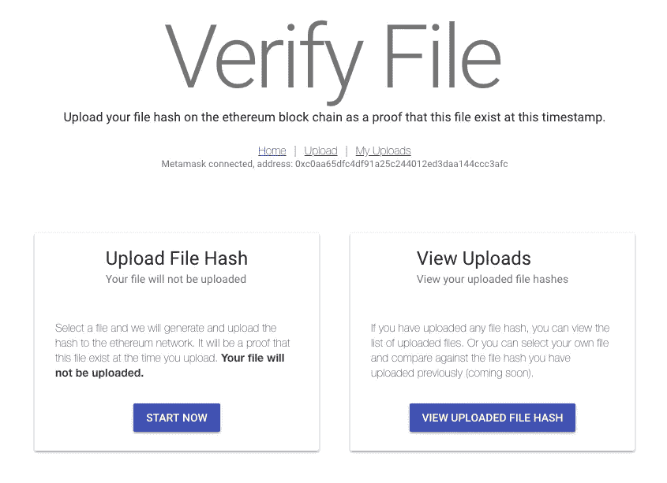
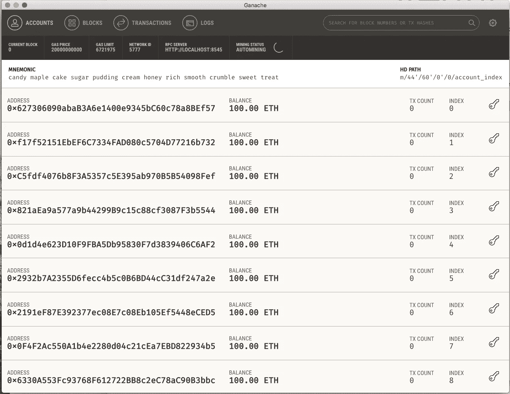
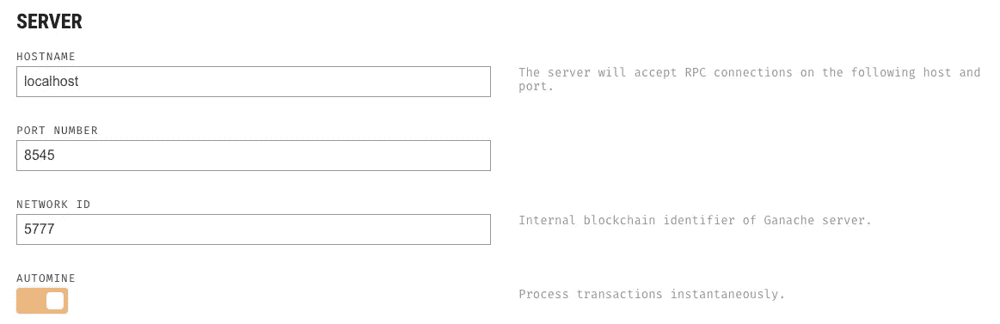
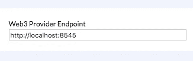
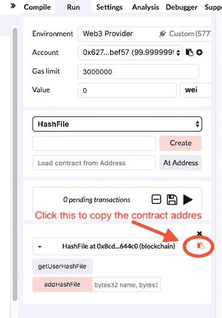
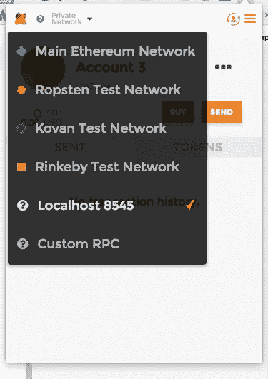

# 零到坚实的东西

> 原文：<https://medium.com/hackernoon/zero-to-something-with-solidity-f9ad0c137447>

渴望开始一个可靠的兼职项目，但不知道如何开始？几周前我也在同样的地方。在这篇文章中，我将指导您从开发前端到上传智能合同的整个过程。该项目的演示可以在这里找到[https://steve-ng.github.io/](https://steve-ng.github.io/)(尝试应用程序需要元掩码)

*本教程需要编程经验，你应该有一个私人的 ETH 钱包(可能来自 myEtherWallet)*



Example app that we will be building

# 开始(预计:20 分钟)

您必须安装以下软件，这需要一些时间

1.  **节点**与 **npm** ，遵循此快速指南:[https://docs.npmjs.com/getting-started/installing-node](https://docs.npmjs.com/getting-started/installing-node)
2.  **加纳切。**它允许你运行本地以太坊网络，从[http://truffleframework.com/ganache/](http://truffleframework.com/ganache/)下载
3.  谷歌 chrome 的 meta mask:这是一个 chrome 插件，你可以从中创建你的 eth 账户。这是一个关于 metamask 的快速指南:[https://www . crypto compare . com/wallets/guides/how-to-use-meta mask/](https://www.cryptocompare.com/wallets/guides/how-to-use-metamask/)
4.  一个文本编辑器如**崇高的文本**

# 运行本地连接到生产以太网的前端(10 分钟)

首先，我们将尝试运行连接到以太坊主网络的本地演示应用程序。在终端中运行以下命令

```
*> git clone* [*https://github.com/steve-ng/verify-file*](https://github.com/steve-ng/verify-file)*Next, we have to ensure you have the right node version, try the following command and you should get 6.0 and above.
> node -v* *
> cd verify-file/verify-frontend
> npm install**We are going to copy the production config into dev config 
> cp properties/prod.json properties/dev.json*> npm start -s
```

在最后一个命令`npm start -s`之后，您应该会看到`localhost:3000`启动了。如果你运行了元蒙版，你应该会看到你之前在[https://steve-ng.github.io/](https://steve-ng.github.io/)看到的。否则，如果您看到“*元掩码未连接，该网站要求设置元掩码”，*尝试在 ur chrome 中单击 ur 元掩码图标，然后单击解锁，然后在`localhost:3000`刷新您的浏览器，它应该可以工作。

如果你喜欢尝试这个应用程序，试着上传一个文件散列并查看你的上传。使用 **1 或 2 gwei** 将交易费用降至最低。我们将很快解释代码是如何工作的。

# 在本地以太网上部署智能合约(15 分钟)

接下来，我们将尝试运行本地以太坊网络并上传智能合同。打开之前下载的 **Ganache** 。您应该会看到如下内容。



Ganche screen when booted up. 10 Ethereum wallet will be preloaded with 100 ETH for you. You can click on the key icon on each row to view its private key.

进入设置(windows ->设置)，记下你的**端口号**和**主机名**。



In this screenshot, my hostname is localhost and port number is 8545\. I’ll be using this config setting.

接下来，我们将上传智能合同。

1.  访问 [Remix — Solidity IDE](http://remix.ethereum.org) ，将[https://github . com/Steve-ng/verify-file/blob/master/contract/hash file . sol](https://github.com/steve-ng/verify-file/blob/master/contract/Hashfile.sol)中的智能合约复制到那里。
2.  接下来，点击选择**运行**选项卡，在环境下选择 **Web3 提供者**。将会弹出一个窗口，询问您的 web3 提供者端点。键入您的主机名和端口号。如果你有和我一样的端口号和主机名，它将是 *http://localhost:8545*



3.最后在同一个**运行**选项卡下，点击粉色**创建**按钮。点击后，按照下面的截图，点击图标复制合同地址。



> 如果您打开 Ganache，在事务选项卡下，您还应该看到 1 **合同创建**事务。

4.最后回到前端应用，用你复制的地址替换`properties/dev.json`的`hashContractAddress`，用`npm start -s`重新启动应用

5.在进入 [http://localhost:3000](http://localhost:3000) 之前，您还必须将元掩码连接到本地以太网。(参考见下图截图)。此外，这是你回到 Ganche，复制一个以太坊钱包私钥，并导入到 MetaMask(预装 100 ETH)的时候



就是这样！在这一阶段，您将使本地前端应用程序连接到您的本地以太网，并且元掩码也连接到本地网络！

# 从前端调用智能合同(10 分钟)

本节介绍前端应用程序如何与以太坊网络上传的智能合约对话。我们使用了一个名为 [**web3JS**](http://web3js.readthedocs.io/en/1.0/index.html) **的库。**我们将在`src/utils/hashContract.js`引用该文件

与智能合约交互的所有应用程序共有 3 个共同步骤

## 1)初始化 web3 提供者环境

您会在文件的前几行注意到这一点:

```
if (typeof web3 !== 'undefined') {
  myWeb3 = new Web3(web3.currentProvider);
} else {
  // set the provider you want from Web3.providers
  console.log('No Web3 Detected... using HTTP Provider');
  return null;
}
```

它所做的是获得你的元掩码实例，并把它赋给变量`myWeb3`

## 2)初始化智能合同

```
hashContract = new myWeb3.eth.Contract([
      {
        "constant": true,
        "inputs": [],
        "name": "getUserHashFile",
        "outputs": [
          {
            "name": "",
            "type": "uint256[]"
          },
          {
            "name": "",
            "type": "bytes32[]"
          },
          {
            "name": "",
            "type": "bytes32[]"
          }
        ],
        "payable": false,
        "stateMutability": "view",
        "type": "function"
      },
      {
        "constant": false,
        "inputs": [
          {
            "name": "name",
            "type": "bytes32"
          },
          {
            "name": "md5Hash",
            "type": "bytes32"
          }
        ],
        "name": "addHashFile",
        "outputs": [],
        "payable": false,
        "stateMutability": "nonpayable",
        "type": "function"
      }
    ],
    hashContractAddress,
    );
```

## 3)最后，调用智能合同

注意上面你已经声明了你的契约为`hashContract`，通过这样做，你允许 web3JS 知道你的智能契约中可用的方法。

您可以使用以下方法调用您的智能合约`hashContract.methods.xxx`

```
hashContract.methods.getUserHashFile().call({from: address});hashContract.methods.addHashFile(nameHash, hexHash).send({from: address})
```

就是这样！我希望您对如何开发一个与以太坊网络交互的前端应用程序有所了解。

*如果你喜欢这个帖子或者认为它对你有帮助，你可以使用我的推荐链接加入一个交流(如果你加入并交易，我会得到一些佣金):*

*   【https://hitbtc.com/?ref_id=59f3f03a31222 
*   [https://www.binance.com/register.html?ref=10050322](https://www.binance.com/register.html?ref=10050322)

或者，试试 coinbase，你每交易 100 美元价值[https://www.coinbase.com/join/58e399c5641b9462a2ee6410](https://www.coinbase.com/join/58e399c5641b9462a2ee6410)的比特币，我们就能获得价值 10 美元的比特币