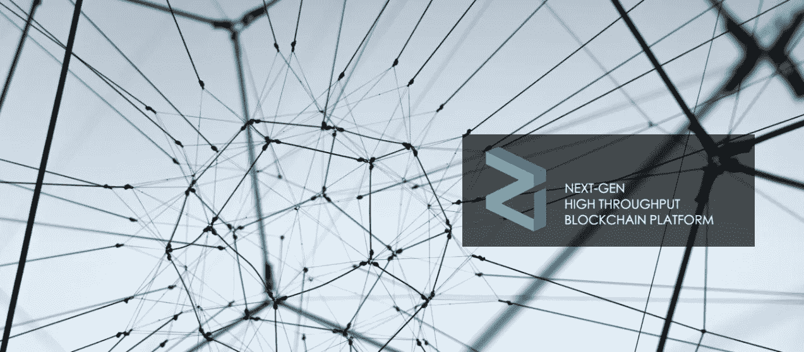

# Zilliqa:区块链可扩展性的游戏规则改变者？

> 原文：<https://medium.com/hackernoon/zilliqa-a-game-changer-when-it-comes-to-blockchain-scalability-4fb1c13b1b8a>

***免责声明*** *:我与 Zilliqa 团队没有任何关系。我既不是财务顾问，也不是财务建议。无论接下来发生什么，都只是反映了我对这个项目的理解，以及我对其未来前景的个人看法。*

最近，我们看到了很多围绕公共区块链可伸缩性的争论，部分源于 [CryptoKitties 的惨败](http://www.bbc.com/news/technology-42237162)。CryptoKitties 是一款在线游戏，由总部位于温哥华的 Axiom Zen 开发，允许用户购买、交易和繁殖数字小猫。在 11 月 28 日公开发行后不久，这款游戏让加密货币界大吃一惊，约占[以太坊](https://www.ethereum.org/)网络总交易量的 11%,这是 CryptoKitties 应用程序所基于的区块链。该平台发布第一周的流量足以给以太坊区块链带来严重压力，堵塞了网络，导致所有区块链用户的交易时间明显变慢，交易成本增加。

一些人可能会认为，在区块链上拥有 Cryptokitties 这样的应用程序是无聊的，因为该应用程序是一个与硬币无关的游戏平台。然而，我认为这是区块链技术的一个伟大应用，也是为什么该技术如此具有颠覆性。事实上，以太坊的联合创始人 Vitalik Buterin 本人也在推特上支持该应用，强调了区块链技术带来的价值:

所以，也许我们不应该问这个问题:*‘我们应该在公共区块链上有一个类似 CryptoKitties 的应用吗？’*，我们真的应该问这样一个问题:*‘公共区块链难道不应该对现实世界的应用程序更具伸缩性吗？*。事实是，**截至目前，区块链的扩展能力有限**，一些人认为这是全球采用该技术的最大技术障碍。

## 什么限制了区块链的可扩展性？

现有公共区块链(以太坊、比特币、Neo、Ripple 等)上的共识协议。)对交易的验证有一个关键的要求:**网络上的每个参与节点必须顺序地验证每个交易，然后将交易存储在分类账上，分类账上的副本由每个节点维护**。这一要求赋予了区块链一个关键特征——“权力下放”。

然而，在这种分散式系统中，随着网络上事务数量的增加(例如，采用区块链)，对处理和存储事务的额外节点的需求也增加了。随着网络上节点数量的增加，每个事务的数据在被网络上的所有节点验证和存储之前必须经过更多的传输。因此，随着更多的节点被添加到网络中，网络不能很好地扩展，因为节点间的延迟随着每个额外的节点以对数方式增加。实际上，**区块链的可扩展性随着网络规模的增加而降低**。

以这种方式运行的公共区块链共识协议被迫选择去中心化而不是高事务吞吐量。

今天，大约有 900 个分布式应用程序(dApps)建立在以太网上。以太坊的事务吞吐量约为每秒 15 个事务(tx/s ),几乎无法处理当前的事务量，并且必须大幅扩展才能处理不久的将来的预期事务量。就交易吞吐量而言，比特币网络甚至更差，处理速度仅为 4 至 7 tx/s。所有现有的公共区块链平台也是如此，其中一些平台的可扩展性略高于其他平台，但所有这些平台都预示着未来**区块链的交易吞吐量可能会成为一个严重的瓶颈，阻碍区块链技术的大规模采用。**

新加坡国立大学(NUS) 的研究人员在区块链创办了一家名为 [**Zilliqa**](https://www.zilliqa.com/) 的初创公司。这款新型区块链采用了“*分片”*技术，可实现约 4000 tx/s 的 Visa 和 MasterCard 级交易吞吐量

## Zilliqa 是如何改变区块链公共领域的游戏规则的

Zilliqa 是一个高吞吐量的公共区块链平台，可以扩展到每秒数千个事务。我认为，Zilliqa 作为一个适合全球采用的公共区块链平台脱颖而出的原因如下:

1.  Zilliqa 可线性扩展。线性可扩展性是指随着网络中参与节点数量的增加，事务吞吐量也以近乎线性的速度增长。虽然这听起来很直观，但事实是，对于大多数区块链来说，事实正好相反，即随着网络中参与节点数量的增加，每个交易现在必须在被验证和添加到分类帐之前被广播到更多的节点，从而限制了交易吞吐量。这就是为什么许多增加事务吞吐量的解决方案依赖于限制网络上参与节点的数量，这是以降低分散化程度为代价的。
2.  **Zilliqa 是第一个实施*分片*的公共区块链。**分片是一个在分布式系统中已经存在很长时间的概念，它被用来提高可伸缩性、性能和 I/O 带宽。然而，这一概念尚未在任何公共区块链上实施。分片是将节点网络自动分割成称为“分片”的并行链的过程，其中每个分片与其他分片一起处理所有事务的一小部分，从而从每个分片产生一个微块。然后将这些微块合并成一个完整的块，添加到区块链中。Zilliqa 现在正率先为公共区块链实现这种自动网络并行化。
3.  【2017 年 10 月，Zilliqa 在运行 3600 个节点和 6 个碎片时，已经在其内部测试网上记录了 2488 tx/s 的峰值吞吐量。这已经是以太坊的 250 倍。随着 Zilliqa 的公共 mainnet 的第一个版本计划于 2018 年在 Q2 举行，这是一个非凡的壮举，并表明 Zilliqa 如何在轨道上使区块链技术适用于高通量应用，从而在全球范围内采用。
4.  **Zilliqa 使用工作证明(PoW)只是为了建立采矿身份，而不是作为一个共识协议，从而显著减少整体能源足迹。这与其他 PoW 区块链(如比特币)有着根本的不同，在比特币中，PoW 是对每个区块进行挖掘，这使得挖掘过程非常耗能。**
5.  **Zilliqa 使用优化的实用拜占庭容错(pBFT)共识协议，该协议赋予事务*终结性*。**换句话说，与需要多个确认的基于 PoW 的共识不同，由于共识协议，pBFT 不允许临时分叉，即，一旦块被提交到区块链，没有其他块可以与提交的块共享相同的父块。因此，不需要确认。
6.  **Zilliqa 基于 pBFT 的共识允许高效管理存储需求。**由于最终性，整个交易历史不必保存在区块链上。相反，只存储最新状态就足够了。但是，使用智能合同，存储需求会显著增加。但 Zilliqa 正在探索与分布式云存储网络(如 [Bluzelle](https://bluzelle.com/) 和 [Genaro Network](https://genaro.network/en) )的合作机会，以便能够利用他们的存储来存储数据块，并在需要时获取数据块，以执行智能合同。
7.  **Zilliqa 的智能合约语言更容易推理，更不容易出现 bug。**与以太坊不同，Zilliqa 的智能契约语言不是图灵完全的，相反它使用了一种非图灵完全的语言，这使得它更简单，更容易理解，更容易接受基于形式化方法的验证。
8.  **Zilliqa 是唯一真正可扩展的区块链协议，不会牺牲安全性或分散性。**还有其他一些区块链协议声称具有更高的交易吞吐量，但它们实现这一点的方式要么是限制网络上参与节点的数量，从而提高集中化程度，要么是使区块链更容易受到攻击，从而降低区块链的安全性。

## Zilliqa 与其“竞争对手”相比如何？

虽然 Zilliqa 的团队没有将其他现有的公共区块链视为竞争对手，而是对他们采取了更开放的态度，促进了从每个项目中学习并在其上发展的健康环境，但我在这里使用术语“竞争对手”的传统意义，以便能够将 Zilliqa 与现有的区块链进行面对面的比较。以下比较基于 Zilliqa 团队与社区分享的信息。

**Zilliqa vs**[**比特币**](https://bitcoin.org/en/) **:**

*   比特币网络每秒处理大约 4 到 7 次交易，而 Zilliqa 在其测试网上每秒已经处理了大约 500 次交易。
*   由于比特币使用 power 作为共识协议，它在每个区块上都应用了 power，这使得区块挖掘更加耗能。另一方面，Zilliqa 使用 pBFT 作为共识协议，PoW 仅用于矿工识别。因此，与 PoW 相关的高能源成本不适用于 Zilliqa。
*   与比特币的共识机制不同， **Zilliqa 的 pBFT 赋予了交易的终结性**，不需要确认，这大大降低了存储需求。
*   与比特币不同， **Zilliqa 拥有智能合约功能**，并支持在其平台上构建 dApps。

**Zilliqa vs**[**以太坊**](https://www.ethereum.org/) **:**

*   以太坊网络处理大约 10 到 12 tx/s，而 **Zilliqa 的事务吞吐量已经高出大约 250 倍**。
*   就像比特币一样，以太坊也使用 PoW 作为其共识协议。因此 **Zilliqa 的 pBFT 共识协议使其更加节能**。
*   以太坊基于 PoW 的共识不能防止临时分叉，因此在提交块之前需要一定数量的确认。然而， **Zilliqa 的 pBFT 为交易提供了终结**，不需要确认，这大大降低了存储需求。
*   与以太坊不同， **Zilliqa 为智能合约**使用了一种非图灵的完整语言，这使得它不容易出现错误，并且更容易接受基于正式方法的验证。
*   以太坊仍在探索利益证明(PoS)和分片作为提高可伸缩性的替代方案。然而，Zilliqa 已经选择并实现了分片作为解决区块链可伸缩性约束的方法，这可能使它在以太坊之前很久就可以运行高吞吐量的应用程序。在真正可扩展的区块链领域，Zilliqa 拥有先发优势。

**Zilliqa 对**[**NEO**](https://neo.org/)**:**

*   作为共识协议，NEO 使用委托 BFT (dBFT ),这需要一个称为簿记节点的节点子集来代表整个网络运行共识。这些簿记节点还需要存放和锁定足够大的抵押品。这种方法的缺点是，如果簿记节点的数量太大，它会由于锁定大量抵押品而显著减少来自市场的流动性；如果簿记节点的数量太少，它会降低区块链的分散程度，使其更不安全。另一方面，Zilliqa 使用 pBFT 达成共识，有大量节点不需要锁定任何抵押品。因此， **Zilliqa 的共识协议既没有降低市场流动性，也没有降低分散化程度或安全性**。
*   NEO 通过在节点子集上运行 dBFT 来应对可扩展性挑战，从而降低分散性和安全性。Zilliqa 通过将网络和事务分成并行链来解决可伸缩性挑战，每个链处理自己的微块，并合并到最终的块中。因此， **Zilliqa 是真正可扩展的，同时保持了分散性和安全性**。

**Zilliqa vs**[**EOS**](https://eos.io/)**:**

*   EOS 使用委托 PoS (dPoS)作为其共识协议，其中 21 个节点的子集(称为块生产者)用于提出块。这确实产生了具有可扩展性的高吞吐量，但是导致了网络的显著集中化和安全风险。 **Zilliqa 可在不影响区块链的分散性或安全性的情况下进行扩展。**
*   **EOS 的 dPoS 不保证交易的终结性，Zilliqa 的 pBFT 则保证交易的终结性**。

## 团队和顾问

Zilliqa 的团队由在区块链领域和网络安全领域拥有丰富经验的知名科学家、企业家和工程师组成。

Zilliqa 的**首席执行官**，[，**董新树**，](https://www.linkedin.com/in/xinshudong/)，拥有[新加坡国立大学](http://www.nus.edu.sg/)的计算机科学博士学位，是一名安全系统构建从业者。他在新加坡领导了几个国家网络安全项目，并在著名的国际会议上广泛发表了他的研究。

Prateek Saxena 是 Zilliqa 的首席科学顾问，拥有加州大学伯克利分校的计算机科学博士学位。他是新加坡国立大学计算机科学的研究教授，曾获得多项顶级奖项，如 2017 年[35 岁以下十大创新者(MIT TR35 Asia)](http://emtechasia.strikingly.com/blog/mit-technology-review-unveils-2017-regional-list-of-innovators)。

Zilliqa 的顾问委员会还包括区块链行业的知名人士，如[Loi Luu](https://www.linkedin.com/in/loiluu/)—[Kyber Network](https://kyber.network/)、[周知方](https://www.linkedin.com/in/shuojizhou/)—[FBG 资本](https://www.fbg.capital/)、[Nicolai Oster](https://www.linkedin.com/in/nicolaioster/)—[瑞士比特币公司](https://www.bitcoinsuisse.ch/)合伙人、[Alexander Lipton](https://www.linkedin.com/in/alexander-lipton-aa2256bb/)——StrongHold Labs 创始人兼首席执行官。

## 项目路线图

Zilliqa 路线图的亮点如下:

*   Zilliqa 已经发布了**公共测试网 v1.0**
*   **公共测试网 v1.5** 计划于 **Q1 2018** 发布
*   **公共主网**发布定于 **Q2 2018**
*   **dApps** 计划于**2018 年第三季度**发布

Zilliqa 有一个非常积极的路线图，最大的事件是它的 mainnet 发布。

## 结果

底线是，对 Zilliqa 来说，天空才是真正的极限。这也是 Zilliqa 的未来潜力如此令人兴奋和值得关注的原因！