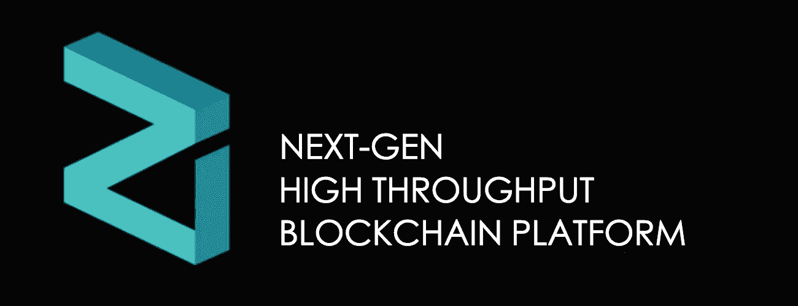
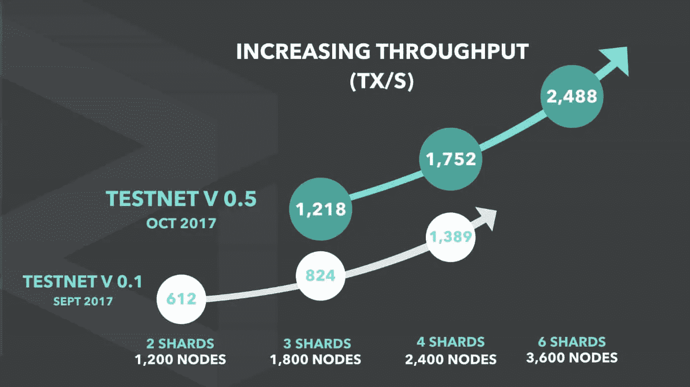
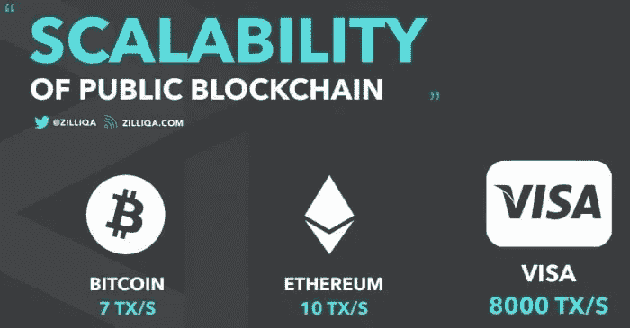
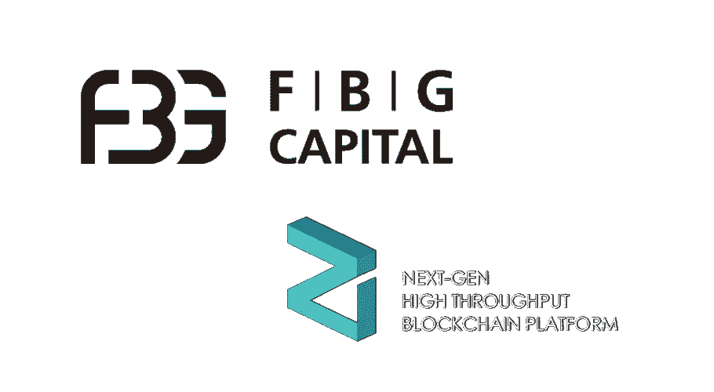
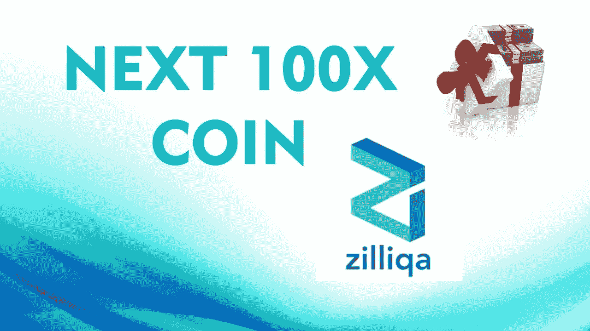

# Zilliqa 可伸缩性的圣杯？

> 原文：<https://medium.com/hackernoon/zilliqa-the-holy-grail-of-scalability-a761c246e83f>

今天，困扰区块链产业向前发展的最大问题之一是 T2 无法扩大规模。这不是秘密，所以已经有一些值得注意的可扩展性项目，如:照明网络，等离子体，侧链，Mimblewimble 等，但对我来说最有趣的**是分片**的概念。自从 Vitalik 为以太坊推出了一个**分片概念证明以来，关于这项技术已经有了大量的讨论。Zilliqa** 是一个采用**新颖方法**进行分片的特殊项目。这个项目**超越了**将网络的整个状态分割成一堆称为碎片的分区。Zilliqa 实际上可以将区块链的状态和交易历史分开。也就是说，网络中的每个节点都有一份当前状态的副本，但交易历史将被分割成不同节点的片段。我认为，凭借他们积极进取的路线图、令人印象深刻的团队、资金、走向市场的战略以及**创新的切分方法，这可能会成为 12 个月内的十大硬币。**

# 基础知识:

1.  Zilliqa 项目**源于 2016 年的新加坡大学**
2.  Zilliqa 是下一代吞吐量区块链平台，它是**关注可伸缩性的**、基于**区块链的支付处理**和**分散应用(dapp)平台**
3.  与许多区块链项目不同，Zilliqa **已经实现了分片**，并将在 2019 年 1 月发布他们的**mainnet**
4.  **股票代码:ZIL**
    价格:$ 0.04
    市值排名:30
    市值:306540431 美元
    流通供应量:7569302268 ZIL
    最大供应量:126 亿 ZIL
    24 小时平均交易量:16248610 美元

# 团队:

1.  Zilliqa 团队由拥有新加坡国立大学博士学位的 Xinshu Dong 领导。Xinshu 是一名科学家，在构建安全系统方面有着丰富的经验，从区块链到 web 浏览器和应用程序。最近，他领导了安泉专有的可扩展安全区块链的研发工作，该产品用于金融和电子商务应用。
2.  该团队的技术负责人是贾，他拥有新加坡国立大学的博士学位。他以前的经验主要是用加密机制构建安全的、保护隐私的 web 和分布式系统。他之前的研究工作已在顶级国际会议上发表，如 CCS、USENIX 安全、PETS、RAID、ESORICS，还获得了 W2SP (2014)最佳论文奖。他的工作得到了谷歌和苹果的认可(Chrome 的 CVE 2014–7948，Safari 的 CVE 2015–5907)。
3.  Zilliqa 团队有一个**额外的 16 名区块链开发者和工程师**
4.  Zilliqa 团队的其他成员还有 **7 名业务开发人员和策略师**

# 增长驱动因素:

1.  在他们最近在 **testnet 上的实验中，Zilliqa 通过网络上的 3600 个节点实现了 2500 TPS**。
2.  加入网络的节点越多，网络运行越快。这是一种独特的方法，因为随着节点数量的增加，大多数区块链的速度会降低。Zilliqa 变得更快。
3.  像以太坊一样，Zilliqa 支持智能合约，但它使用了一种专门为分片构建的新脚本语言，能够并行运行程序，以充分利用网络的计算能力。
4.  虽然分片作为一个概念在数据库领域已经存在了一段时间，但是 **Zilliqa 是第一个真正实现它的区块链平台**。Zilliqa 执行分片有三种不同的方式:网络分片、原子事务分片和计算分片。
5.  网络分片是指将网络分成子网的过程。这意味着事务子集可以并行处理，这**导致事务吞吐量比单一区块链网络快得多。**
6.  Zilliqa 使用 PoW 只是为了**防止 Sybil 攻击**(一种基于攻击者伪造身份的网络攻击)和执行分片。
7.  **Zilliqa 中的事务看起来是这样的**:用户发起一个事务，然后该事务被发送到一个 shard。碎片验证事务，将其与其他事务分组以形成事务的“微块”，并且碎片就微块的有效性达成共识。该微块被发送到 DS 委员会，DS 委员会将微块组合成所谓的“最终块”，并在将微块添加到区块链之前对该微块进行最终协商。
8.  Zilliqa 还使用所谓的**原子事务分片协议**，这意味着它允许网络在最终操作中确认事务，就像没有分片一样。这是通过 Zilliqa 的“基于账户的设计”来完成的，在这种设计中，交易是根据发送交易的账户来划分的。
9.  Zilliqa 使用**分片的最后一种方式是通过一个计算框架，该框架允许资源密集型 dapps 在网络上更高效地运行。Zilliqa 网络能够一次运行多条指令，相比之下，其他 dapp 和智能合约平台(如以太坊)一次只能处理一条指令。**
10.  最近， [**Zilliqa 与 Bluzelle**](https://blog.bluzelle.com/bluzelle-first-wave-of-collaborations-efb2bd0cf33d) 合作。Bluzelle 承诺了一个分散的数据库解决方案，这将解决 Zilliqa 在使用分片实现智能契约时必须克服的内存问题。
11.  **高调投资 Zilliqa 的基金:**

1kx —超链资本— 8 位小数资本—丹华资本(DHVC)—One Block Capital—NEO Global Capital—希格诺资本—Node Capital—Kenetic Capital—FBG 资本—Polychain Capital—meta chain Capital

# 逆风:

1.  Zilliqa 实现事务，但不实现状态分片。状态分片更复杂，仍在研究中。有很多问题需要解决，还没有人为区块链实现一个工作状态分片。
2.  Zilliqa 不在他们的区块链上存储状态信息。在平台上实现智能合约需要存储状态信息，但已经与 Bluzelle 合作，作为这个问题的解决方案。
3.  这个团队在很大程度上是从核心编程/数学/计算机科学人群中培养出来的，所以没有太多的营销。这意味着你不会看到炒作或泵新闻被团队永久化。他们专注于让技术自我实现。

# 结论:

Zilliqa 的核心特性是，Zilliqa 的交易速度理论上会随着网络节点数量的增加而增加，这使得 Zilliqa 能够超越现有的类似平台，如以太坊。Zilliqa 开发团队表示，该网络最终应该能够与 VISA 和 MasterCard 的交易处理速度相匹配，但费用更低，并且不依赖于中央网络。有了 Zilliqa 的合作伙伴支持网络、高知名度的资助者、尖端技术和领导力，一旦 mainnet 启动，这枚硬币很容易就能进入前 10 名。

**想了解更多信息，请访问我的网站:**

[www.MasiDigitalVentures.com](http://www.MasiDigitalVentures.com)