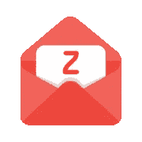
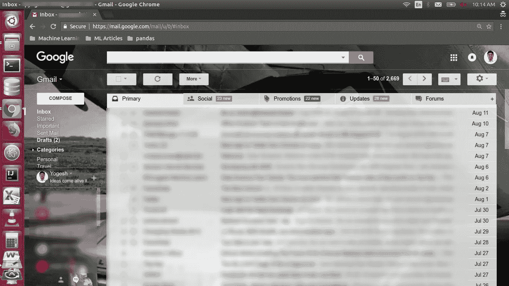
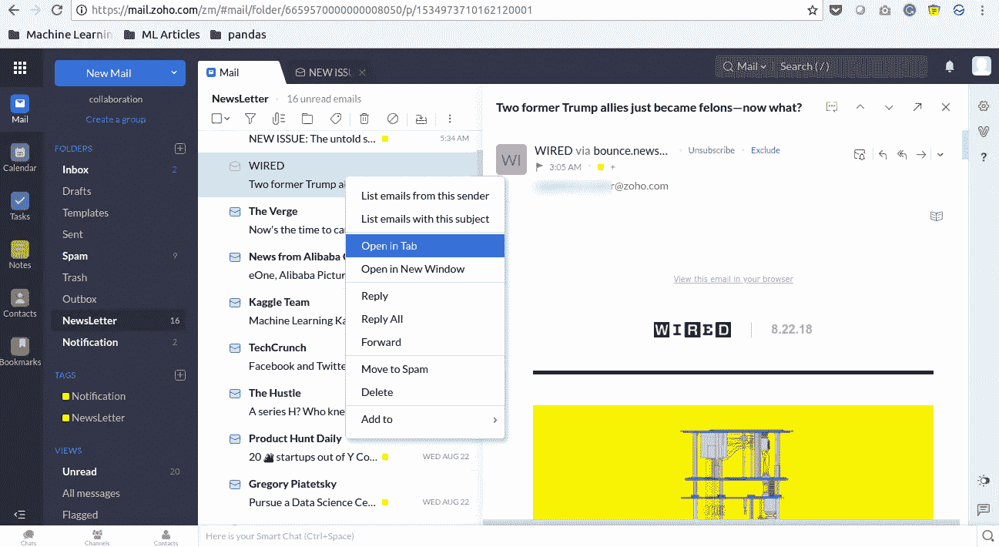
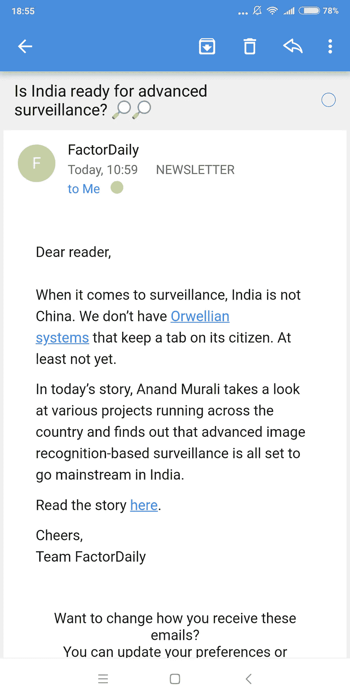
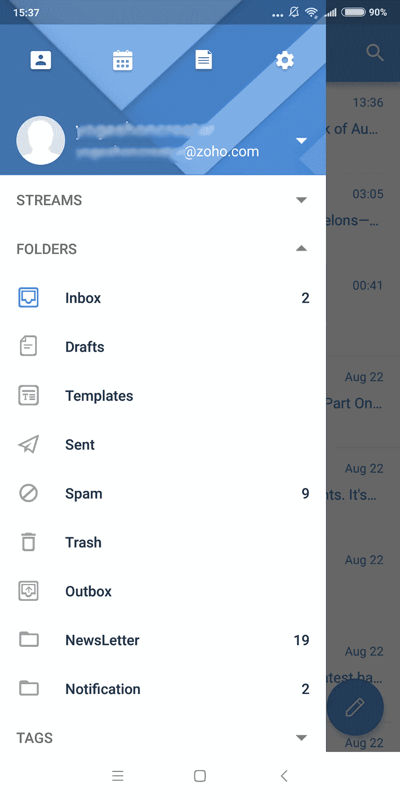
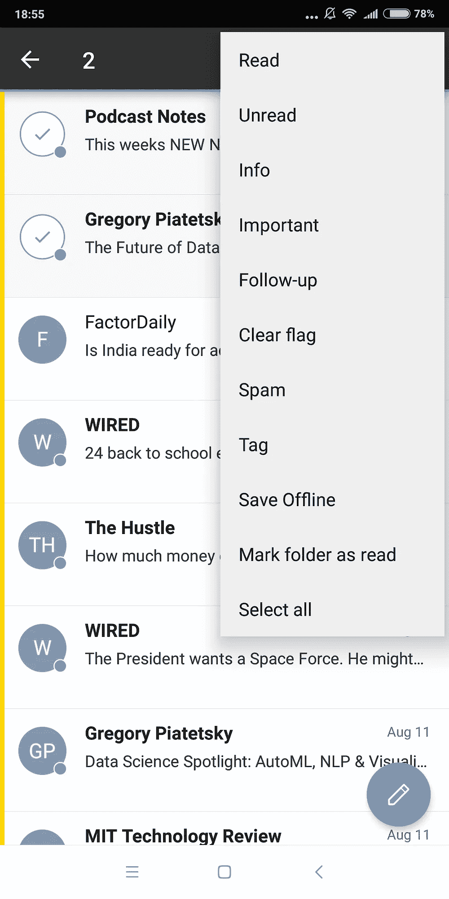
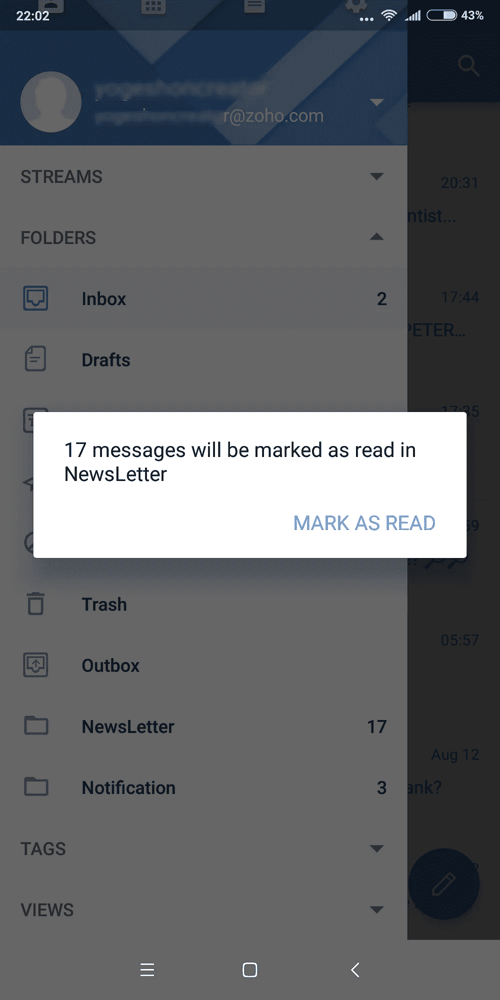
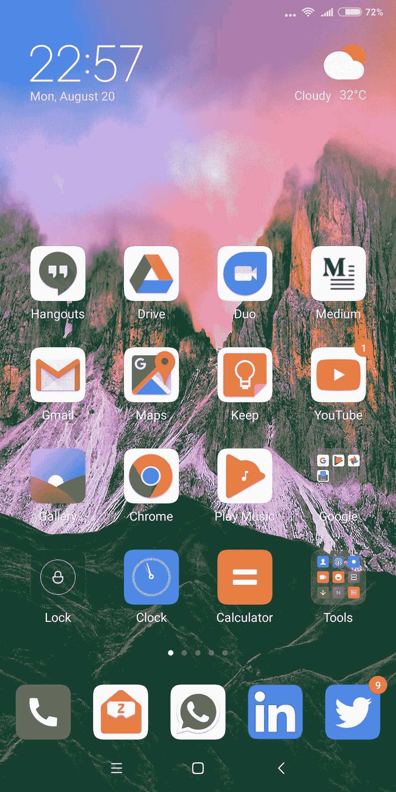

# Zoho mail，一个时事通讯伴侣

> 原文：<https://medium.com/hackernoon/zoho-mail-a-newsletter-companion-33ced62a23ca>

当我在大学的时候，我每天喜欢做的事情是阅读。我曾经去 [**招待所**图书馆](https://media.licdn.com/media-proxy/ext?w=800&h=800&f=n&hash=0VR2TVUCqqwWB54ZigPRX1AS538%3D&ora=1%2CaFBCTXdkRmpGL2lvQUFBPQ%2CxAVta9Er0Vinkhwfjw8177yE41y87UNCVordEGXyD3u0qYrdf3XhK8KLerLyuQsfLCwclFczffL5FjDiD8C1eNnqdIp1jZXkIY24ZxUBbFI8lWxI)找过它。这在我(我们)这一代人中是一种罕见的习惯。我阅读和聊天(辩论)时事的同伴是宿舍工人，他们唯一的爱好(消磨时间)是宿舍图书馆(印度**前 Jio 时代**)。

我觉得我养成的阅读习惯非常好。我开始了解身边发生的事情。我开始成为一个有强烈阅读习惯的不同的人。参加工作后，我对技术产生了兴趣。传统媒体没有报道很多让我感兴趣的事情。我喜欢阅读的网站有 [Techcrunch](https://techcrunch.com/) 、 [Factordaily](https://factordaily.com) 、 [Nextbigwhat](http://nextbigwhat.com) 、 [Livemint](https://www.livemint.com/) 等..，每天跟踪看什么发布什么和我相关真的很痛苦。

这就是时事通讯发挥作用的地方。每个网站都发布一份时事通讯。这非常容易保持阅读习惯。但是你如何阅读所有的时事通讯而不遗漏它呢？可能吗？你能用普通的 Gmail 账户做到吗？

据我所知，用 Gmail 阅读时事通讯非常困难，因为它有社交、促销和其他电子邮件，在 Gmail 中真的很难做到。大多数时事通讯都会更新。你可以说为什么我不能再创建一个 Gmail id 来做同样的事情。但这取决于你。

所以我决定单独使用另一个[电子邮件](https://hackernoon.com/tagged/email)服务来发送简讯。我尝试了另一个 gmail 帐户 Hotmail，但它无法运行。

> 那是我开始知道 Zoho Mail 的时候。个人使用免费。起初，它看起来很奇怪。但不到一周，我就适应了。我开始只用它来阅读时事通讯。 [Zoho mail](https://hackernoon.com/tagged/zoho-mail) 有一个独立的标签类型叫做“时事通讯”。所以所有的简讯都会自动传送到简讯文件夹。与[的 Gmail](http://gmail.com) 相比，它非常容易使用。

Zoho mail 有一个独特的设计，这使得它非常容易阅读。Zoho 邮件看起来像上面的截图。三个不同的窗格。简直牛逼。

**在选项卡**中打开

我会在邮件中的新标签页打开我想阅读的邮件。这样我就不会错过任何东西。甚至 gmail 都没有这个功能。

是非常丰富的阅读体验。

**手机 App**

没有移动应用，世界上什么都不会动。我使用安卓系统，所以让我来说说安卓版的 Zoho mail。

手机应用也有一些很酷的功能。

离线阅读

只需点击数字，即可将所有内容标记为已读

最后，Zoho 邮件值得在我的手机中占据这个位置。

