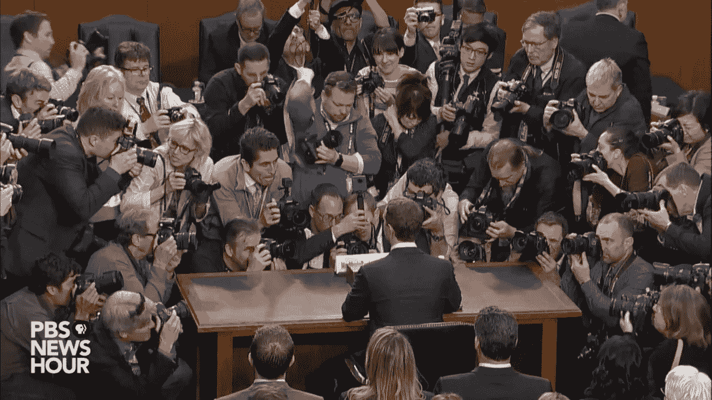
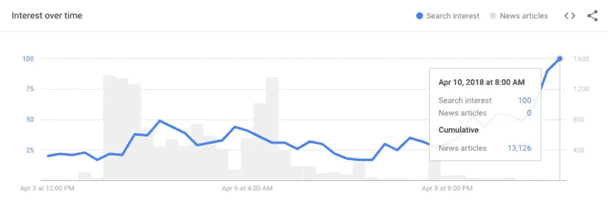

# 扎克伯格的证词直播

> 原文：<https://medium.com/hackernoon/zuckerberg-live-c9e7ce1b9b54>

Credits: [同样在昨天，2018 年美国国会民主党候选人亚历山大·奥卡西奥-科尔特斯](https://medium.com/u/c833ad796b9f#扎克伯格参议院的证词，肯定会为我们的联盟感到骄傲。”

<h1 id=) 

[Via](https://medium.com/u/4c5db72117d1#HonestAds 法案后，他补充道:“向前迈出了一大步。[……]我希望谷歌能很快加入脸书和推特的行列，支持这项两党合作的法案，为在线政治广告带来问责制和透明度。”
<h1 id=)

[Via Emma Loop of](https://medium.com/u/6f50810b16a8#HonestAds </a>法案中自愿实施更严格的网络政治广告标准。美国人有权知道谁在出钱影响我们的选举，不管是什么平台。”
<figure class=) [BuzzFeed](https://medium.com/u/ef7ccf89e7dc?source=post_page-----c9e7ce1b9b54--------------------------------) [BuzzFeed News](https://medium.com/u/41c584236554?source=post_page-----c9e7ce1b9b54--------------------------------) on Twitter

# 2018 年 4 月 10 日–中午 12 点 25 分

在最初出现在《财富》杂志(Fortune)的一篇评论文章中，参议院司法委员会(Senate Judiciary Committee)网站随后发布了该文章，该委员会主席参议员查克·格拉斯利表示，扎克伯格的证词“吸引了很多关注，但重要的是专注于听证会的原因:收集信息，并就我们如何解决日益增长的消费者隐私问题展开公开对话。”

他补充道:“在过去的几周里，涉及剑桥分析公司的数据滥用事件显然已经破坏了消费者的信任。坦率地说，这是早该进行的对话的催化剂。许多人可能没有完全理解或意识到个人数据被收集、保护、传输、使用或滥用的程度。确保有关数据隐私和安全的政策与技术的快速发展同步至关重要。数据隐私应该与消费者的期望挂钩。至少，这应该意味着对消费者来说增加了透明度。”

 [## 参议员查克·格拉斯利:我今天需要从马克·扎克伯格那里听到的话|美国参议院…

### 美国参议院司法委员会

www.judiciary.senate.gov](https://www.judiciary.senate.gov/press/rep/commentary/sen-chuck-grassley-what-i-need-to-hear-from-mark-zuckerberg-today) 

# 2018 年 4 月 10 日–上午 11:59

Via Haley Barlow on Twitter

# 2018 年 4 月 10 日–上午 11:25

市政厅媒体 [的 Cortney O'Brian 报道](https://twitter.com/obrienc2/status/983726423180488704)参议员 John Kennedy 在扎克伯格听证会之前说:“我不反对大公司。我反对哑巴。我首先反对脸书，其次反对人民。”

# 2018 年 4 月 10 日–上午 10:26

今天，脸书推出了[数据滥用奖金](http://facebook.com/data-abuse)，奖励举报应用开发者滥用数据的人。

“我们承诺在几周前[推出这个项目](https://newsroom.fb.com/news/2018/03/cracking-down-on-platform-abuse/)，作为我们更快发现潜在的滥用人们信息的努力的一部分，”脸书产品安全负责人 Collin Greene 在今天的一篇博客文章中写道。“受我们用来发现和解决安全问题的[现有漏洞奖励计划](https://www.facebook.com/BugBounty/)的启发，数据滥用奖励将帮助我们识别违反我们的[政策的行为](https://developers.facebook.com/policy)。”

 [## 数据滥用赏金:脸书现在奖励数据滥用的报告

### 今天，脸书推出了数据滥用奖金，奖励那些举报应用开发者滥用数据的人。我们…

newsroom.fb.com](https://newsroom.fb.com/news/2018/04/data-abuse-bounty/) 

# 2018 年 4 月 10 日–上午 10:23

Via [Senator Chris Coons](https://medium.com/u/21eff43999e7?source=post_page-----c9e7ce1b9b54--------------------------------) on Twitter

# **2018 年 4 月 10 日–上午 10:15**

纽约媒体实验室[的](https://medium.com/u/e94797f3db55?source=post_page-----c9e7ce1b9b54--------------------------------)[贾斯汀·亨德里克斯](https://medium.com/u/7b98787d1b6d?source=post_page-----c9e7ce1b9b54--------------------------------)发布了这张图片:

# 2018 年 4 月 10 日–上午 9:20

Via [Bloomberg](https://medium.com/u/3d76181076e6?source=post_page-----c9e7ce1b9b54--------------------------------) on Twitter

# **2018 年 4 月 10 日–上午 9 点**

通过 KTVU 进行的 Twitter 现场投票:本周的国会听证会会改变你对脸书隐私的看法吗？到目前为止，61%的人回答“不”

# 2018 年 4 月 10 日–上午 8:40

扎克伯格在 Twitter 上有超过 12，000 条推文。截至今天早上，他还在谷歌搜索(第 60 大热门)上拥有超过 13，000 篇新闻文章。

Via Google Trends

在脸书，最流行的趋势是剑桥分析。

# 2018 年 4 月 10 日–上午 8:30

[西沃恩·休斯](https://medium.com/u/f01f60d233d7?source=post_page-----c9e7ce1b9b54--------------------------------)[华尔街日报](https://medium.com/u/18ebb660d0b9?source=post_page-----c9e7ce1b9b54--------------------------------)关于[扎克伯格证词中的 5 件值得关注的事情](https://www.wsj.com/articles/facebooks-mark-zuckerberg-testifies-before-congress-what-to-watch-1523352600):

*   扎克伯格先生能在没有剧本的情况下表达悔悟吗？
*   脸书会披露更多坏消息吗？
*   是否有立法或监管的动力？
*   为什么脸书在与政府达成协议以获得用户同意收集个人数据后，等了这么久才做出政策改变？
*   选举年的政治会使气氛复杂化吗？

# 2018 年 4 月 10 日–上午 8:10

参议员约翰·图恩(John Thune)今天早上在哥伦比亚广播公司(CBS)谈到扎克伯格时说:“我认为他想承担这个责任，我认为他需要这样做。脸书必须站出来，为发生的事情承担责任，并告诉我们他们未来将如何保护用户的数据，以及他们将如何主动阻止他们的有害行为。"

Via [Craig Caplan](https://medium.com/u/2564a8cc9aba?source=post_page-----c9e7ce1b9b54--------------------------------) on Twitter

# 2018 年 4 月 10 日–早上 6:30

“大技术的新时代开始了，”Axios 今天早上说，称今天的见证是“新的一天[……]，一个由怀疑、监管和不断碰撞定义的新时代。”

今早的政治剧本指出“许多国会议员几乎不懂技术。”它补充说:“立法者不会在一次听证会后就停止。政府往往需要很长时间来制定法规，但扎克伯格将在现场为硅谷辩护，并证明为什么连接数十亿人的大型社交网络应该得到与其他任何主要公用事业不同的对待，以及为什么它不需要国会来监管。”

# 2018 年 4 月 9 日–晚上 8:45

“他是一个非常好的年轻人，”[参议员黛安娜·范斯坦](https://medium.com/u/5ecf91bc03ac?source=post_page-----c9e7ce1b9b54--------------------------------) [告诉](https://twitter.com/StevenTDennis/status/983486305928663040)彭博[史蒂文·丹尼斯](https://medium.com/u/72d0c1bdd268?source=post_page-----c9e7ce1b9b54--------------------------------)她与扎克伯格的会面。“他很年轻。他有 27000 名员工。这真是太神奇了。他显然很聪明。很明显，他知道自己在做什么，而且他的性格非常好。在我看来，他一点也不锋芒毕露。”

# 2018 年 4 月 9 日–晚上 8:10

Via John Thune via Twitter

Via John Thune via Twitter

# 2018 年 4 月 9 日–下午 7:45

参议员查克·格拉斯利告诉美国消费者新闻与商业频道的 Kayla Tausche，他与扎克伯格的会面“只是过程，没有实质内容”，扎克伯格看起来“相当平静”

# 2018 年 4 月 9 日–晚上 7 点

“脸书辜负了我们，”参议员比尔·纳尔逊在推特上写道。“他们不仅未能保护数百万用户的个人信息，还对我们隐瞒了这些信息。如果脸书不能解决自己的隐私问题，其他公司也一样，那么我们将没有任何个人隐私。”

# 2018 年 4 月 9 日–下午 4:10

Via Marianna Sotomayor on Twitter

参议员约翰·肯尼迪在美国消费者新闻与商业频道接受采访时说:“我为和平而来。我不想把他们监管得半死，但我认为很明显，数字乐土并不都是牛奶和蜂蜜。我们在潘趣酒碗里发现了一些杂质。”

# 2018 年 4 月 9 日–下午 3 点 55 分

参议员比尔·纳尔逊，参议院商务委员会的资深成员，在今天与扎克伯格会面后:据彭博称，他是“真诚和直率的”。“我相信他明白，监管可能就在眼前。”

Via [Bloomberg](https://medium.com/u/3d76181076e6?source=post_page-----c9e7ce1b9b54--------------------------------) on Twitter

Via Kevin Cirilli on Twitter

# 2018 年 4 月 9 日–下午 3 点 45 分

“在这方面，我没有具体的政策声明，但我认为我们都期待着那份证词，”白宫新闻秘书萨拉·桑德斯在今天的新闻发布会上回答一名记者的提问时说:“我想问你关于马克·扎克伯格的问题——前往国会山作证。本届政府经常谈到放松管制，以及总统和本届政府所做的放松管制的努力。但有一个问题是，脸书是否应该受到监管。白宫对脸书是否应该受到监管有立场吗？如果是，那是什么立场？”

Via [ABC News](https://medium.com/u/40810111aa4c?source=post_page-----c9e7ce1b9b54--------------------------------) on Twitter

# 2018 年 4 月 9 日–下午 1:30

Via Reuters on Twitter

# 2018 年 4 月 9 日–上午 11:55

阅读马克·扎克伯格的证词全文(通过 [Axios](https://medium.com/u/5e0bd5d0161a?source=post_page-----c9e7ce1b9b54--------------------------------) ):

> “脸书是一家理想主义和乐观的公司。在我们存在的大部分时间里，我们关注的是人们之间的联系能够带来的所有好处。[……]但现在很明显，我们没有做足够的工作来防止这些工具也被用于伤害。这适用于假新闻、外国对选举的干涉、仇恨言论，以及开发者和数据隐私。我们对自己的责任没有足够的认识，这是一个很大的错误。是我的错，我很抱歉。我创办了脸书，我管理它，我对这里发生的一切负责。”

# 2018 年 4 月 9 日–上午 10:50

Via [Geoff Bennett](https://medium.com/u/eaca4f6cc7b?source=post_page-----c9e7ce1b9b54--------------------------------) on Twitter

# 2018 年 4 月 9 日–上午 10:30

[众议员 Jan Schakowsky](https://medium.com/u/792cae927d63?source=post_page-----c9e7ce1b9b54--------------------------------) 的[评论美国消费者新闻与商业频道](https://www.cnbc.com/2018/04/09/what-facebooks-mark-zuckerberg-needs-to-tell-congress-rep-jan-schakowsky.html?__source=sharebar|twitter&par=sharebar):“当 Mark Zuckerberg 作证时，我期待一份脸书如何分享其 20 亿用户数据的详细说明——其中大多数人不知道他们的数据被分享。我希望听到脸书如何加强其隐私保护，并让消费者了解和选择如何分享他们的数据。国会面临的一个大问题是接下来会发生什么。我敦促我的共和党同事提出他们自己的想法，这样我们就可以谈判一项两党法案，以改善数据安全和消费者隐私。”

# 2018 年 4 月 9 日—上午 9:30

 [## 脸书推出新举措，帮助学者评估社交媒体对选举的影响

### 今天，脸书宣布了一项新举措，以帮助提供关于社会角色的独立、可信的研究…

newsroom.fb.com](https://newsroom.fb.com/news/2018/04/new-elections-initiative/) 

在今早出版的《大西洋》的对[罗宾逊·迈耶](https://medium.com/u/f104505af1e4?source=post_page-----c9e7ce1b9b54--------------------------------)的采访中，扎克伯格说:

> “我认为，我们看待自己责任的方式发生了非常基本的转变。我们过去认为我们的角色是为人们打造工具，并说，‘嘿，我们要把这种力量交到你的手中。’我们认为人基本上是好的，我们认为这可以产生积极的影响。现在，我想我们明白了——因为我们有能力开发这些东西，也因为我们运营的规模——我们也有责任确保所有这些工具都得到很好的使用，而不仅仅是把它们放在人们的手中。你知道，你不能只是给人们一个声音。你还需要确保这种声音不会被外国用来干涉选举或传播假新闻。"

 [## 见见可能让扎克伯格下地狱的立法者

### 议员们本周将有机会质询脸书首席执行官马克·扎克伯格关于该公司的数据操作，其…

www.axios.com](https://www.axios.com/lawmakers-who-could-give-zuckerberg-hell-3f269ea3-f9c6-44b7-8a97-08643e852746.html)  [## 马克·扎克伯格前往国会时的 5 个问题

### 旧金山(美联社)-国会有很多问题要问脸书首席执行官马克·扎克伯格，他将在国会作证…

finance.yahoo.com](https://finance.yahoo.com/news/5-questions-mark-zuckerberg-heads-001210758.html?.tsrc=fauxdal)  [## 脸书的扎克伯格可以期待来自国会的棘手问题

### 脸书公司首席执行官马克·扎克伯格将于周一会见立法者，这是…

www.bloomberg.com](https://www.bloomberg.com/news/articles/2018-04-09/tough-questions-facebook-s-zuckerberg-can-expect-from-congress?cmpid%3D=socialflow-twitter-tictoc&utm_content=tictoc&utm_source=twitter&utm_campaign=socialflow-organic&utm_medium=social) 

# 4 月 8 日星期日—晚上 10 点

扎克伯格“将于周一与一些美国议员举行会议，这是他因一家政治咨询公司使用客户数据而出席国会听证会的前一天，”[路透社援引两名国会助手的话报道](https://www.reuters.com/article/us-facebook-privacy-congress/zuckerberg-to-meet-with-u-s-lawmakers-monday-sources-idUSKBN1HG00H)。

纽约时报 [报道](https://www.nytimes.com/2018/04/08/technology/zuckerberg-gets-a-crash-course-in-charm-will-congress-care.html)“为了准备扎克伯格先生的证词，这是他的第一次露面，脸书在过去的几周里试图将其公众形象从一个桀骜不驯、神秘兮兮的庞然大物转变为一个开放的悔悟典范，宣布了一系列新的隐私和反滥用措施，并让公司高管接受了多次采访。它还聘请了一个专家团队，其中包括乔治·w·布什总统的前特别助理，让 33 岁的大脑编码员扎克伯格参加谦逊和魅力速成班。我们的计划是，当扎克伯格周二在参议院商业和司法委员会面前坐下来时，他将有具体的变化要谈，没有他不能处理的问题。