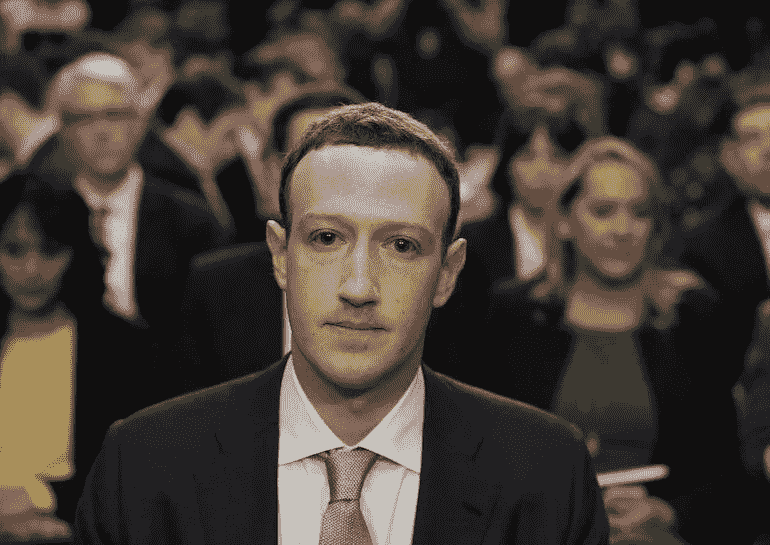
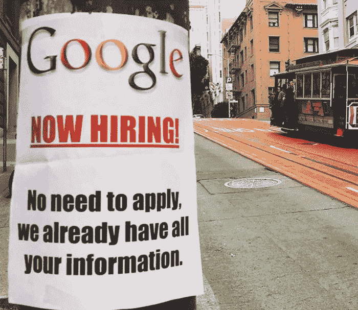

# 扎克伯格的听证会——字里行间

> 原文：<https://medium.com/hackernoon/zuckerbergs-hearings-between-the-lines-8de6333b9457>

*(Image: pool photo via CSPAN)*

脸书的首席执行官举行了一场激烈的听证会，围绕该平台实际收集的内容有许多故事和谣言。一些人批评扎克伯格回避调查，而另一些人则对没有询问的问题或立法者有限的技术知识表示愤怒。

在这篇文章中，我将回顾一些被问到的问题和给出的答案，并尝试从众所周知的关于脸书的事实中给出答案。

脸书会跨设备追踪用户吗？

罗伊·布朗特参议员问了这个问题，但马克不能立即回答。

事实证明，脸书确实这么做了，并将其作为他们服务的一部分进行宣传:[测量脸书、各种设备和移动应用的转化率](https://www.facebook.com/business/news/cross-device-measurement)

这是棘手的部分。如果脸书跟踪用户，即使他们不使用脸书。这也是脸书做的事情——但不像某些间谍软件。我们很快会谈到这一点。

**脸书听你的音频是为了提取广告信息吗？**

扎克伯格给了参议员加里·彼得斯一个直接的“不”。

有许多猜测说脸书监听你的手机，就像人们谈论猫粮，过一会儿就能得到它的广告。但是脸书没有。它不需要。

做这样的事情需要一个语音转文本引擎，它会不断地记录和分析人们所说的话。考虑到这将需要一个持续的音频上传流到脸书服务器，在那里所有的声音文件必须被存储和分析。正如《连线》[杂志](https://www.wired.com/story/facebooks-listening-smartphone-microphone/)中所讨论的，存储如此大量的信息将需要比目前多 33 倍的存储空间。

即使你不在他们的网站或应用上，脸书也会追踪你吗？

众议员黛比·丁格尔提出了脸书像素和脸书喜欢按钮的话题，而众议员本·卢汉提出了“影子档案”的问题，脸书收集的数据甚至不是脸书的用户。脸书与数据经纪人合作，他们向这个巨头提供你的个人资料，所以这不是巫术。

脸书像素安装在数百万个网站和应用程序上，他们甚至没有显示 FB 的标志。但是通过它，它可以获得你的浏览历史——你点击了什么链接或者你在购物车里放了什么。许多应用的试用版依靠广告生存——如果广告来自脸书的观众网络，或者如果广告提供商与脸书交换信息，它可以了解你对什么应用感兴趣。

至于来自经纪商的数据，尽管被算法屏蔽了，但仍可以与脸书的账户信息进行匹配。另一半就是这么盖的。这些数据可以涵盖你的薪水、汽车偏好、房子大小、政治倾向和消费习惯等。

**人脸识别**

这不是秘密，所以没有“问题”——这是事实，FB 运行人脸识别。扎克伯格通过提到“中国竞争对手”进行了辩护。虽然您可以选择退出该功能，但默认情况下它是打开的。因此，它可以扫描数百万人，找出关系，甚至从背景中的人。

脸书能做物体检测吗？比如你在喝茶还是喝咖啡？没有这方面的证据，但这可能是一个可行的下一步。况且技术还在发展。

**位置追踪**

这是另一个理所当然的事实。FB 应用程序连接到你的手机的全球定位系统，并跟踪你的位置。事实证明，即使是[匿名位置跟踪也可能会非常暴露](https://www.fastcompany.com/3068846/how-your-location-data-identifies-you-gilad-lotan-privacy)，更别说知道你是谁的人了！

这不仅仅局限于你去过的商店(这揭示了你的很多购物习惯)，而是通过使用人工智能，位置跟踪可以揭示你住在哪里，你在哪里工作，在某些情况下甚至可以揭示你在做什么。事实上，[谷歌使用 AI 和位置追踪来检测非法捕鱼](https://www.forbes.com/sites/bernardmarr/2018/04/09/the-amazing-ways-google-uses-artificial-intelligence-and-satellite-data-to-prevent-illegal-fishing/#1544ab81c14f)。将位置跟踪和时间戳结合起来，它还可以揭示你见过谁，你有什么样的习惯，你对什么样的爱好感兴趣(它可以跟踪你到你的健身房，对吗？)

**删除账户和数据**

这是众议员迪安·海勒和科里·加德纳提出的热门话题之一，扎克伯格承诺会“跟进”。在我们从脸书那里得到答案之前，这里有一个来自传统数据库开发实践的事实；用户数据不会被删除。它只会被“软删除”，即处于公众无法访问的状态，但仍在存储中。

原因？除了提取数据，技术方面是用户有许多其他信息与他们联系在一起。要完全删除一个用户帐户，系统必须遍历所有相关的节点并删除它们，这反过来会触发其他数据库操作。在更大的系统中，这些情况中的一些甚至可能被遗漏，并导致系统中的 bug 和错误。这种努力根本不值得，所以只能被软删除。

除此之外，“历史数据”是必要的——例如，用户不能注册 14 天试用系统两次——即使他们要求管理员删除他们的帐户。

脸书在出售我们的数据吗？

不是。扎克伯格强调他的公司“卖广告”。这就是他们的盈利方式。事实上，脸书的平台对广告商来说尤其有利可图，因为它允许他们精确定位非常具体的人口统计，而成本低于谷歌广告。

使脸书具有潜在危险的另一件事是，它是一个封闭的系统:一个可以看到你当前的互动，控制它向你显示的内容，并可以衡量这些事情的结果的系统是一个完美适合[人类行为优化](/@francois.chollet/what-worries-me-about-ai-ed9df072b704)的系统。这使得政治广告特别有利可图。我已经在[这里](https://venturebeat.com/2018/04/13/another-cambridge-analytica-is-out-there-and-we-arent-ready-to-fight-it/)更详细地讨论了这个话题。

**关闭思路**

我们试图给出一个公平的概述，脸书可能知道你什么，以及它是如何知道的。但老实说，我不认为马克应得的。单纯从数据收集的角度来看，谷歌让脸书相形见绌。他们只是很幸运，扎克伯格成为隐私保护运动的靶心。事实上，Google 有类似的(如果不是更多的话)访问上面讨论的相同技术和类似资源的途径。让我们希望他们能从脸书的遭遇中吸取教训。

